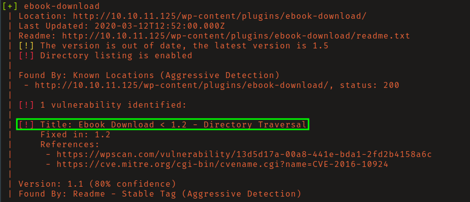
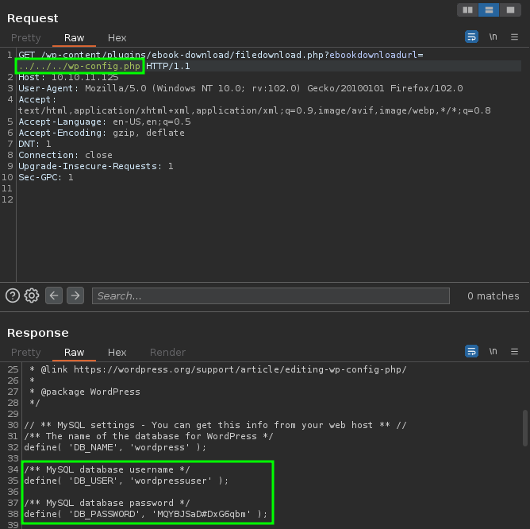
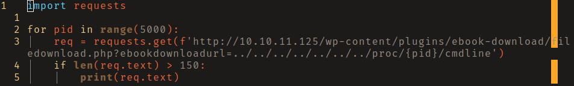
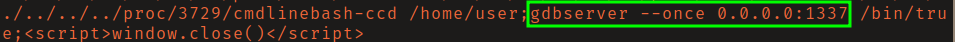
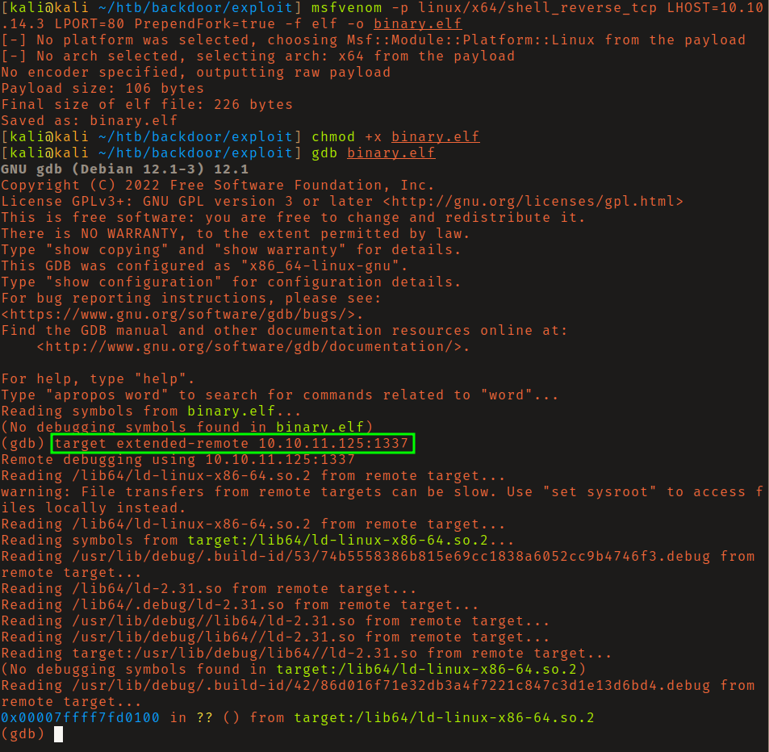
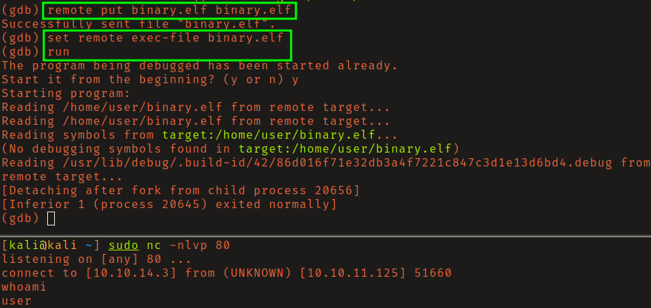
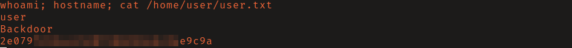
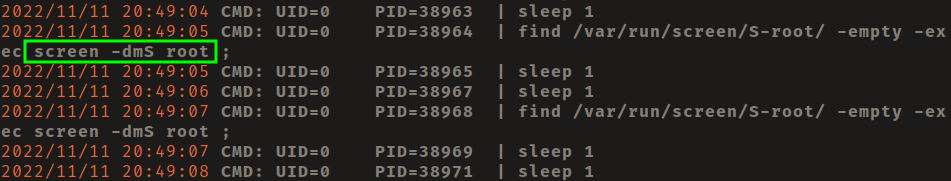
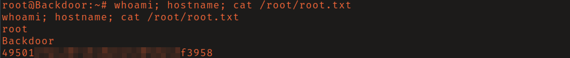

# HackTheBox - Backdoor

**OS:** Linux

Backdoor is a Linux box built around a WordPress site with a vulnerable plugin that opens a local file inclusion path wide enough to map the full process list. The mystery service on port 1337 turns out to be gdbserver, which provides a clean route to an initial shell. Root comes via a detached screen session running as root that can simply be reattached.

| Field | Value |
|---|---|
| Platform | HTB |
| Target | `<target-ip>` |
| Initial Access | Exposed gdbserver remote code execution |
| Privilege Escalation | Root screen session hijacking |
| Final Access | root |

---

## Attack Path

1. Recon identified the exposed services and separated useful attack surface from noise.
2. The first break was Exposed gdbserver remote code execution.
3. Post-exploitation enumeration exposed Root screen session hijacking.
4. The final privileged context was reached and the required proof was captured.

---

## Recon

### Port Scan

Initial enumeration found port 80 running WordPress and an unidentified service on port 1337.

### Web Enumeration

Running `wpscan` in aggressive plugin detection mode revealed the `ebook-download` plugin was installed at a version affected by CVE-2016-10924, a local file inclusion bug.

The LFI endpoint at `/wp-content/plugins/ebook-download/filedownload.php?ebookdownload=../../../wp-config.php` exposed MySQL credentials in plaintext. Reading `/etc/passwd` through the same path gave a list of users with login shells, though credential reuse attempts against those accounts failed.

### Identifying Port 1337

With no obvious service banner, I used the LFI to read `/proc/<PID>/cmdline` for running processes. A Python script iterated PIDs from 1 to 5000, and the output identified the process behind port 1337 as `gdbserver`.

---

## Initial Access

### gdbserver Remote Code Execution

`gdbserver` is designed for remote debugging - it lets `gdb` connect over the network and run binaries on the target. That same capability makes it an RCE primitive when exposed without authentication: upload an ELF, run it.

A reverse shell ELF was generated with `msfvenom`, uploaded to the target via the gdb connection, and executed. The callback came back as `user`.

---

## Privilege Escalation

### Screen Session Hijacking

`pspy32` showed a root process periodically running `screen`. The `screen` utility allows sessions to be detached and reattached later, and when the session owner is root, any user who can attach to it inherits that context.

Setting the `TERM` environment variable and attaching to the existing root session with `screen -x root/root` dropped into a root shell without any exploit.

---

## Summary

Backdoor chains an LFI (CVE-2016-10924) into process enumeration, which is the key step - without identifying gdbserver behind port 1337 the box looks like a dead end. The root path via screen reattachment is straightforward once pspy surfaces it.

**Key takeaway:** Unauthenticated gdbserver is effectively a remote code execution primitive - it was designed to run binaries on demand, and no authentication means anyone can use it.

---

## Root Cause

The demonstrated path worked because credential reuse, unpatched vulnerable software, local privilege boundary misconfiguration gave the attacker a bridge from reconnaissance to execution. The important pattern is the chain: Exposed gdbserver remote code execution created a foothold, and Root screen session hijacking converted that foothold into root.

## Impact

Successful exploitation reached root. That level of access allows command execution, proof or sensitive-file access, credential collection, and a realistic path to additional systems if the same credentials, services, or trust relationships exist elsewhere.

## Remediation

- Remove or harden the specific exposure used for initial access: Exposed gdbserver remote code execution.
- Fix the privilege boundary that enabled escalation: Root screen session hijacking.
- Rotate credentials observed or replayed during the chain and search for reuse on adjacent systems.
- Validate the fix by safely replaying the enumeration steps that originally exposed the weakness.

## Detection Opportunities

- Alert on exploit attempts or suspicious access patterns against the service that enabled initial access.
- Correlate successful authentication, new process creation, and privilege-boundary events after enumeration activity.
- Monitor for the specific escalation signal: Root screen session hijacking.

## Lessons Learned

- The winning path was not just a vulnerable service; it was the connection between Exposed gdbserver remote code execution and Root screen session hijacking.
- Preserve the observations that explain why each pivot made sense, not only the commands that worked.
- Write remediation from the root cause of each step so the report reads like an operator narrative and a defender action plan.
