# HackTheBox - Horizontall

**OS:** Linux

Horizontall is a Linux box where the attack path runs through two separate CVEs. The frontend JavaScript source leaks a subdomain running a Strapi CMS instance vulnerable to unauthenticated RCE. Post-exploitation reveals a Laravel application listening only on localhost, exploitable via CVE-2021-3129 once the port is forwarded out over SSH.

| Field | Value |
|---|---|
| Platform | HTB |
| Target | `<target-ip>` |
| Initial Access | Strapi unauthenticated RCE |
| Privilege Escalation | Laravel debug-mode RCE from local access |
| Final Access | root |

---

## Attack Path

1. Recon identified the exposed services and separated useful attack surface from noise.
2. The first break was Strapi unauthenticated RCE.
3. Post-exploitation enumeration exposed Laravel debug-mode RCE from local access.
4. The final privileged context was reached and the required proof was captured.

---

## Recon

### Web Enumeration

The web server on port 80 redirected to `horizontall.htb`. The JavaScript bundle at `/js/app.c68eb462.js` contained a reference to `api-prod.horizontall.htb`. Adding that subdomain to `/etc/hosts` and running gobuster against it found `/admin/`, which presented a Strapi CMS login page.

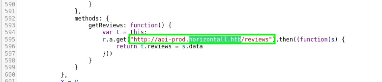

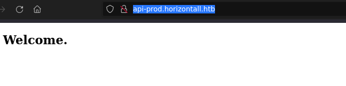

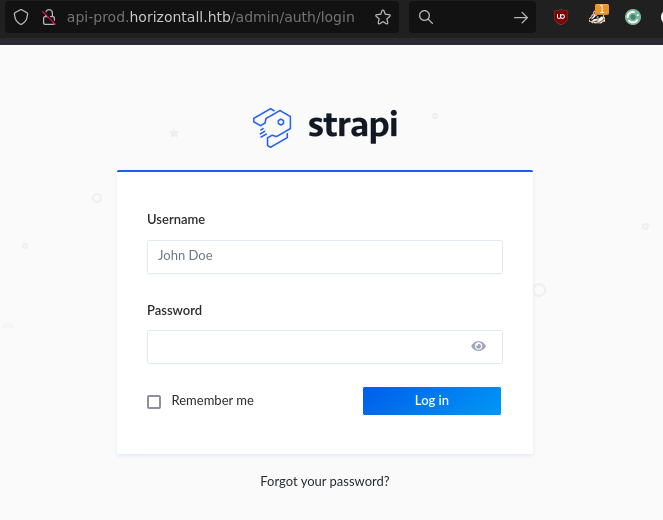

---

## Initial Access

### Strapi Unauthenticated RCE (CVE-2019-18818 / CVE-2019-19609)

The Strapi version running on `api-prod` was affected by a pair of CVEs: CVE-2019-18818 allows password reset without the reset token, and CVE-2019-19609 is an authenticated RCE via the plugin installation endpoint. Together they produce an unauthenticated RCE primitive.

`50239.py` from exploit-db implements the full chain. After reviewing the source, running it gave blind command execution on the server. A netcat reverse shell command sent through the exploit delivered an interactive shell as `strapi`.

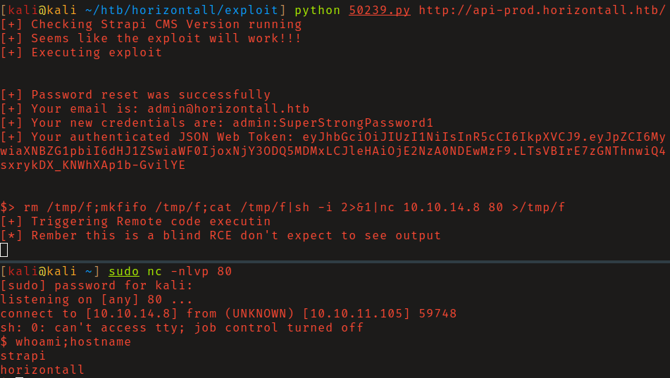

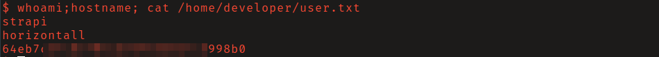

---

## Privilege Escalation

### Laravel Debug Mode RCE (CVE-2021-3129)

Checking for locally listening ports that didn't appear in the initial scan found port 8000. Curling it locally returned a Laravel v8 application in debug mode.

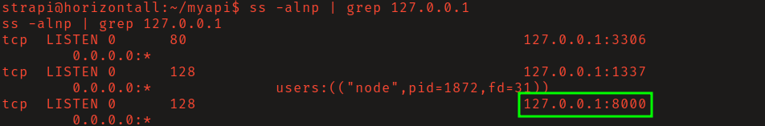

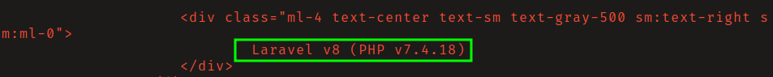

CVE-2021-3129 exploits Laravel's debug mode log file handling to achieve RCE, but the exploit requires internet access to fetch a gadget chain - HTB machines have no outbound connectivity, so it can't run directly on the target.

The solution was to set up SSH access first. I created a `.ssh` directory in strapi's home folder and dropped my public key into `authorized_keys`, then connected as strapi over SSH and established a local port forward for port 8000.

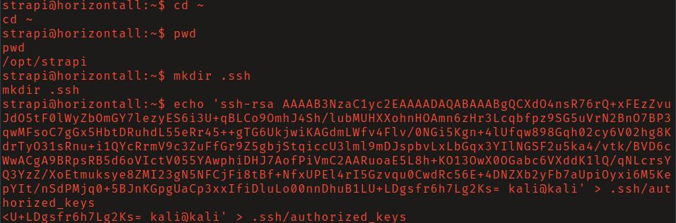

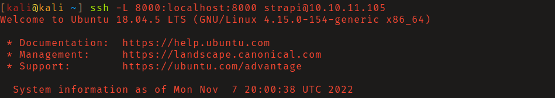

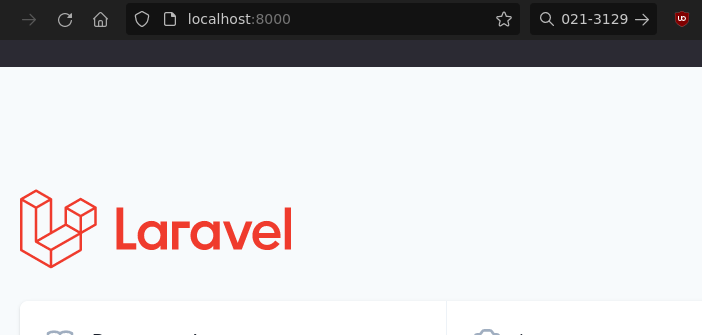

With the port forwarded, running the CVE-2021-3129 exploit from the attacking machine and pointing it at `localhost:8000` executed the payload as `root`.

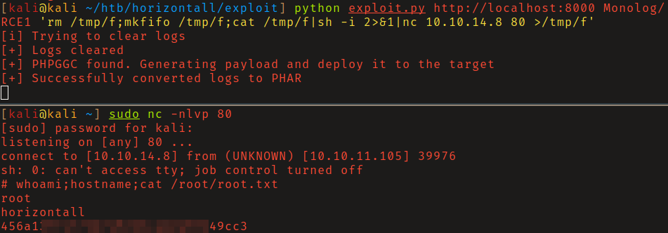

---

## Summary

Horizontall is a two-stage CVE chain with an interesting middle step: the port forwarding requirement for the Laravel exploit forces SSH setup during post-exploitation rather than jumping straight to the second exploit. The subdomain discovery from JavaScript source is a reliable real-world technique.

**Key takeaway:** Laravel debug mode is a pre-auth RCE when the log file is writable - it should never be enabled in production, and internal-only services are still reachable once an attacker has foothold on the same host.

---

## Root Cause

The demonstrated path worked because unpatched vulnerable software gave the attacker a bridge from reconnaissance to execution. The important pattern is the chain: Strapi unauthenticated RCE created a foothold, and Laravel debug-mode RCE from local access converted that foothold into root.

## Impact

Successful exploitation reached root. That level of access allows command execution, proof or sensitive-file access, credential collection, and a realistic path to additional systems if the same credentials, services, or trust relationships exist elsewhere.

## Remediation

- Remove or harden the specific exposure used for initial access: Strapi unauthenticated RCE.
- Fix the privilege boundary that enabled escalation: Laravel debug-mode RCE from local access.
- Rotate credentials observed or replayed during the chain and search for reuse on adjacent systems.
- Validate the fix by safely replaying the enumeration steps that originally exposed the weakness.

## Detection Opportunities

- Alert on exploit attempts or suspicious access patterns against the service that enabled initial access.
- Correlate successful authentication, new process creation, and privilege-boundary events after enumeration activity.
- Monitor for the specific escalation signal: Laravel debug-mode RCE from local access.

## Lessons Learned

- The winning path was not just a vulnerable service; it was the connection between Strapi unauthenticated RCE and Laravel debug-mode RCE from local access.
- Preserve the observations that explain why each pivot made sense, not only the commands that worked.
- Write remediation from the root cause of each step so the report reads like an operator narrative and a defender action plan.
