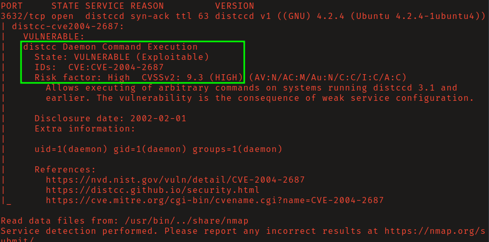
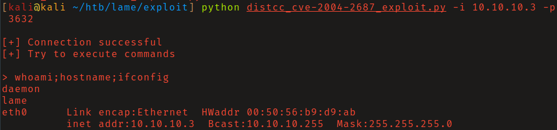
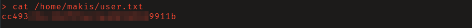
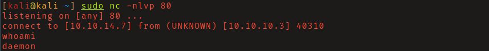
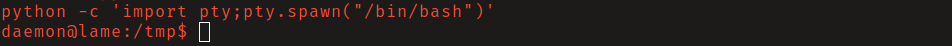
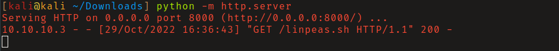
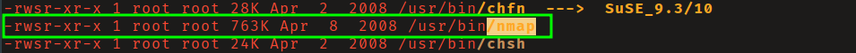
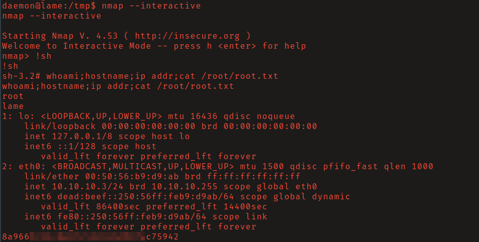

# HackTheBox - Lame

**OS:** Linux

Lame is one of the first machines on HackTheBox and runs several outdated services. The intended path is through `distcc`, a distributed compilation daemon running without authorization checks on port 3632, which allows arbitrary command execution via crafted compilation jobs. Post-exploitation finds nmap installed with the SUID bit set, which is the privilege escalation vector. (The box also runs a vulnerable Samba version - CVE-2007-2447 - but distcc was the path taken here.)

| Field | Value |
|---|---|
| Platform | HTB |
| Target | `<target-ip>` |
| Initial Access | Unauthenticated distcc command execution |
| Privilege Escalation | Unsafe SUID nmap interactive mode |
| Final Access | root |

---

## Attack Path

1. Recon identified the exposed services and separated useful attack surface from noise.
2. The first break was Unauthenticated distcc command execution.
3. Post-exploitation enumeration exposed Unsafe SUID nmap interactive mode.
4. The final privileged context was reached and the required proof was captured.

---

## Recon

### Port Scan

Nmap's `distcc-cve2004-2687` NSE script confirmed the distcc service on port 3632 was vulnerable to CVE-2004-2687. `distcc` is a tool for offloading compilation work to remote machines, and this version passes compilation jobs to the server without any authorization check, allowing command injection via the job payload.

---

## Initial Access

A public PoC for CVE-2004-2687 sends a crafted compilation job containing a shell command. After reviewing the source, running the exploit gave command execution as `daemon`.

The shell from the exploit was non-interactive. I transitioned to a proper interactive shell and stabilized it with Python.

---

## Privilege Escalation

### Nmap SUID

Fetching and running `linpeas.sh` in-memory (via curl piped to bash) found that `nmap` was installed with the SUID bit set and owned by root.

Older versions of nmap include an `--interactive` mode that drops into a shell. Because the binary runs with root's effective UID via the SUID bit, `!sh` inside interactive mode gives a root shell.

---

## Summary

Lame showcases two classic misconfigurations: an unauthenticated network service that executes arbitrary code, and a SUID binary that can escape into a shell. The distcc vulnerability is old and the nmap SUID escape is well-documented - this box would be a trivial compromise on any real network still running this configuration.

**Key takeaway:** Old compilation daemons running without authentication on internal networks are a reliable, low-noise RCE path that doesn't require touching web applications at all.

---

## Root Cause

The demonstrated path worked because the target exposed a concrete bridge from reconnaissance to execution: Unauthenticated distcc command execution. The chain became critical when Unsafe SUID nmap interactive mode converted that foothold into root.

## Impact

Successful exploitation reached root. That access is enough to read sensitive files, execute commands in the privileged context, collect credentials, and use the host or domain position as a pivot if similar trust relationships exist elsewhere.

## Remediation

- Remove or harden the specific exposure used for initial access: Unauthenticated distcc command execution.
- Fix the privilege boundary that enabled escalation: Unsafe SUID nmap interactive mode.
- Rotate credentials observed or replayed during the chain and search for reuse on adjacent systems.
- Validate the fix by safely replaying the enumeration steps that originally exposed the weakness.

## Detection Opportunities

- Alert on suspicious access patterns against the service that enabled initial access.
- Correlate successful authentication, process creation, and privilege-boundary events after enumeration activity.
- Monitor for the specific escalation signal: Unsafe SUID nmap interactive mode.

## Lessons Learned

- The useful lesson is the connection between Unauthenticated distcc command execution and Unsafe SUID nmap interactive mode, not just the individual command that worked.
- Preserve the observations that explain why each pivot made sense.
- Write remediation from the root cause of each step so the report reads like both an operator narrative and a defender action plan.
