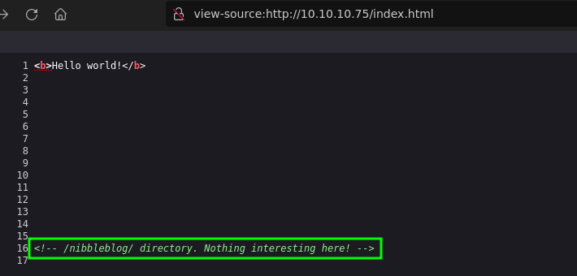
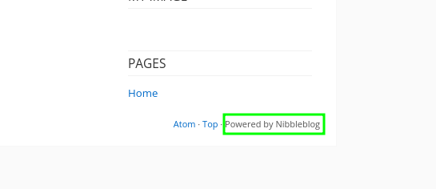
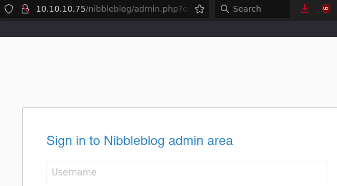
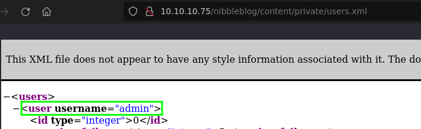
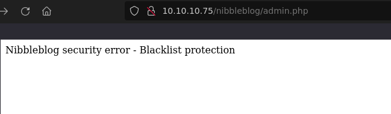
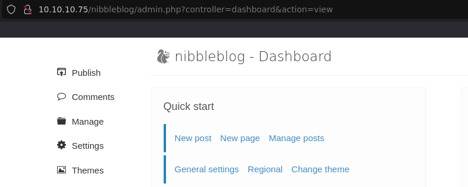
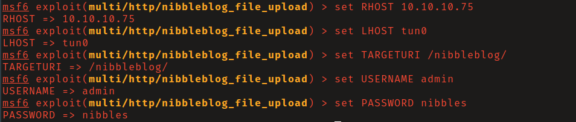
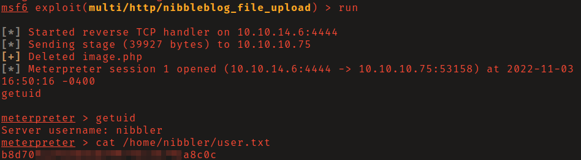
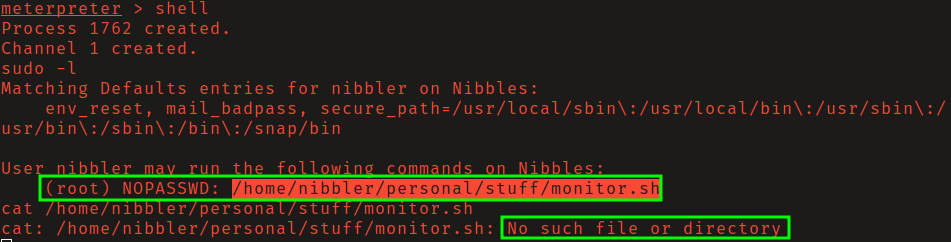
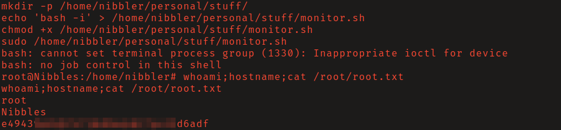

# HackTheBox - Nibbles

**OS:** Linux

Nibbles is a Linux box running NibbleBlog, a simple PHP blogging platform. A comment in the landing page source code leads to the installation, the admin panel is found through directory brute-forcing, and the password is trivially guessable. An authenticated arbitrary file upload vulnerability (CVE-2015-6967) in NibbleBlog gives the initial shell. Privilege escalation is a sudo rule pointing at a script path that doesn't exist yet.

| Field | Value |
|---|---|
| Platform | HTB |
| Target | `<target-ip>` |
| Initial Access | NibbleBlog admin access and plugin upload RCE |
| Privilege Escalation | Over-broad sudo rights to root |
| Final Access | root |

---

## Attack Path

1. Recon identified the exposed services and separated useful attack surface from noise.
2. The first break was NibbleBlog admin access and plugin upload RCE.
3. Post-exploitation enumeration exposed Over-broad sudo rights to root.
4. The final privileged context was reached and the required proof was captured.

---

## Recon

### Web Enumeration

A comment in the HTML source of the default landing page referenced `/nibbleblog/`. Navigating there revealed a running NibbleBlog instance.

Directory brute-forcing within `/nibbleblog/` found the admin login panel and a `users.xml` file that confirmed the username `admin`.

---

## Initial Access

### Credential Guessing and File Upload RCE

The login form briefly blacklists IPs after repeated failed attempts, so guessing had to be paced. After a few tries, `nibbles` worked as the password.

CVE-2015-6967 is an authenticated arbitrary file upload in NibbleBlog's image plugin - it fails to validate file type despite showing a warning, so uploading a PHP webshell works. The Metasploit module `multi/http/nibbleblog_file_upload` handles this automatically. With the credentials in hand, running the module delivered a shell as `nibbler`.

---

## Privilege Escalation

### Missing Sudo Script

`sudo -l` showed `nibbler` could run `/home/nibbler/personal/stuff/monitor.sh` as root without a password. That path didn't exist. Creating the directory structure, writing `bash -i` as the script content, setting it executable, and running it via sudo gave a root shell.

---

## Summary

Nibbles chains source code disclosure to credential guessing to an authenticated file upload CVE. The privilege escalation is a clean example of sudo rules referencing paths the authorized user controls - if the script doesn't exist yet, creating it is all that's needed.

**Key takeaway:** Sudo rules that specify a path under the user's own home directory are effectively unrestricted root access - the user controls what that script contains.

---

## Root Cause

The demonstrated path worked because unpatched vulnerable software, local privilege boundary misconfiguration gave the attacker a bridge from reconnaissance to execution. The important pattern is the chain: NibbleBlog admin access and plugin upload RCE created a foothold, and Over-broad sudo rights to root converted that foothold into root.

## Impact

Successful exploitation reached root. That level of access allows command execution, proof or sensitive-file access, credential collection, and a realistic path to additional systems if the same credentials, services, or trust relationships exist elsewhere.

## Remediation

- Remove or harden the specific exposure used for initial access: NibbleBlog admin access and plugin upload RCE.
- Fix the privilege boundary that enabled escalation: Over-broad sudo rights to root.
- Rotate credentials observed or replayed during the chain and search for reuse on adjacent systems.
- Validate the fix by safely replaying the enumeration steps that originally exposed the weakness.

## Detection Opportunities

- Alert on exploit attempts or suspicious access patterns against the service that enabled initial access.
- Correlate successful authentication, new process creation, and privilege-boundary events after enumeration activity.
- Monitor for the specific escalation signal: Over-broad sudo rights to root.

## Lessons Learned

- The winning path was not just a vulnerable service; it was the connection between NibbleBlog admin access and plugin upload RCE and Over-broad sudo rights to root.
- Preserve the observations that explain why each pivot made sense, not only the commands that worked.
- Write remediation from the root cause of each step so the report reads like an operator narrative and a defender action plan.
