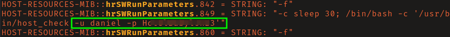
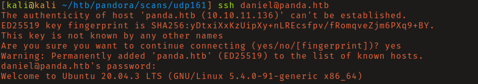
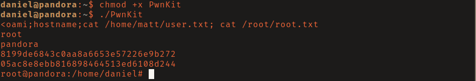

# HackTheBox - Pandora

**OS:** Linux

Pandora is a Linux box where the initial TCP scan looks nearly empty - just SSH and a web server. The key is running a UDP scan, which finds SNMP open on port 161. Walking the SNMP tree recovers SSH credentials for a low-privilege user. Privilege escalation is via PwnKit (CVE-2021-4034), a polkit privilege escalation that was present across a huge number of Linux distributions.

| Field | Value |
|---|---|
| Platform | HTB |
| Target | `<target-ip>` |
| Initial Access | SNMP enumeration exposing reusable credentials |
| Privilege Escalation | PwnKit local privilege escalation |
| Final Access | root |

---

## Attack Path

1. Recon identified the exposed services and separated useful attack surface from noise.
2. The first break was SNMP enumeration exposing reusable credentials.
3. Post-exploitation enumeration exposed PwnKit local privilege escalation.
4. The final privileged context was reached and the required proof was captured.

---

## Recon

### UDP Enumeration

A standard TCP scan found SSH on 22 and an HTTP server on 80 - neither yielded anything useful on the surface. Running a UDP scan revealed port 161 (SNMP) was open.

Running `snmpwalk` against the target and parsing the output surfaced credentials for the user `daniel` embedded in the process table or configuration data visible via SNMP.

---

## Initial Access

SSH login with the recovered credentials for `daniel` succeeded.

---

## Privilege Escalation

### PwnKit (CVE-2021-4034)

`linpeas` flagged the system as potentially vulnerable to CVE-2021-4034, a local privilege escalation in `pkexec` (part of polkit) affecting virtually every major Linux distribution. The vulnerability is a memory corruption bug in pkexec's argument handling that allows any local user to execute arbitrary code as root.

Using the exploit from [ly4k/PwnKit](https://github.com/ly4k/PwnKit) gave an immediate root shell.

---

## Summary

Pandora's key lesson is about scan coverage. Stopping at a TCP scan would leave SNMP undiscovered and the box seemingly dead-end. UDP services - especially SNMP - frequently contain sensitive information that's accessible without authentication. PwnKit was a widespread vulnerability at the time this box was active; the polkit bug affected nearly every major Linux distro for over a decade before disclosure.

**Key takeaway:** SNMP without authentication configured is an information disclosure endpoint - process command lines, system details, and sometimes credentials are visible to any unauthenticated scanner.

---

## Root Cause

The demonstrated path worked because unauthenticated management/service exposure, unpatched vulnerable software gave the attacker a bridge from reconnaissance to execution. The important pattern is the chain: SNMP enumeration exposing reusable credentials created a foothold, and PwnKit local privilege escalation converted that foothold into root.

## Impact

Successful exploitation reached root. That level of access allows command execution, proof or sensitive-file access, credential collection, and a realistic path to additional systems if the same credentials, services, or trust relationships exist elsewhere.

## Remediation

- Remove or harden the specific exposure used for initial access: SNMP enumeration exposing reusable credentials.
- Fix the privilege boundary that enabled escalation: PwnKit local privilege escalation.
- Rotate credentials observed or replayed during the chain and search for reuse on adjacent systems.
- Validate the fix by safely replaying the enumeration steps that originally exposed the weakness.

## Detection Opportunities

- Alert on exploit attempts or suspicious access patterns against the service that enabled initial access.
- Correlate successful authentication, new process creation, and privilege-boundary events after enumeration activity.
- Monitor for the specific escalation signal: PwnKit local privilege escalation.

## Lessons Learned

- The winning path was not just a vulnerable service; it was the connection between SNMP enumeration exposing reusable credentials and PwnKit local privilege escalation.
- Preserve the observations that explain why each pivot made sense, not only the commands that worked.
- Write remediation from the root cause of each step so the report reads like an operator narrative and a defender action plan.
