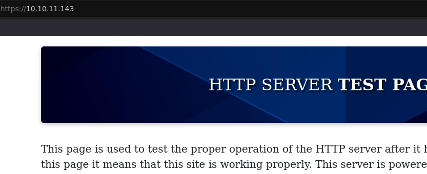
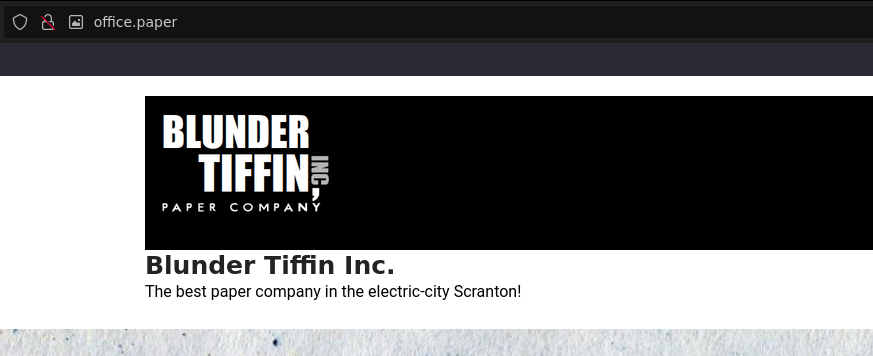
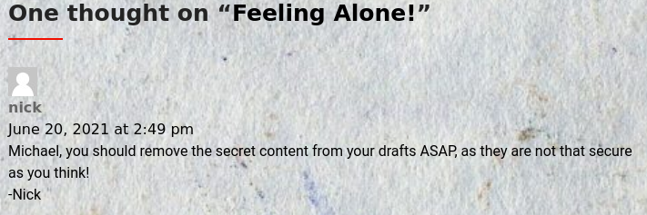
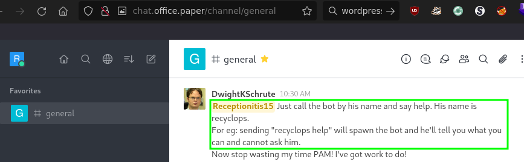
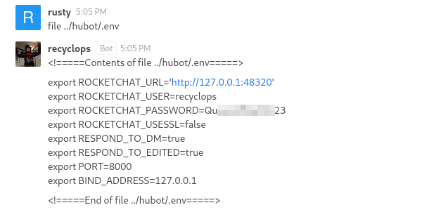
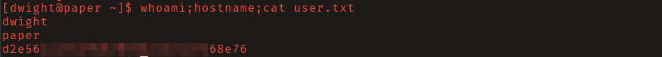
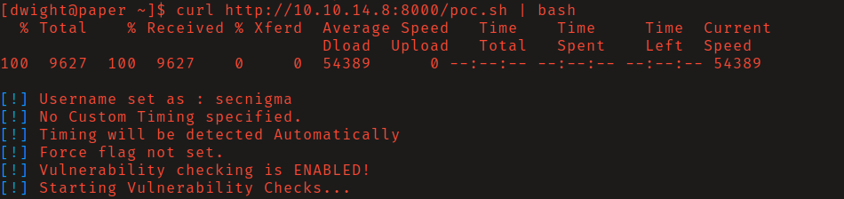
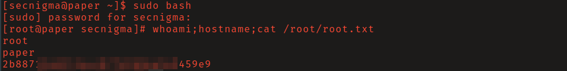

# HackTheBox - Paper

**OS:** Linux

Paper is a Linux box with a layered recon chain. An HTTP response header leaks a backend hostname that leads to a WordPress site, which has an unauthenticated draft disclosure vulnerability. The drafts contain a registration link for an internal Rocket.Chat instance, where a Hubot chatbot with a path traversal vulnerability exposes a plaintext credential. Privilege escalation uses a polkit bypass (CVE-2021-3560).

| Field | Value |
|---|---|
| Platform | HTB |
| Target | `<target-ip>` |
| Initial Access | Path Traversal via Chatbot |
| Privilege Escalation | Polkit local privilege escalation |
| Final Access | root |

---

## Attack Path

1. Recon identified the exposed services and separated useful attack surface from noise.
2. The first break was Path Traversal via Chatbot.
3. Post-exploitation enumeration exposed Polkit local privilege escalation.
4. The final privileged context was reached and the required proof was captured.

---

## Recon

### Header-Based Vhost Disclosure

The web server on port 80 returned nothing interesting at the IP directly, and directory brute-forcing found nothing. The HTTP response header `X-Backend-Server` leaked the hostname `office.paper`. Adding that to `/etc/hosts` and visiting it revealed a WordPress site.

### WordPress Draft Disclosure (CVE-2019-17671)

A comment on a blog post hinted that secret content was in draft posts. WordPress 5.2.3 and below is affected by CVE-2019-17671, which allows unauthenticated users to view private/draft posts by appending `?static=1` to a post URL. The drafts contained a registration link for `chat.office.paper`.

### Rocket.Chat Bot Enumeration

After registering and logging in, the internal chat channel referenced a bot named `recyclops`. The bot responded to direct messages and supported `list` and `file` commands to browse and read files on the server.

---

## Initial Access

### Path Traversal via Chatbot

Direct command injection into the bot was filtered, but directory traversal using `../` was not. Hubot stores its configuration in a `.env` file in the bot's working directory. Using the `file` command with path traversal to read `hubot/.env` exposed the plaintext password for the `dwight` user.

SSH login as `dwight` with the recovered password worked.

---

## Privilege Escalation

### Polkit Bypass (CVE-2021-3560)

The installed `sudo` version (1.8.29) was vulnerable to CVE-2021-3560, a race condition in polkit's `dbus-send` authentication handling that allows an unprivileged user to create a new local administrator account. The PoC by secnigma is fetched and piped directly to bash. It may require several attempts to win the race.

Once the exploit completes it creates the user `secnigma` with password `secnigmaftw`. Switching to that user and running `sudo bash` gives a root shell.

---

## Summary

Paper has an unusually long recon chain: HTTP header -> WordPress draft disclosure -> Rocket.Chat -> chatbot path traversal -> credentials. Each pivot requires reading the environment carefully rather than running tools. The CVE-2021-3560 polkit race is somewhat unreliable but well-documented.

**Key takeaway:** Debug and metadata headers like `X-Backend-Server` regularly expose internal architecture - stripping non-essential response headers from public-facing servers should be standard practice.

---

## Root Cause

The demonstrated path worked because unpatched vulnerable software, local privilege boundary misconfiguration gave the attacker a bridge from reconnaissance to execution. The important pattern is the chain: Path Traversal via Chatbot created a foothold, and Polkit local privilege escalation converted that foothold into root.

## Impact

Successful exploitation reached root. That level of access allows command execution, proof or sensitive-file access, credential collection, and a realistic path to additional systems if the same credentials, services, or trust relationships exist elsewhere.

## Remediation

- Remove or harden the specific exposure used for initial access: Path Traversal via Chatbot.
- Fix the privilege boundary that enabled escalation: Polkit local privilege escalation.
- Rotate credentials observed or replayed during the chain and search for reuse on adjacent systems.
- Validate the fix by safely replaying the enumeration steps that originally exposed the weakness.

## Detection Opportunities

- Alert on exploit attempts or suspicious access patterns against the service that enabled initial access.
- Correlate successful authentication, new process creation, and privilege-boundary events after enumeration activity.
- Monitor for the specific escalation signal: Polkit local privilege escalation.

## Lessons Learned

- The winning path was not just a vulnerable service; it was the connection between Path Traversal via Chatbot and Polkit local privilege escalation.
- Preserve the observations that explain why each pivot made sense, not only the commands that worked.
- Write remediation from the root cause of each step so the report reads like an operator narrative and a defender action plan.
