# HackTheBox - Poison

**OS:** FreeBSD

Poison is a FreeBSD box built around a PHP test page that doubles as a file read primitive. Working through a series of disclosures leads to SSH credentials, and the escalation path involves tunneling into a locally-running VNC session owned by root using a VNC password file found in the user's home directory.

| Field | Value |
|---|---|
| Platform | HTB |
| Target | `<target-ip>` |
| Initial Access | PHP file-read chain leading to SSH credentials |
| Privilege Escalation | VNC session tunneling to privileged desktop access |
| Final Access | root |

---

## Attack Path

1. Recon identified the exposed services and separated useful attack surface from noise.
2. The first break was PHP file-read chain leading to SSH credentials.
3. Post-exploitation enumeration exposed VNC session tunneling to privileged desktop access.
4. The final privileged context was reached and the required proof was captured.

---

## Recon

### Web Enumeration

The web server on port 80 presented a page for testing PHP scripts by filename, with a default list of scripts available. The site's `browse.php` script also allowed directory traversal to read arbitrary files.

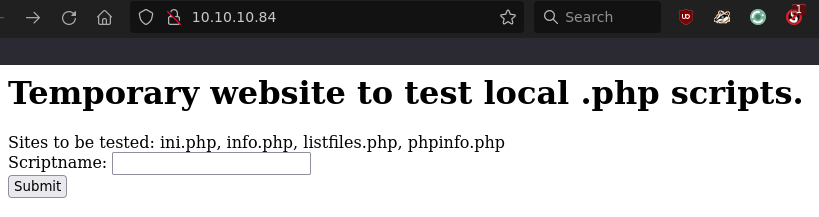

The script `listfiles.php` included a filename not in the default list: `pwdbackup.txt`. Reading it through the site's file access functionality returned a block of base64-encoded data.

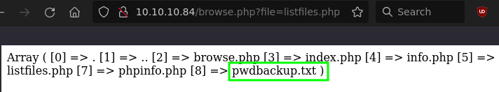

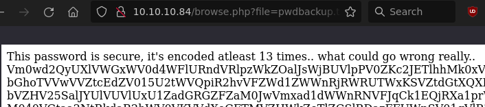

### Credential Recovery

The base64 in `pwdbackup.txt` was encoded multiple times - decoding it repeatedly with CyberChef eventually revealed a plaintext password. Reading `/etc/passwd` through the same file traversal gave the list of users with login shells.

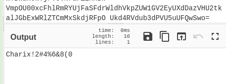

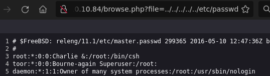

---

## Initial Access

The recovered password worked for SSH access as `charix`.

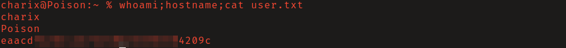

---

## Privilege Escalation

### VNC Session Tunneling

Two VNC ports were listening locally on the box.

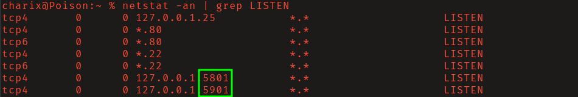

Charix's home directory contained `secret.zip`. Downloading it via `scp` and unzipping it with charix's password revealed a file named `secret`. The `vncviewer` man page documented a `-passwd` flag that accepts a VNC authentication file - `secret` is that file, storing the VNC password in VNC's obfuscated binary format.

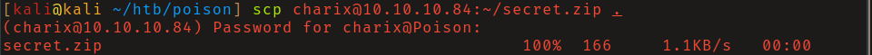

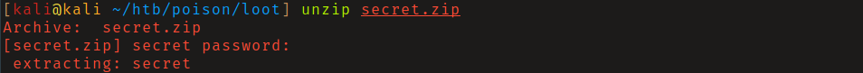

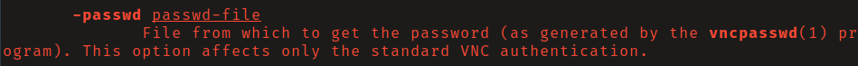

An SSH local port forward exposed VNC on the attacking machine:

```bash
ssh -L 5901:127.0.0.1:5901 charix@<target>
```

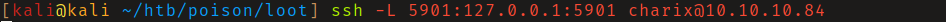

Connecting with `vncviewer -passwd secret localhost:5901` opened the VNC session running as root.

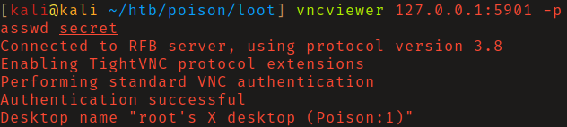

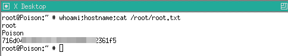

---

## Summary

Poison's chain - file traversal, repeated base64 decoding, SSH, local port forward, VNC password file - is methodical rather than relying on any single CVE. The most interesting step is recognizing that `secret` is a VNC password file format and using it directly with `vncviewer -passwd`. The VNC session running as root with its authentication file stored in a reachable user's home is the core misconfiguration.

**Key takeaway:** Sensitive files like VNC password stores should not be in user home directories that are accessible via lower-privilege accounts - credential material in reachable paths is credential material that can be used.

---

## Root Cause

The demonstrated path worked because the target exposed a concrete bridge from reconnaissance to execution: PHP file-read chain leading to SSH credentials. The chain became critical when VNC session tunneling to privileged desktop access converted that foothold into root.

## Impact

Successful exploitation reached root. That access is enough to read sensitive files, execute commands in the privileged context, collect credentials, and use the host or domain position as a pivot if similar trust relationships exist elsewhere.

## Remediation

- Remove or harden the specific exposure used for initial access: PHP file-read chain leading to SSH credentials.
- Fix the privilege boundary that enabled escalation: VNC session tunneling to privileged desktop access.
- Rotate credentials observed or replayed during the chain and search for reuse on adjacent systems.
- Validate the fix by safely replaying the enumeration steps that originally exposed the weakness.

## Detection Opportunities

- Alert on suspicious access patterns against the service that enabled initial access.
- Correlate successful authentication, process creation, and privilege-boundary events after enumeration activity.
- Monitor for the specific escalation signal: VNC session tunneling to privileged desktop access.

## Lessons Learned

- The useful lesson is the connection between PHP file-read chain leading to SSH credentials and VNC session tunneling to privileged desktop access, not just the individual command that worked.
- Preserve the observations that explain why each pivot made sense.
- Write remediation from the root cause of each step so the report reads like both an operator narrative and a defender action plan.
