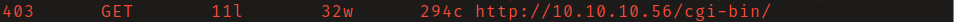
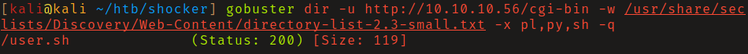
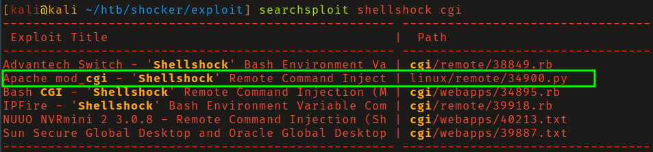
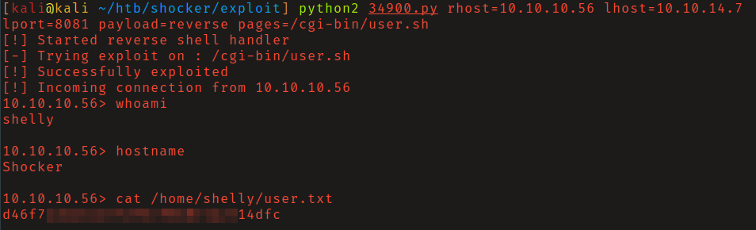
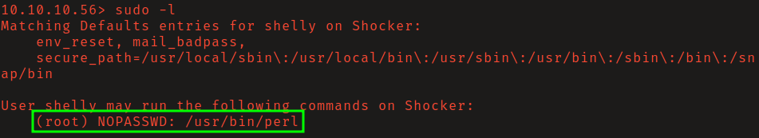
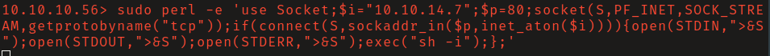
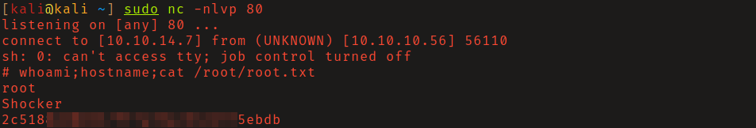

# HackTheBox - Shocker

**OS:** Linux

Shocker is a Linux box themed around the Shellshock vulnerability (CVE-2014-6271). The Apache server runs mod_cgi, and finding a script in `/cgi-bin/` is the setup for the exploit. Privilege escalation is a perl GTFOBins sudo escape.

| Field | Value |
|---|---|
| Platform | HTB |
| Target | `<target-ip>` |
| Initial Access | Shellshock command execution through CGI |
| Privilege Escalation | Over-broad sudo rights to root |
| Final Access | root |

---

## Attack Path

1. Recon identified the exposed services and separated useful attack surface from noise.
2. The first break was Shellshock command execution through CGI.
3. Post-exploitation enumeration exposed Over-broad sudo rights to root.
4. The final privileged context was reached and the required proof was captured.

---

## Recon

### Web Enumeration

Directory brute-forcing found `/cgi-bin/`. The directory itself returned 403 - its contents couldn't be listed - so a second round of brute-forcing was needed, this time targeting filenames with script extensions (`.sh`, `.pl`, `.cgi`). That found `/cgi-bin/user.sh`.





---

## Initial Access

### Shellshock (CVE-2014-6271)

Shellshock is a bash vulnerability where specially crafted function definitions in environment variables are executed as commands. Apache mod_cgi passes HTTP headers as environment variables to CGI scripts, making any CGI endpoint that invokes bash a remote code execution surface.

Searchsploit found `linux/remote/34900.py`, an Apache mod_cgi Shellshock exploit. After reviewing the source and finding nothing suspicious, running it gave a shell as `shelly`.





---

## Privilege Escalation

### Perl Sudo

`sudo -l` showed `shelly` could run `/usr/bin/perl` as root without a password. The GTFOBins perl sudo escape spawns a shell via perl's `exec`:

```bash
sudo perl -e 'exec "/bin/sh";'
```

A netcat listener caught the reverse shell running as root.







---

## Summary

Shocker is a textbook Shellshock demonstration. The two-phase directory brute-force (directory first, then filename with extension) is the critical enumeration step - without finding `user.sh`, the attack surface doesn't exist. The perl sudo escape is one of the cleaner GTFOBins entries.

**Key takeaway:** Any CGI endpoint that invokes bash is a Shellshock target - the `/cgi-bin/` directory is worth a second enumeration pass specifically looking for shell scripts.

---

## Root Cause

The demonstrated path worked because unpatched vulnerable software, local privilege boundary misconfiguration gave the attacker a bridge from reconnaissance to execution. The important pattern is the chain: Shellshock command execution through CGI created a foothold, and Over-broad sudo rights to root converted that foothold into root.

## Impact

Successful exploitation reached root. That level of access allows command execution, proof or sensitive-file access, credential collection, and a realistic path to additional systems if the same credentials, services, or trust relationships exist elsewhere.

## Remediation

- Remove or harden the specific exposure used for initial access: Shellshock command execution through CGI.
- Fix the privilege boundary that enabled escalation: Over-broad sudo rights to root.
- Rotate credentials observed or replayed during the chain and search for reuse on adjacent systems.
- Validate the fix by safely replaying the enumeration steps that originally exposed the weakness.

## Detection Opportunities

- Alert on exploit attempts or suspicious access patterns against the service that enabled initial access.
- Correlate successful authentication, new process creation, and privilege-boundary events after enumeration activity.
- Monitor for the specific escalation signal: Over-broad sudo rights to root.

## Lessons Learned

- The winning path was not just a vulnerable service; it was the connection between Shellshock command execution through CGI and Over-broad sudo rights to root.
- Preserve the observations that explain why each pivot made sense, not only the commands that worked.
- Write remediation from the root cause of each step so the report reads like an operator narrative and a defender action plan.
