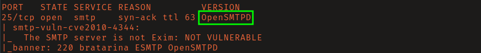
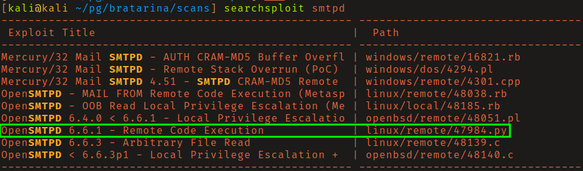
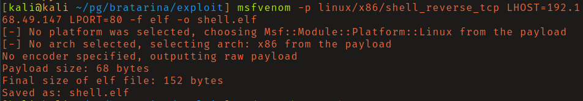
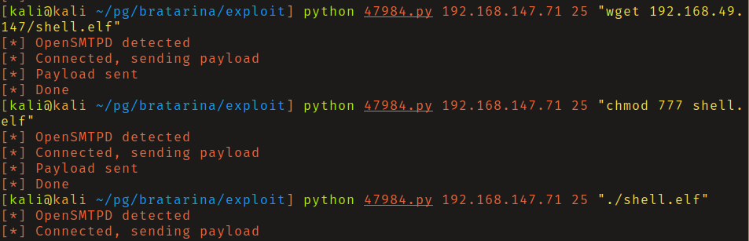

# OffSec Proving Grounds - Bratarina

**OS:** Linux

Bratarina has a few rabbit holes but the intended path is short once the right service is identified. OpenSMTPD is running on port 25 in a version affected by CVE-2020-7247, a critical unauthenticated RCE that drops a root shell directly with no privilege escalation needed.

| Field | Value |
|---|---|
| Platform | OffSec Proving Grounds |
| Target | `<target-ip>` |
| Initial Access | OpenSMTPD unauthenticated RCE |
| Privilege Escalation | Not required — initial exploit reached the objective |
| Final Access | root |

---

## Attack Path

1. Recon identified the exposed services and separated useful attack surface from noise.
2. The first break was OpenSMTPD unauthenticated RCE.
3. Post-exploitation enumeration exposed Not required — initial exploit reached the objective.
4. The final privileged context was reached and the required proof was captured.

---

## Recon

### Service Enumeration

A full TCP scan found OpenSMTPD listening on port 25. Searchsploit returned results for OpenSMTPD including a remote code execution exploit matching the version in use.

---

## Initial Access

### OpenSMTPD RCE (CVE-2020-7247)

CVE-2020-7247 is a command injection in OpenSMTPD's mail delivery path. A crafted `MAIL FROM` field containing shell metacharacters is passed unsanitized to a local delivery command, allowing unauthenticated remote code execution as root.

After reviewing the exploit source, the initial test was confirming blind code execution by pinging the attacking machine and listening with `tcpdump` for ICMP responses. Direct reverse shell payloads failed, as did base64-encoded variants. The reliable path was generating an msfvenom ELF payload, serving it over HTTP, and using `wget` in the exploit's blind execution context to download and run it.

---

## Summary

Bratarina is a clean example of a network-exposed service with a critical unauthenticated RCE - no foothold needed before hitting root. The troubleshooting around shell payload delivery (switching from inline reverse shells to a staged msfvenom binary) is a realistic reminder that blind command execution contexts are restrictive and require testing what works.

**Key takeaway:** CVE-2020-7247 achieves root via a mail field that was never sanitized - SMTP services running as root should not be internet-exposed, and version management on mail infrastructure matters.

---

## Root Cause

The demonstrated path worked because unpatched vulnerable software gave the attacker a bridge from reconnaissance to execution. The important pattern is the chain: OpenSMTPD unauthenticated RCE created a foothold, and Not required — initial exploit reached the objective converted that foothold into root.

## Impact

Successful exploitation reached root. That level of access allows command execution, proof or sensitive-file access, credential collection, and a realistic path to additional systems if the same credentials, services, or trust relationships exist elsewhere.

## Remediation

- Remove or harden the specific exposure used for initial access: OpenSMTPD unauthenticated RCE.
- Fix the privilege boundary that enabled escalation: Not required — initial exploit reached the objective.
- Rotate credentials observed or replayed during the chain and search for reuse on adjacent systems.
- Validate the fix by safely replaying the enumeration steps that originally exposed the weakness.

## Detection Opportunities

- Alert on exploit attempts or suspicious access patterns against the service that enabled initial access.
- Correlate successful authentication, new process creation, and privilege-boundary events after enumeration activity.
- Monitor for the specific escalation signal: Not required — initial exploit reached the objective.

## Lessons Learned

- The winning path was not just a vulnerable service; it was the connection between OpenSMTPD unauthenticated RCE and Not required — initial exploit reached the objective.
- Preserve the observations that explain why each pivot made sense, not only the commands that worked.
- Write remediation from the root cause of each step so the report reads like an operator narrative and a defender action plan.
