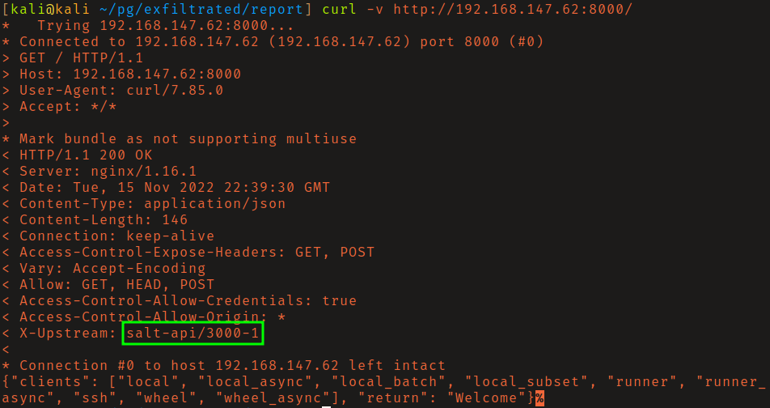
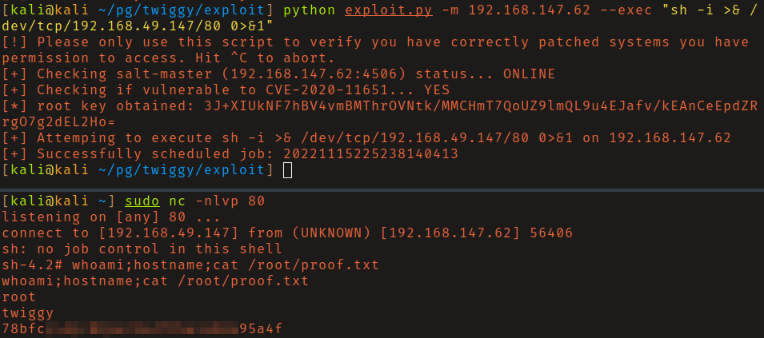

# OffSec Proving Grounds - Twiggy

**OS:** Linux

Twiggy's attack vector is well-hidden in the response headers. Port 8000 runs the SaltStack REST API, and the version in use is vulnerable to CVE-2020-11651, an authentication bypass that gives unauthenticated access to master functions - including arbitrary command execution. The shell lands as root with no escalation step.

| Field | Value |
|---|---|
| Platform | OffSec Proving Grounds |
| Target | `<target-ip>` |
| Initial Access | SaltStack authentication bypass RCE |
| Privilege Escalation | Not required — initial exploit reached the objective |
| Final Access | root |

---

## Attack Path

1. Recon identified the exposed services and separated useful attack surface from noise.
2. The first break was SaltStack authentication bypass RCE.
3. Post-exploitation enumeration exposed Not required — initial exploit reached the objective.
4. The final privileged context was reached and the required proof was captured.

---

## Recon

### Service Identification

Response headers from the service on port 8000 identified it as the SaltStack REST API (CherryPy-based). Searching for vulnerabilities in that specific version pointed directly to CVE-2020-11651, a critical authentication bypass in SaltStack that was disclosed in 2020 alongside CVE-2020-11652 (directory traversal). Together they allow unauthenticated RCE against any exposed Salt master.

---

## Initial Access

### SaltStack Authentication Bypass (CVE-2020-11651)

The vulnerability is in the `ClearFuncs` class, which exposes methods over ZeroMQ without authentication checks. The PoC at [jasperla/CVE-2020-11651-poc](https://github.com/jasperla/CVE-2020-11651-poc) exploits this to run commands via the Salt master. After reviewing the source, running it delivered a root shell.

---

## Summary

Twiggy is a one-step box once the API is identified. The challenge is recognizing the service from headers alone with no obvious web UI. CVE-2020-11651 was a critical vulnerability - Salt masters are typically privileged infrastructure components, and unauthenticated RCE against them is as serious as it gets.

**Key takeaway:** Response headers from APIs and services can be more valuable than web content - identifying the software from header strings and checking its version for CVEs is a core recon step that is easy to skip.

---

## Root Cause

The demonstrated path worked because unpatched vulnerable software gave the attacker a bridge from reconnaissance to execution. The important pattern is the chain: SaltStack authentication bypass RCE created a foothold, and Not required — initial exploit reached the objective converted that foothold into root.

## Impact

Successful exploitation reached root. That level of access allows command execution, proof or sensitive-file access, credential collection, and a realistic path to additional systems if the same credentials, services, or trust relationships exist elsewhere.

## Remediation

- Remove or harden the specific exposure used for initial access: SaltStack authentication bypass RCE.
- Fix the privilege boundary that enabled escalation: Not required — initial exploit reached the objective.
- Rotate credentials observed or replayed during the chain and search for reuse on adjacent systems.
- Validate the fix by safely replaying the enumeration steps that originally exposed the weakness.

## Detection Opportunities

- Alert on exploit attempts or suspicious access patterns against the service that enabled initial access.
- Correlate successful authentication, new process creation, and privilege-boundary events after enumeration activity.
- Monitor for the specific escalation signal: Not required — initial exploit reached the objective.

## Lessons Learned

- The winning path was not just a vulnerable service; it was the connection between SaltStack authentication bypass RCE and Not required — initial exploit reached the objective.
- Preserve the observations that explain why each pivot made sense, not only the commands that worked.
- Write remediation from the root cause of each step so the report reads like an operator narrative and a defender action plan.
