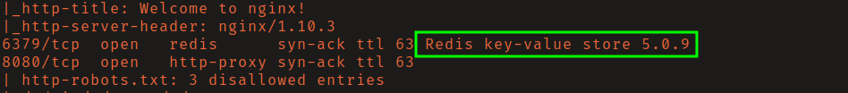
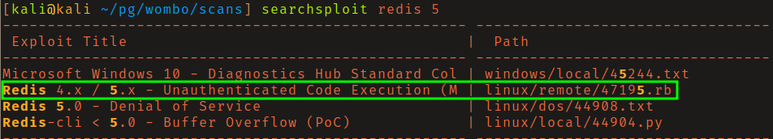
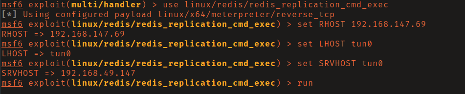
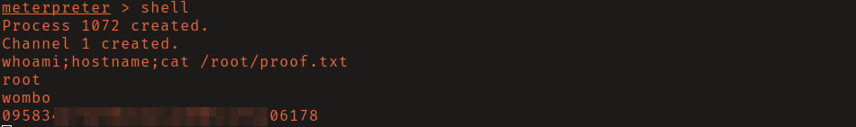

# OffSec Proving Grounds - Wombo

**OS:** Linux

Wombo has a few distracting services but the path is through Redis. The Redis instance on port 6379 has no authentication configured, and the version supports a replication-based module loading technique that achieves RCE. The shell lands as root.

| Field | Value |
|---|---|
| Platform | OffSec Proving Grounds |
| Target | `<target-ip>` |
| Initial Access | Unauthenticated Redis replication module RCE |
| Privilege Escalation | Not required — initial exploit reached the objective |
| Final Access | root |

---

## Attack Path

1. Recon identified the exposed services and separated useful attack surface from noise.
2. The first break was Unauthenticated Redis replication module RCE.
3. Post-exploitation enumeration exposed Not required — initial exploit reached the objective.
4. The final privileged context was reached and the required proof was captured.

---

## Recon

### Port Scan

A full port scan revealed Redis 5.0.9 on port 6379 alongside other services that turned out to be rabbit holes.

---

## Initial Access

### Redis Replication RCE

Redis is running without a password, making it directly accessible with `redis-cli`. The Metasploit module `linux/redis_replication_cmd_exec` exploits Redis's master-slave replication feature to load a malicious `.so` module that executes shell commands. Because Redis on this box runs as root, the resulting shell has root privileges with no further escalation needed.

---

## Summary

Wombo is a short box that demonstrates the impact of an exposed, unauthenticated Redis instance. Redis is commonly deployed for caching and message queuing, and it's frequently misconfigured with no authentication on internal networks - or occasionally exposed directly to the internet. Running it as root compounds the impact significantly.

**Key takeaway:** Redis without authentication is effectively an RCE primitive when the right version is present - it should never be exposed without auth, and should never run as root.

---

## Root Cause

The demonstrated path worked because unauthenticated management/service exposure gave the attacker a bridge from reconnaissance to execution. The important pattern is the chain: Unauthenticated Redis replication module RCE created a foothold, and Not required — initial exploit reached the objective converted that foothold into root.

## Impact

Successful exploitation reached root. That level of access allows command execution, proof or sensitive-file access, credential collection, and a realistic path to additional systems if the same credentials, services, or trust relationships exist elsewhere.

## Remediation

- Remove or harden the specific exposure used for initial access: Unauthenticated Redis replication module RCE.
- Fix the privilege boundary that enabled escalation: Not required — initial exploit reached the objective.
- Rotate credentials observed or replayed during the chain and search for reuse on adjacent systems.
- Validate the fix by safely replaying the enumeration steps that originally exposed the weakness.

## Detection Opportunities

- Alert on exploit attempts or suspicious access patterns against the service that enabled initial access.
- Correlate successful authentication, new process creation, and privilege-boundary events after enumeration activity.
- Monitor for the specific escalation signal: Not required — initial exploit reached the objective.

## Lessons Learned

- The winning path was not just a vulnerable service; it was the connection between Unauthenticated Redis replication module RCE and Not required — initial exploit reached the objective.
- Preserve the observations that explain why each pivot made sense, not only the commands that worked.
- Write remediation from the root cause of each step so the report reads like an operator narrative and a defender action plan.
