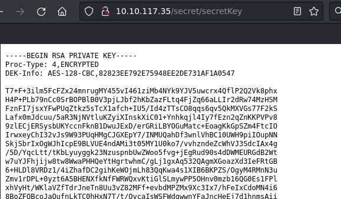
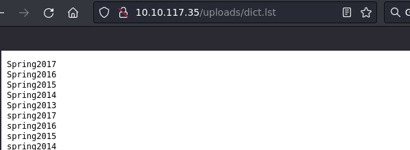
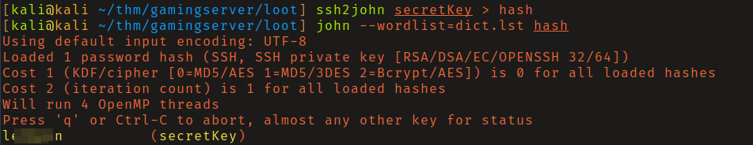
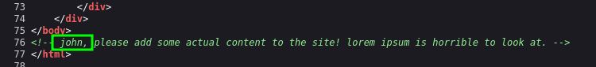
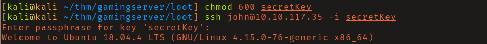
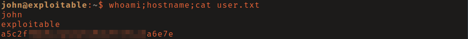
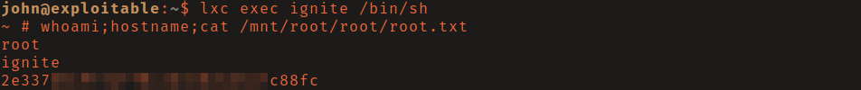

# TryHackMe - GamingServer

**OS:** Linux

GamingServer exposes two useful files through directory brute-forcing: an encrypted RSA private key and a wordlist that cracks it. A username found in the page source and the cracked key give SSH access as `john`. Privilege escalation is via `lxd` group membership, which allows spawning a privileged container with the host filesystem mounted.

| Field | Value |
|---|---|
| Platform | TryHackMe |
| Target | `<target-ip>` |
| Initial Access | Cracked SSH private key exposed through web content |
| Privilege Escalation | LXD group container breakout to host root |
| Final Access | root |

---

## Attack Path

1. Recon identified the exposed services and separated useful attack surface from noise.
2. The first break was Cracked SSH private key exposed through web content.
3. Post-exploitation enumeration exposed LXD group container breakout to host root.
4. The final privileged context was reached and the required proof was captured.

---

## Recon

### Web Enumeration

Directory brute-forcing on the web server found two notable files:

- `/secret/secretKey` - a passphrase-protected RSA private key
- `/uploads/dict.lst` - a wordlist





Both were downloaded with `wget`. `ssh2john` converted the RSA key to a john-compatible hash, and the provided wordlist cracked the passphrase.



### Username Discovery

The web page HTML source contained a comment referencing the name "john."



---

## Initial Access

With the correct passphrase and username, SSH as `john` using the recovered key worked after setting correct permissions (`chmod 600`) on the key file.





---

## Privilege Escalation

### LXD Container Escape

`john` was a member of the `lxd` group. LXD is a container hypervisor, and group membership allows creating and managing containers. A privileged container with the host root filesystem mounted inside it provides unrestricted read/write access to the host.

An Alpine Linux LXD image was built using [lxd-alpine-builder](https://github.com/saghul/lxd-alpine-builder) on the attacking machine, transferred to the target, and imported. The container was initialized with `security.privileged=true` and the host filesystem was mounted inside it:

```bash
lxc image import ./alpine-v3.13-x86_64-20210218_0139.tar.gz --alias rusty
lxc init rusty ignite -c security.privileged=true
lxc config device add ignite mydevice disk source=/ path=/mnt/root recursive=true
lxc start ignite
lxc exec ignite /bin/sh
```

The host filesystem was mounted at `/mnt/root` inside the container, giving full access to all files including `/mnt/root/root/root.txt` and the ability to write SSH keys or modify `/etc/passwd`.



---

## Summary

GamingServer is a good example of reading the environment carefully during web enumeration - the wordlist and key being on the same server as the login target is an obvious hint once both are found. The LXD privilege escalation is a reliable technique that requires building a container image in advance and transferring it.

**Key takeaway:** LXD group membership is effectively root - a privileged container with the host filesystem mounted provides complete access to all files on the host regardless of file permissions.

---

## Root Cause

The demonstrated path worked because the target exposed a concrete bridge from reconnaissance to execution: Cracked SSH private key exposed through web content. The chain became critical when LXD group container breakout to host root converted that foothold into root.

## Impact

Successful exploitation reached root. That access is enough to read sensitive files, execute commands in the privileged context, collect credentials, and use the host or domain position as a pivot if similar trust relationships exist elsewhere.

## Remediation

- Remove or harden the specific exposure used for initial access: Cracked SSH private key exposed through web content.
- Fix the privilege boundary that enabled escalation: LXD group container breakout to host root.
- Rotate credentials observed or replayed during the chain and search for reuse on adjacent systems.
- Validate the fix by safely replaying the enumeration steps that originally exposed the weakness.

## Detection Opportunities

- Alert on suspicious access patterns against the service that enabled initial access.
- Correlate successful authentication, process creation, and privilege-boundary events after enumeration activity.
- Monitor for the specific escalation signal: LXD group container breakout to host root.

## Lessons Learned

- The useful lesson is the connection between Cracked SSH private key exposed through web content and LXD group container breakout to host root, not just the individual command that worked.
- Preserve the observations that explain why each pivot made sense.
- Write remediation from the root cause of each step so the report reads like both an operator narrative and a defender action plan.
