# TryHackMe - Tomghost

**OS:** Linux

Tomghost is built around Ghostcat (CVE-2020-1938), an Apache Tomcat vulnerability in the AJP connector that allows reading arbitrary files from the web application, including configuration files with credentials. Getting to the user flag requires a second step - cracking a GPG key to decrypt an encrypted credentials file. Root is a GTFOBins sudo escape via `zip`.

| Field | Value |
|---|---|
| Platform | TryHackMe |
| Target | `<target-ip>` |
| Initial Access | Ghostcat file read leading to credentials |
| Privilege Escalation | Over-broad sudo rights to root |
| Final Access | root |

---

## Attack Path

1. Recon identified the exposed services and separated useful attack surface from noise.
2. The first break was Ghostcat file read leading to credentials.
3. Post-exploitation enumeration exposed Over-broad sudo rights to root.
4. The final privileged context was reached and the required proof was captured.

---

## Recon

### Port Scan

Nmap found Tomcat running on port 8080 and the AJP connector on port 8009. The Tomcat manager was configured to reject connections from remote hosts.

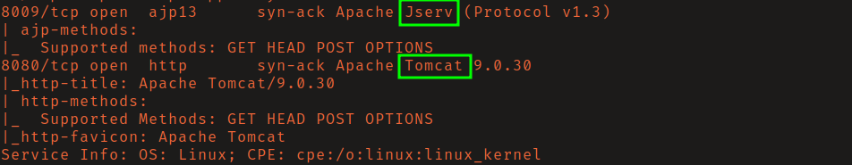

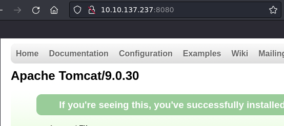

Port 8009 being open is the key indicator for Ghostcat. The AJP protocol is Tomcat's internal communication mechanism, and this version is vulnerable to CVE-2020-1938.

---

## Initial Access

### Ghostcat (CVE-2020-1938)

Ghostcat is an arbitrary file read/include vulnerability in Tomcat's AJP connector. It allows reading any file within the web application's root without authentication. The exploit at [00theway/Ghostcat-CNVD-2020-10487](https://github.com/00theway/Ghostcat-CNVD-2020-10487) reads the target file and returns its contents.

Reading `/WEB-INF/web.xml` returned plaintext credentials for the user `skyfuck`.

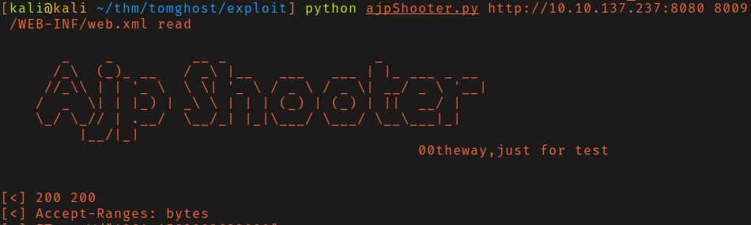

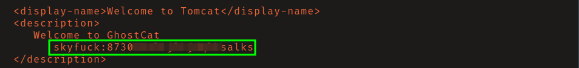

SSH login as `skyfuck` succeeded, but this user couldn't read `user.txt`. The home directory contained `credential.pgp` (encrypted) and `tryhackme.asc` (a GPG private key). Importing the ASC key prompted for a passphrase.

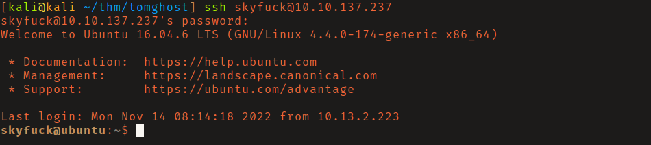

### GPG Key Cracking

Both files were transferred to the attacking machine using Python's `http.server` module. `gpg2john` converted the ASC key file to a john-compatible hash, and rockyou cracked the passphrase.

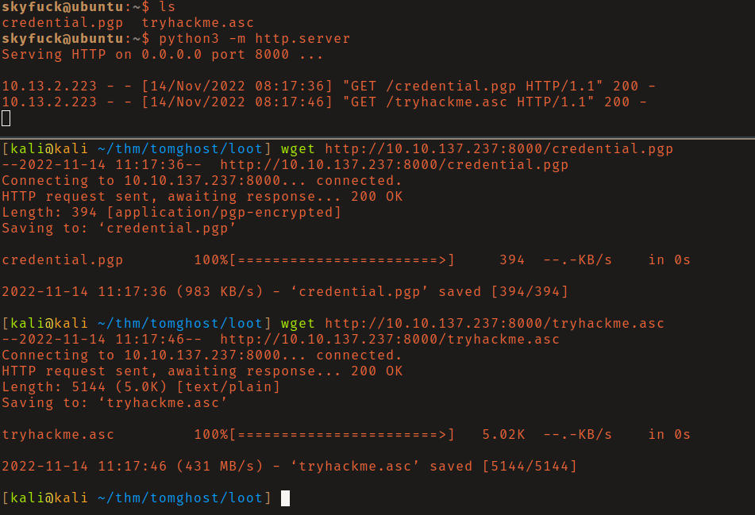

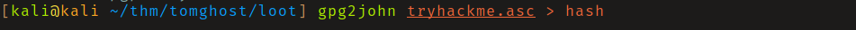

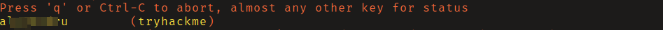

With the passphrase, importing the GPG key and decrypting `credential.pgp` revealed the password for user `merlin`. `su merlin` gave access to `user.txt`.

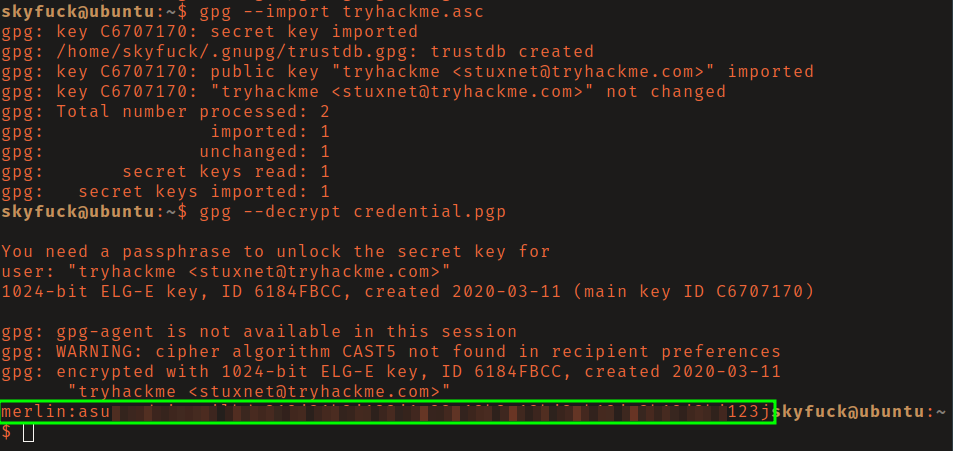

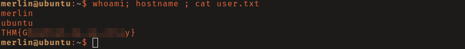

---

## Privilege Escalation

### Zip Sudo (GTFOBins)

`sudo -l` showed `merlin` could run `/usr/bin/zip` as root without a password. The GTFOBins zip sudo escape uses zip's `-T` flag and `--unzip-command` to invoke a shell:

```bash
TF=$(mktemp -u)
sudo zip $TF /etc/hosts -T -TT 'sh #'
```

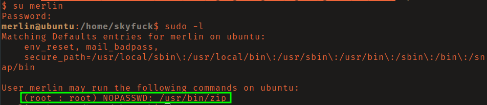

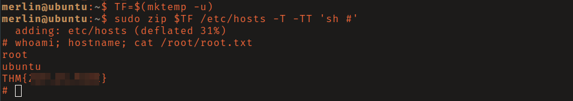

---

## Summary

Tomghost chains an unauthenticated file read (Ghostcat) into credential discovery, GPG password cracking, lateral user movement, and a GTFOBins sudo escape. The GPG step is a standout - cracking an ASC key with `gpg2john` is a less common workflow that's worth adding to the toolkit.

**Key takeaway:** The AJP connector (port 8009) should be disabled or firewalled when not in active use - Ghostcat made it clear that this internal protocol was never designed to be internet-accessible.

---

## Root Cause

The demonstrated path worked because unpatched vulnerable software, local privilege boundary misconfiguration gave the attacker a bridge from reconnaissance to execution. The important pattern is the chain: Ghostcat file read leading to credentials created a foothold, and Over-broad sudo rights to root converted that foothold into root.

## Impact

Successful exploitation reached root. That level of access allows command execution, proof or sensitive-file access, credential collection, and a realistic path to additional systems if the same credentials, services, or trust relationships exist elsewhere.

## Remediation

- Remove or harden the specific exposure used for initial access: Ghostcat file read leading to credentials.
- Fix the privilege boundary that enabled escalation: Over-broad sudo rights to root.
- Rotate credentials observed or replayed during the chain and search for reuse on adjacent systems.
- Validate the fix by safely replaying the enumeration steps that originally exposed the weakness.

## Detection Opportunities

- Alert on exploit attempts or suspicious access patterns against the service that enabled initial access.
- Correlate successful authentication, new process creation, and privilege-boundary events after enumeration activity.
- Monitor for the specific escalation signal: Over-broad sudo rights to root.

## Lessons Learned

- The winning path was not just a vulnerable service; it was the connection between Ghostcat file read leading to credentials and Over-broad sudo rights to root.
- Preserve the observations that explain why each pivot made sense, not only the commands that worked.
- Write remediation from the root cause of each step so the report reads like an operator narrative and a defender action plan.
