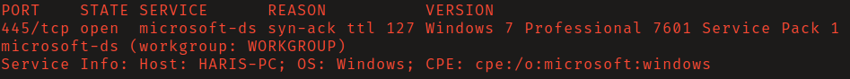
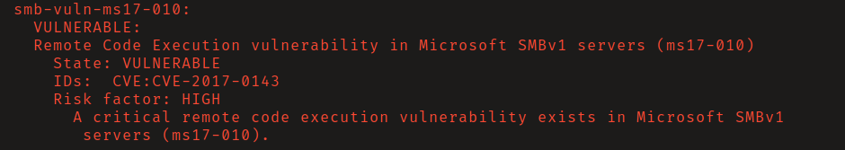
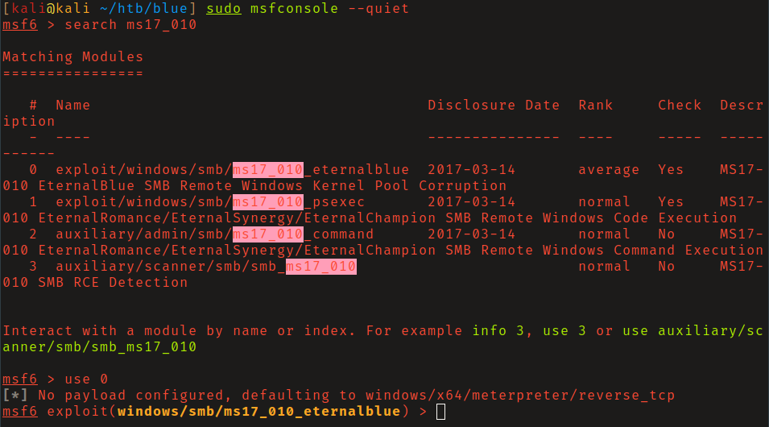
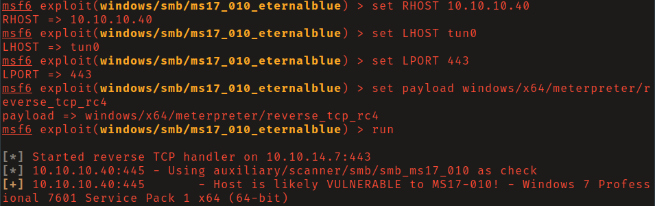
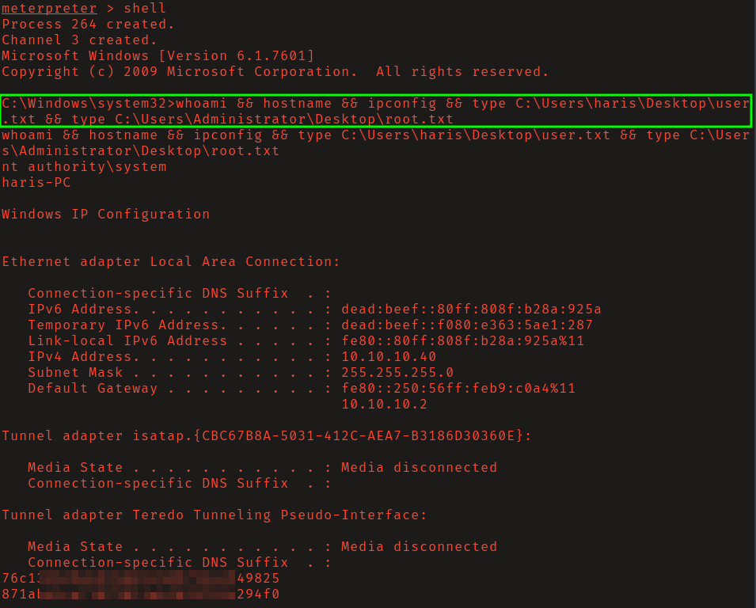

# HackTheBox - Blue

**OS:** Windows

Blue is a Windows 7 box running SMBv1, vulnerable to EternalBlue (MS17-010 / CVE-2017-0144). The NSA-developed exploit was leaked by the Shadow Brokers in 2017 and weaponized in the WannaCry and NotPetya attacks. The Metasploit implementation drops a SYSTEM shell directly with no post-exploitation required.

| Field | Value |
|---|---|
| Platform | HTB |
| Target | `<target-ip>` |
| Initial Access | EternalBlue SMBv1 remote code execution |
| Privilege Escalation | Not required — initial exploit reached the objective |
| Final Access | Administrator / SYSTEM |

---

## Attack Path

1. Recon identified the exposed services and separated useful attack surface from noise.
2. The first break was EternalBlue SMBv1 remote code execution.
3. Post-exploitation enumeration exposed Not required — initial exploit reached the objective.
4. The final privileged context was reached and the required proof was captured.

---

## Recon

### Port Scan

Nmap identified the target as Windows 7 SP1 with SMB running on port 445.

The Nmap NSE script `smb-vuln-ms17-010` confirmed the target was vulnerable to EternalBlue.

---

## Exploitation

### EternalBlue (MS17-010)

MS17-010 is a critical heap-based buffer overflow in the Windows SMBv1 implementation. It allows unauthenticated remote code execution by sending a specially crafted packet to TCP port 445. Microsoft patched this in March 2017 (MS17-010), but unpatched Windows 7 systems remained widely deployed years after.

Loading the Metasploit module `exploit/windows/smb/ms17_010_eternalblue` and running it with a `windows/x64/meterpreter/reverse_tcp_rc4` payload (RC4-encrypted to obscure the traffic) took roughly three minutes and landed a shell as `NT AUTHORITY\SYSTEM`.

No privilege escalation required - EternalBlue runs in kernel context and the session inherits SYSTEM.

---

## Summary

Blue is a single-step exploitation demonstration of one of the most impactful publicly known vulnerabilities. EternalBlue became the backbone of two major ransomware outbreaks in 2017. Unpatched SMBv1 systems remain in production environments today.

**Key takeaway:** SMBv1 should be disabled at the network level regardless of patch status - even patched systems benefit from not exposing unnecessary legacy protocols, and SMBv1 has no legitimate modern use case.

---

## Root Cause

The demonstrated path worked because unpatched vulnerable software gave the attacker a bridge from reconnaissance to execution. The important pattern is the chain: EternalBlue SMBv1 remote code execution created a foothold, and Not required — initial exploit reached the objective converted that foothold into Administrator / SYSTEM.

## Impact

Successful exploitation reached Administrator / SYSTEM. That level of access allows command execution, proof or sensitive-file access, credential collection, and a realistic path to additional systems if the same credentials, services, or trust relationships exist elsewhere.

## Remediation

- Remove or harden the specific exposure used for initial access: EternalBlue SMBv1 remote code execution.
- Fix the privilege boundary that enabled escalation: Not required — initial exploit reached the objective.
- Rotate credentials observed or replayed during the chain and search for reuse on adjacent systems.
- Validate the fix by safely replaying the enumeration steps that originally exposed the weakness.

## Detection Opportunities

- Alert on exploit attempts or suspicious access patterns against the service that enabled initial access.
- Correlate successful authentication, new process creation, and privilege-boundary events after enumeration activity.
- Monitor for the specific escalation signal: Not required — initial exploit reached the objective.

## Lessons Learned

- The winning path was not just a vulnerable service; it was the connection between EternalBlue SMBv1 remote code execution and Not required — initial exploit reached the objective.
- Preserve the observations that explain why each pivot made sense, not only the commands that worked.
- Write remediation from the root cause of each step so the report reads like an operator narrative and a defender action plan.
