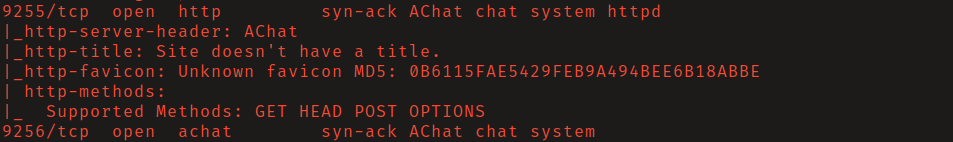
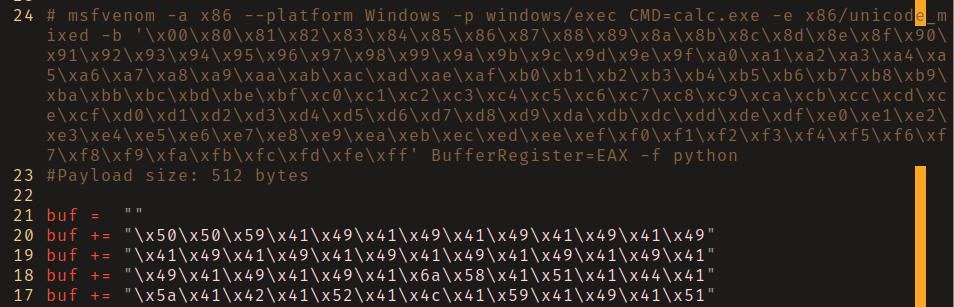
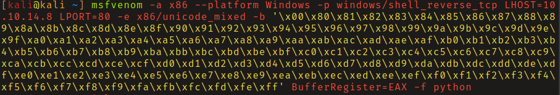
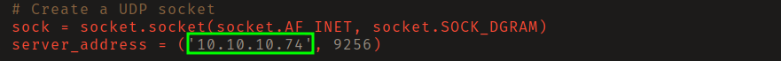
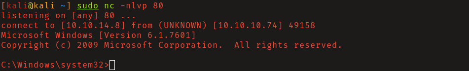
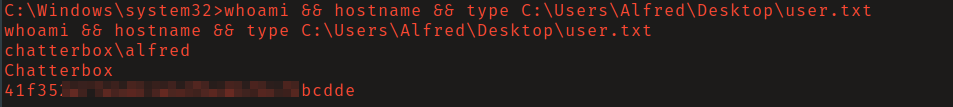
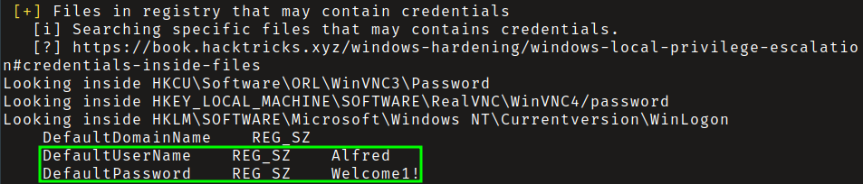
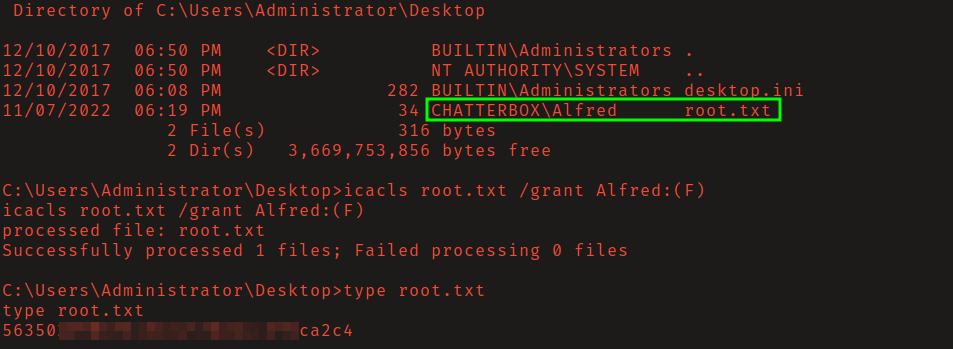

# HackTheBox - Chatterbox

**OS:** Windows

Chatterbox runs Achat, a peer-to-peer chat application that has a buffer overflow vulnerability in its UDP broadcast handling. Exploiting it gives a low-privilege shell as the application user. The escalation path is credential reuse - the AutoLogon registry key stores the user's password in plaintext, and that password also works for the Administrator account. Port 139 isn't externally exposed, so rather than a full pivot the root flag is accessed directly by modifying its ACLs.

| Field | Value |
|---|---|
| Platform | HTB |
| Target | `<target-ip>` |
| Initial Access | Achat UDP buffer overflow RCE |
| Privilege Escalation | Autologon credential recovery and privileged reuse |
| Final Access | Administrator / SYSTEM |

---

## Attack Path

1. Recon identified the exposed services and separated useful attack surface from noise.
2. The first break was Achat UDP buffer overflow RCE.
3. Post-exploitation enumeration exposed Autologon credential recovery and privileged reuse.
4. The final privileged context was reached and the required proof was captured.

---

## Recon

### Port Scan

A full TCP scan found ports 9255 and 9256 open. These are the default ports for Achat, a chat application known to have a buffer overflow vulnerability in versions prior to 0.150 beta7.

---

## Initial Access

### Achat Buffer Overflow (EDB-36025)

The exploit at EDB-36025 implements a buffer overflow in Achat's UDP broadcast functionality. The exploit template includes the msfvenom command to generate shellcode for the payload - the default shellcode in the exploit needs to be replaced with fresh shellcode for the attacking machine's IP.

Generating shellcode with the `windows/shell_reverse_tcp` non-staged payload (non-staged keeps the exploit self-contained over UDP):

After replacing the shellcode in the exploit source and updating `server_address` to point at the target, running it with `python2` and a netcat listener open caught a shell as `alfred`.

---

## Privilege Escalation

### AutoLogon Credentials and Flag Access

The registry key `HKLM\SOFTWARE\Microsoft\Windows NT\CurrentVersion\WinLogon` contained alfred's plaintext credentials stored by the AutoLogon feature. The same password was reused for the Administrator account.

Port 139 (required for PsExec lateral movement) isn't exposed externally, and forwarding it was more complexity than needed. The simpler approach: `root.txt` was owned by Alfred's account, so granting read permissions directly and reading it from the current session worked without escalating to a full Administrator shell.

---

## Summary

Chatterbox combines a buffer overflow against an obscure chat application with a credential reuse finding via the AutoLogon registry key. The escalation path is a pragmatic flag grab rather than a full administrative shell - the credentials and access are there, the port restriction just changes how you use them.

**Key takeaway:** The AutoLogon registry key stores credentials in cleartext and is a standard target during post-exploitation enumeration - any account configured for automatic login has its password readable by SYSTEM-level processes.

---

## Root Cause

The demonstrated path worked because credential reuse, plaintext autologon credentials gave the attacker a bridge from reconnaissance to execution. The important pattern is the chain: Achat UDP buffer overflow RCE created a foothold, and Autologon credential recovery and privileged reuse converted that foothold into Administrator / SYSTEM.

## Impact

Successful exploitation reached Administrator / SYSTEM. That level of access allows command execution, proof or sensitive-file access, credential collection, and a realistic path to additional systems if the same credentials, services, or trust relationships exist elsewhere.

## Remediation

- Remove or harden the specific exposure used for initial access: Achat UDP buffer overflow RCE.
- Fix the privilege boundary that enabled escalation: Autologon credential recovery and privileged reuse.
- Rotate credentials observed or replayed during the chain and search for reuse on adjacent systems.
- Validate the fix by safely replaying the enumeration steps that originally exposed the weakness.

## Detection Opportunities

- Alert on exploit attempts or suspicious access patterns against the service that enabled initial access.
- Correlate successful authentication, new process creation, and privilege-boundary events after enumeration activity.
- Monitor for the specific escalation signal: Autologon credential recovery and privileged reuse.

## Lessons Learned

- The winning path was not just a vulnerable service; it was the connection between Achat UDP buffer overflow RCE and Autologon credential recovery and privileged reuse.
- Preserve the observations that explain why each pivot made sense, not only the commands that worked.
- Write remediation from the root cause of each step so the report reads like an operator narrative and a defender action plan.
