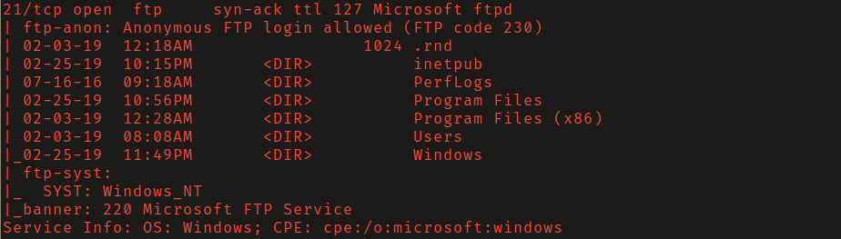
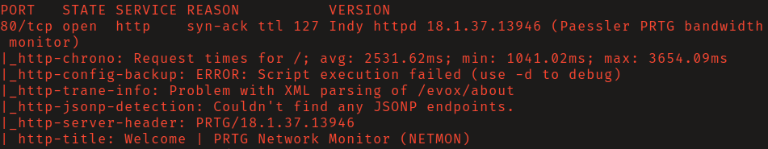
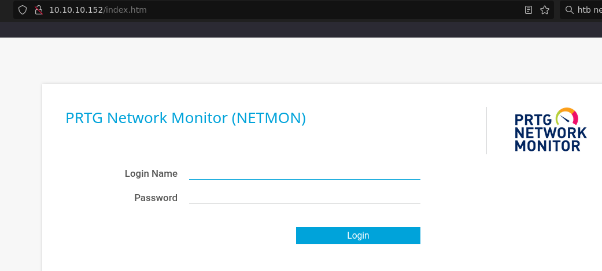
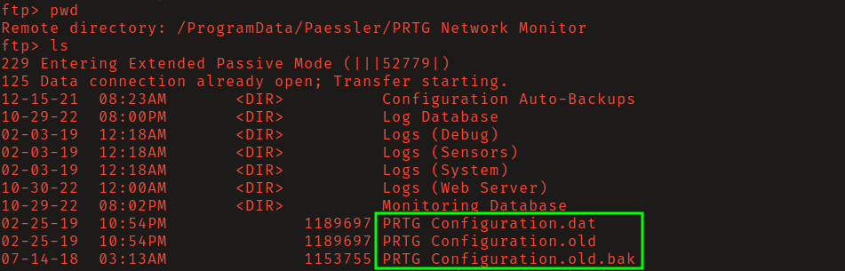
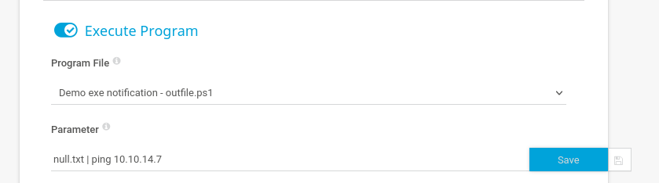
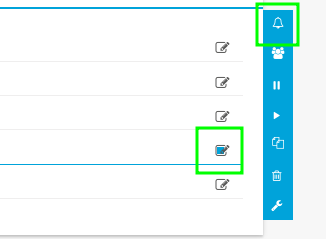
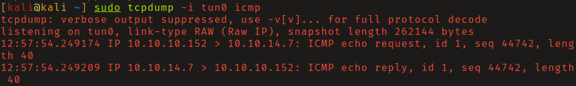
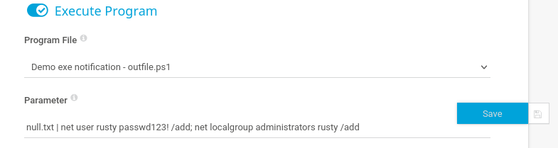
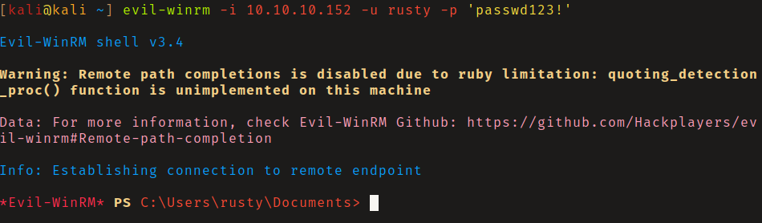
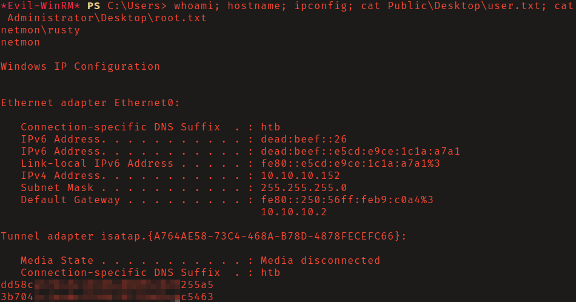

# HackTheBox - Netmon

**OS:** Windows

Netmon is a Windows box running PRTG Network Monitor. Anonymous FTP gives access to the entire `C:\` drive, including PRTG's configuration backup files which contain credentials in plaintext. A year-increment on the recovered password gets into the admin panel. From there, PRTG's notification execution feature allows running arbitrary commands as SYSTEM (CVE-2018-9276).

| Field | Value |
|---|---|
| Platform | HTB |
| Target | `<target-ip>` |
| Initial Access | Credential recovery from exposed FTP data |
| Privilege Escalation | Not required — initial exploit reached the objective |
| Final Access | Administrator / SYSTEM |

---

## Attack Path

1. Recon identified the exposed services and separated useful attack surface from noise.
2. The first break was Credential recovery from exposed FTP data.
3. Post-exploitation enumeration exposed Not required — initial exploit reached the objective.
4. The final privileged context was reached and the required proof was captured.

---

## Recon

### FTP Enumeration

The FTP server allowed anonymous login with the `C:\` drive as its root. Navigating to `C:/ProgramData/Paessler/PRTG Network Monitor` found three configuration files.







### Credential Recovery

PRTG versions 17.4.35 through 18.1.37 store user passwords in plaintext in the configuration `.dat` files. Downloading and inspecting `PRTG Configuration.old.bak` revealed the password `<redacted-password-old>`.




Logging into the PRTG panel with `prtgadmin:<redacted-password-old>` failed - the password had been changed. Incrementing the year to `<redacted-password-current>` worked. This is a common pattern: credentials rotate on a predictable schedule, and old backups reflect the prior year's value.


---

## Initial Access

### PRTG Notification RCE (CVE-2018-9276)

PRTG's notification system allows configuring an action to execute a program when a notification fires. This feature runs with SYSTEM privileges. To confirm blind command execution, a notification was created to ping the attacking machine, with `tcpdump` listening for ICMP responses.







With RCE confirmed, a notification was set to create a new local administrator:

```
net user rusty <redacted-temp-password> /add && net localgroup administrators rusty /add
```



After triggering the notification, the new account was used to connect via Evil-WinRM.





---

## Summary

Netmon demonstrates two things in sequence: configuration backup files are a high-value target in post-FTP enumeration, and credential rotation on predictable schedules (yearly increments) doesn't stop an attacker who has last year's backup. The PRTG notification RCE is authenticated but trivially abused once in the admin panel.

**Key takeaway:** Backup files in accessible network shares often contain credentials that are still close to valid - old passwords are a starting point for educated guessing, not a dead end.

---

## Root Cause

The demonstrated path worked because unpatched vulnerable software gave the attacker a bridge from reconnaissance to execution. The important pattern is the chain: Credential recovery from exposed FTP data created a foothold, and Not required — initial exploit reached the objective converted that foothold into Administrator / SYSTEM.

## Impact

Successful exploitation reached Administrator / SYSTEM. That level of access allows command execution, proof or sensitive-file access, credential collection, and a realistic path to additional systems if the same credentials, services, or trust relationships exist elsewhere.

## Remediation

- Remove or harden the specific exposure used for initial access: Credential recovery from exposed FTP data.
- Fix the privilege boundary that enabled escalation: Not required — initial exploit reached the objective.
- Rotate credentials observed or replayed during the chain and search for reuse on adjacent systems.
- Validate the fix by safely replaying the enumeration steps that originally exposed the weakness.

## Detection Opportunities

- Alert on exploit attempts or suspicious access patterns against the service that enabled initial access.
- Correlate successful authentication, new process creation, and privilege-boundary events after enumeration activity.
- Monitor for the specific escalation signal: Not required — initial exploit reached the objective.

## Lessons Learned

- The winning path was not just a vulnerable service; it was the connection between Credential recovery from exposed FTP data and Not required — initial exploit reached the objective.
- Preserve the observations that explain why each pivot made sense, not only the commands that worked.
- Write remediation from the root cause of each step so the report reads like an operator narrative and a defender action plan.
