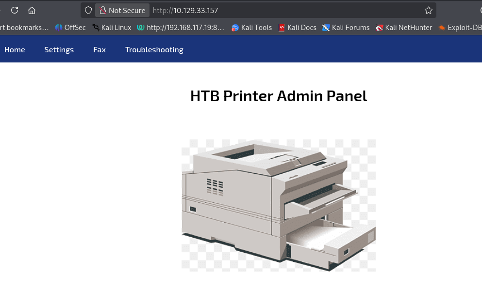
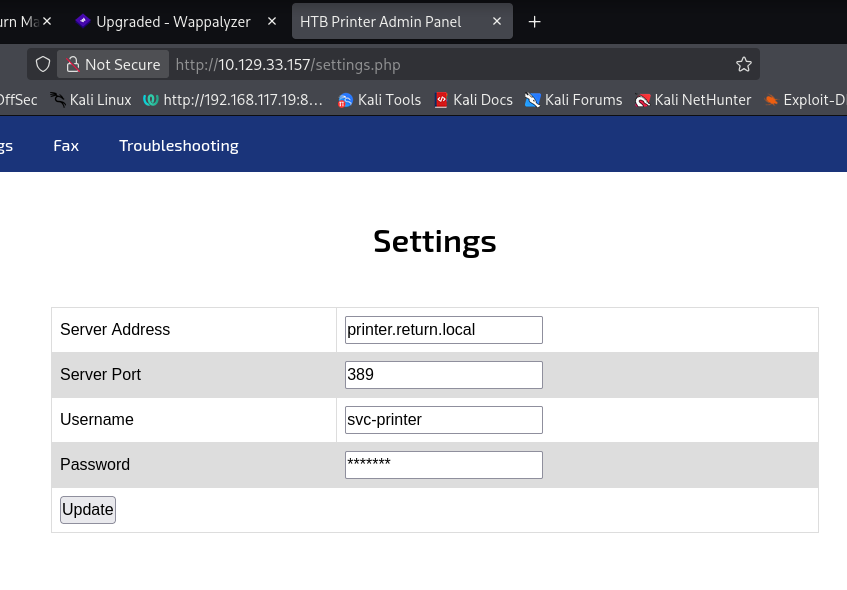
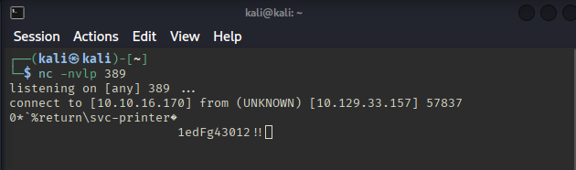
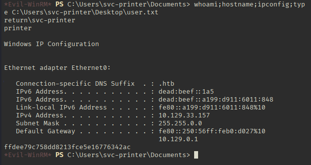
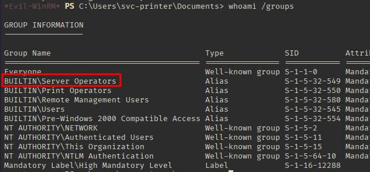
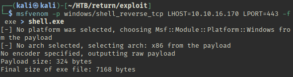
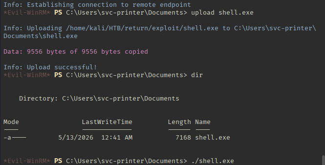
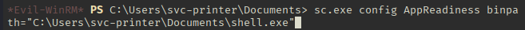
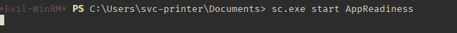
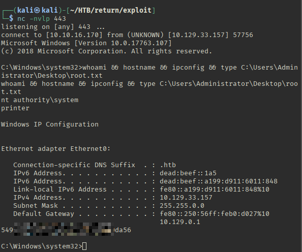

# HackTheBox - Return

**OS:** Windows

Return is an Active Directory box built around a network printer administration panel. Abusing the panel's LDAP settings page to redirect authentication to an attacker-controlled listener leaks plaintext service account credentials. Those credentials give WinRM access, and membership in the Server Operators group allows rewriting a service binary path to escalate to SYSTEM.

| Field | Value |
|---|---|
| Platform | HTB |
| Target | `<target-ip>` |
| Initial Access | Credential capture through printer LDAP configuration abuse |
| Privilege Escalation | Server Operators service path hijack |
| Final Access | Administrator / SYSTEM |

---

## Attack Path

1. Recon identified the exposed services and separated useful attack surface from noise.
2. The first break was Credential capture through printer LDAP configuration abuse.
3. Post-exploitation enumeration exposed Server Operators service path hijack.
4. The final privileged context was reached and the required proof was captured.

---

## Recon

### Port Scan

```
# Nmap 7.98 scan initiated Tue May 12 22:57:01 2026 as: /usr/lib/nmap/nmap --privileged -n -sS -sV --version-light -sC -Pn -p 53,88,135,139,389,445,464,636,3268,3269,9389,49664,49665,49666,49668,49671,49674,49675,49676,49679,49697 --stats-every 3m -oN - <target-ip>
Nmap scan report for <target-ip>
Host is up (0.41s latency).

PORT      STATE SERVICE       VERSION
53/tcp    open  domain        Simple DNS Plus
88/tcp    open  kerberos-sec  Microsoft Windows Kerberos (server time: 2026-05-13 06:15:44Z)
135/tcp   open  msrpc         Microsoft Windows RPC
139/tcp   open  netbios-ssn   Microsoft Windows netbios-ssn
389/tcp   open  ldap          Microsoft Windows Active Directory LDAP (Domain: return.local, Site: Default-First-Site-Name)
445/tcp   open  microsoft-ds?
464/tcp   open  kpasswd5?
636/tcp   open  tcpwrapped
3268/tcp  open  ldap          Microsoft Windows Active Directory LDAP (Domain: return.local, Site: Default-First-Site-Name)
3269/tcp  open  tcpwrapped
9389/tcp  open  adws?
49664/tcp open  unknown
49665/tcp open  unknown
49666/tcp open  unknown
49668/tcp open  unknown
49671/tcp open  unknown
49674/tcp open  ncacn_http    Microsoft Windows RPC over HTTP 1.0
49675/tcp open  unknown
49676/tcp open  unknown
49679/tcp open  unknown
49697/tcp open  unknown
Service Info: Host: PRINTER; OS: Windows; CPE: cpe:/o:microsoft:windows

Host script results:
| smb2-time: 
|   date: 2026-05-13T06:16:08
|_  start_date: N/A
| smb2-security-mode: 
|   3.1.1: 
|_    Message signing enabled and required
|_clock-skew: 18m34s

Service detection performed. Please report any incorrect results at https://nmap.org/submit/ .
# Nmap done at Tue May 12 23:00:25 2026 -- 1 IP address (1 host up) scanned in 204.38 seconds
```

The open port profile is a textbook Windows domain controller: DNS, Kerberos, RPC, SMB, and LDAP are all present. The hostname `PRINTER` hints at an additional attack surface worth investigating on the web.

### Web Enumeration

The machine hosts a network printer administration panel on port 80.



Navigating to `/settings.php` reveals a configuration form that accepts an IP address and port for LDAP authentication. The intent is to point the printer at a domain controller for credential validation, but the field accepts any arbitrary address.



---

## Exploitation

### Credential Capture via Rogue LDAP Listener

Setting the LDAP server address to the attacking machine's IP and starting a netcat listener on port 389 causes the printer to send its authentication request outbound. Because the printer communicates over plain LDAP rather than LDAPS, the credentials arrive in cleartext.



With a valid set of domain credentials in hand, WinRM access is tested with Evil-WinRM and succeeds, giving an interactive shell on the box.



---

## Privilege Escalation

### Server Operators Group - Service Binary Path Hijack

Running `whoami /groups` shows the compromised account is a member of the Server Operators group.



Server Operators is a privileged built-in group that, among other things, can start, stop, and reconfigure Windows services on a domain controller. The key permission here is the ability to modify a service's binary path using `sc.exe config`.

To avoid breaking anything on the domain controller, the target should be a service that is already disabled. `AppReadiness` fits the bill.

A second msfvenom reverse shell payload is generated and uploaded via Evil-WinRM.





The `AppReadiness` service binary path is then rewritten to point at the uploaded shell:



The first shell is closed, a new listener is started, and the service is started to trigger the payload.



Because Windows services run under SYSTEM by default, the callback arrives as `NT AUTHORITY\SYSTEM`.



---

## Summary

**Key takeaway:** Printer and IoT administration interfaces frequently authenticate to internal services using service accounts, and they rarely implement transport security for those connections. Exposing the target server field to user input turns any plain-text protocol (LDAP, SMTP, FTP) into a credential harvesting opportunity. On the escalation side, the Server Operators group is a common over-provisioned membership in AD environments and should be audited carefully, as it provides a reliable path to SYSTEM on any domain controller running a modifiable service.

---

## Root Cause

The demonstrated path worked because local privilege boundary misconfiguration gave the attacker a bridge from reconnaissance to execution. The important pattern is the chain: Credential capture through printer LDAP configuration abuse created a foothold, and Server Operators service path hijack converted that foothold into Administrator / SYSTEM.

## Impact

Successful exploitation reached Administrator / SYSTEM. That level of access allows command execution, proof or sensitive-file access, credential collection, and a realistic path to additional systems if the same credentials, services, or trust relationships exist elsewhere.

## Remediation

- Remove or harden the specific exposure used for initial access: Credential capture through printer LDAP configuration abuse.
- Fix the privilege boundary that enabled escalation: Server Operators service path hijack.
- Rotate credentials observed or replayed during the chain and search for reuse on adjacent systems.
- Validate the fix by safely replaying the enumeration steps that originally exposed the weakness.

## Detection Opportunities

- Alert on exploit attempts or suspicious access patterns against the service that enabled initial access.
- Correlate successful authentication, new process creation, and privilege-boundary events after enumeration activity.
- Monitor for the specific escalation signal: Server Operators service path hijack.

## Lessons Learned

- The winning path was not just a vulnerable service; it was the connection between Credential capture through printer LDAP configuration abuse and Server Operators service path hijack.
- Preserve the observations that explain why each pivot made sense, not only the commands that worked.
- Write remediation from the root cause of each step so the report reads like an operator narrative and a defender action plan.
